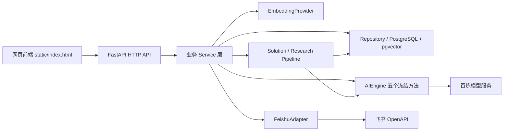

# 淘到宝引擎 V1 集成基线接力开发说明

## 1. 文档目的

本文是后续开发者接手淘到宝引擎时的第一份技术交接文件，回答四个问题：

1. 当前版本已经实现并合并了什么；
2. 当前版本明确还没有实现什么；
3. 后续增加飞书、云部署、Worker 或其他服务时，应通过什么中介层接入；
4. 下一位开发者如何以当前版本为基线继续开发，而不破坏已验收能力。

本文不要求接力开发者完整读取整个仓库。开发者应先读本文，再按照任务类型读取文末给出的最小文件集。

V1 集成验收中的未关闭问题统一维护在 `docs/V1_BUG_LIST.md`；开发、回归和关闭缺陷时必须同步更新该文件。

## 2. 当前基线身份

| 项目 | 当前值 |
|---|---|
| GitHub 仓库 | `https://github.com/wxh042/xianjintuan-engine` |
| 接力基线分支 | `feat/v1-integration-acceptance` |
| V1 集成代码提交 | `78a753c` |
| GitHub 网页协作说明提交 | `b77c1f2` |
| 当前基线来源 | `feat/gateway` + 已集成 AI 服务 + V1 后端增量 + 验收修复 |
| 是否已进入 `main` | 否 |
| 当前定位 | 已部署云端并完成真实 OAuth/资料列表验收的 V1 集成候选基线，不是正式生产发布版 |

后续开发者必须从 `feat/v1-integration-acceptance` 创建自己的功能分支。真实飞书端到端和云端部署验收通过后，再建立或更新 `v1-integration`，最终由集成分支进入 `main`。

### 2.1 状态判断优先级

仓库中存在按日期累计的历史开发记录，部分“尚未实现”描述已经被后续提交覆盖。判断当前状态时按以下顺序：

1. 冻结契约和最新确认的 V1 PRD；
2. 当前分支实际代码和测试；
3. 本接力文档；
4. 历史开发记录。

例如 `docs/AI服务交接说明.md` 中“还需要 Dev A 完成”的 Harness 注入、运行元数据、分库检索和阶段结果保存已经在当前基线实现；该段应视为集成前历史说明。`docs/开发文档.md` 中较早的 Live 飞书限制也不能替代当前代码检查，但真实飞书端到端仍以本文第 12 节为准。

## 3. 当前系统的接力架构



接力开发必须保留以下责任边界：

- 前端只调用 FastAPI HTTP 接口，不直接调用 AI、飞书或数据库；
- API Route 只处理 HTTP、鉴权、参数和响应，不直接拼 Prompt 或编写外部服务调用；
- Service 层负责业务规则、状态流转和编排；
- Repository 层负责数据库读写和工作空间隔离；
- AI 只能通过 `AIEngine` 五个冻结方法调用；
- Embedding 通过 `EmbeddingProvider` 调用，不增加第六个 AIEngine 方法；
- 飞书通过 `FeishuAdapter` 调用，业务代码不能直接散落 `httpx` 请求；
- 长流程通过 Solution/Research Pipeline 执行，后续 Worker 复用现有 Pipeline，不重写业务流程。

## 4. 当前分支合并了什么

当前分支不是单一模块代码，而是把原有网关/后端与 AI 服务整合为同一套可运行基线。关键历史提交包括：

| Commit | 已合并内容 |
|---|---|
| `9d40325` | 将 AI Engine、Schema、Prompt、算子和评测接入后端 Harness |
| `988b589` | 对齐 V0.5 资产负载与合并后的 AI Schema |
| `d56b906` | 合并 V1 后端增量、Deep Research、专家协作、飞书适配、Docker 基线、AI 验收修复和测试 |
| `b77c1f2` | 增加 GitHub 网页版合作伙伴更新操作手册 |
| `510e516` | 接通真实飞书资料选择器，完善限时单次邀请码门禁 |
| `da3ba27` | 页面启动时刷新真实运行模式，避免本地缓存状态过期 |
| `27cb92f` | 安全合并合作伙伴的非 root Docker、Caddy 和生产 Compose 配置 |
| `03eb5e4` | 强制 Linux 入口脚本使用 LF，修复 Windows 构建容器无法启动 |
| `78a753c` | 增加服务端邀请码凭证消费账本，拒绝旧凭证重放 |

这些内容目前只存在于接力基线分支，尚未合并到 `main`。

## 5. 已实现：V0.5 后端主流程

以下接口和服务已经存在：

### 5.1 登录与会话

- 飞书 OAuth start、callback、当前用户和退出接口；
- Mock/Live 飞书模式使用相同后端接口；
- 服务端签名 Cookie 保存登录会话；
- 飞书访问 Token 不放在 Cookie 中；
- Token 过期前尝试使用 refresh token 刷新。

主要文件：

```text
app/api/v1/routes/auth.py
app/services/auth.py
app/core/security.py
app/api/deps.py
```

### 5.2 资料导入与处理

- 支持飞书链接和粘贴文本导入；
- 支持资料列表、详情、编辑、删除、刷新和失败重试；
- Source 与 Job 保存处理阶段、状态、错误和重试次数；
- 原文刷新创建新版本，旧资产保留追溯并暂停召回；
- Source Job 调用 AI 提取画像、经验或能力草稿。

主要文件：

```text
app/api/v1/routes/sources.py
app/api/v1/routes/jobs.py
app/services/source_service.py
app/services/job_runner.py
```

### 5.3 客户画像

- 创建、列表、详情、编辑、生成和确认；
- AI 生成结果保持 `pending_confirmation`；
- 同一画像可供快速方案和 Deep Research 复用；
- 会话新信息不会绕过人工确认直接覆盖长期画像。

### 5.4 经验与原子能力

- 经验和能力使用独立模型、接口、审核和检索；
- 支持列表、详情、编辑和审核；
- 待审核、已打回、来源过期或来源更新资产不能参与在线召回；
- 审核通过后生成 Embedding，并保存版本和指纹。

### 5.5 快速方案

- 支持客户多会话和多轮消息；
- AI 提取 SearchIntent；
- 后端分别检索 Top 3 经验和 Top 5 能力；
- 检索同时过滤审核状态、Embedding、来源状态、新鲜度和来源版本；
- 每次运行保存独立 RetrievalSnapshot；
- AI 输出八区块方案，并区分可信边界和来源；
- 运行结果、错误和 AI 元数据进入数据库。

主要文件：

```text
app/services/session_service.py
app/services/retrieval_service.py
app/services/solution_pipeline.py
app/services/ai_harness.py
app/services/ai_payload_adapter.py
```

## 6. 已实现：AI 服务基线

后端与 AI 服务通过以下五个冻结方法协作：

```text
extract_profile(raw_text, source_ids)
extract_experience(raw_text, source_id)
extract_capabilities(raw_text, source_id)
extract_search_intent(context)
generate_solution(context, retrieval_snapshot)
```

当前实现包括：

- Mock 和真实百炼 Engine；
- 客户画像、经验和能力提取；
- SearchIntent 和经验/能力分库查询文本；
- 快速方案八区块生成；
- 逐条事实审计和最多两次自动重写；
- Deep Research 分阶段输出；
- 真实候选专家排序；
- 画像字段归一化、经验状态校正、同义意图去重；
- Deep Research 子问题 ID 稳定补齐；
- 复合资产引证拦截；
- AI 运行模型、Prompt、Schema、Embedding、参数、耗时和错误记录。

Embedding 已通过独立 `EmbeddingProvider` 接入百炼 `text-embedding-v4`，不是第六个冻结方法。

主要入口：

```text
app/contracts/ai.py
app/ai/engine.py
app/ai/model_client.py
app/ai/embedding.py
app/ai/pipelines/
app/ai/prompts/
app/ai/schemas/
```

## 7. 已实现：V1 Deep Research

当前后端已实现：

- 创建、列表、详情、取消和失败重试；
- 持久化画像、会话和证据快照；
- analysis、planning、evidence_synthesis、route_comparison、fact_audit、final_report 阶段；
- 每个阶段保存输入、输出、状态、进度和尝试次数；
- 证据不足时进入 `waiting_expert`；
- `/context` 为研究页和专家协作页提供同一份研究上下文；
- 专家回复后恢复为 `researching` 并继续原任务；
- 已完成、已取消任务不会重复运行。

主要文件：

```text
app/api/v1/routes/research.py
app/services/research_service.py
app/services/research_pipeline.py
app/ai/pipelines/deep_research.py
```

## 8. 已实现：V1 专家协作后端

当前实现包括：

- 专家候选只来自真实作者、贡献者和审核人记录；
- AI 只能对后端提供的真实候选排序，不能生成候选；
- 专家协作必须关联一个 Deep Research 任务；
- 同一研究任务同时只能有一个进行中的专家协作；
- 创建后先进入 `awaiting_confirmation`；
- 员工确认专家和问题后才执行飞书动作；
- 后端编排创建研究文档、创建群聊和发送开场消息；
- 专家回复绑定任务、协作、问题、作者和飞书消息；
- 飞书消息 ID 全局去重；
- 回复进入研究时保持 `pending_confirmation`；
- 人工采纳后只生成 `pending_review` 经验，不能直接在线召回。

主要文件：

```text
app/api/v1/routes/expert_collaborations.py
app/services/expert_collaboration_service.py
app/ai/pipelines/expert_routing.py
app/ai/collaboration.py
```

## 9. 已实现：数据库和契约增量

当前数据库已经增加：

- AI Run 记录；
- ResearchTask、ResearchStep；
- ExpertContribution；
- ExpertCollaboration、ExpertReply；
- 任务状态、阶段、证据快照、研究报告和失败恢复字段；
- 同任务单个进行中协作的部分唯一索引；
- 飞书用户 Token 和过期时间字段。

对应迁移：

```text
alembic/versions/4859effd0277_add_v1_backend_models.py
```

契约规则：

- 根目录 `openapi.yaml` 仍是冻结的 V0.5 前后端契约；
- `docs/openapi-v1-incremental.yaml` 保存 V1 新接口；
- AI 五方法签名未修改。

## 10. 已实现：前端和本地运行基线

`static/index.html` 已包含 V1 单文件交互页面，并已调用后端的：

- 登录与当前用户；
- 资料、画像、经验和能力；
- 会话与快速方案；
- Deep Research；
- 专家协作。

页面仍保留 SEED 作为未登录/空态演示结构，但登录后会重新读取后端数据和运行模式；演示资料会明确标记。它仍是单文件 V1 UI 基线，不应被描述为完整生产前端工程。

部署基线包括：

- `Dockerfile`：可构建 FastAPI 应用镜像；
- `docker-compose.yml`：可启动 PostgreSQL 16 + pgvector、FastAPI 和 Caddy；
- Alembic 迁移；
- 演示数据初始化 CLI。

## 11. 当前验证结果

| 验证范围 | 结果 |
|---|---|
| AI 专项测试 | 108/108 通过 |
| 模拟数据断言 | 907/907 通过 |
| 仓库全量测试 | 170/170 通过（含隔离数据库 V1 工作流） |
| Mock 业务回归 | Schema、引用、拒答和可信边界通过率 100% |
| 真实百炼黄金方案 | 通过；33 条事实审计失败 0 条；重写 0 次 |
| 真实 Embedding | `text-embedding-v4`，1024 维，语义区分符合预期 |
| 冻结 `openapi.yaml` | 未修改 |
| AI 五方法签名 | 与冻结契约一致 |
| 密钥扫描 | 未发现提交中的真实密钥 |
| 云端健康 | service/database 正常；飞书 live/configured；AI mock |
| 真实飞书资料列表 | 文档 3 项、妙记 0 项，接口均成功 |
| 邀请码门禁 | 未验证拦截、正确验证、OAuth 启动、单次消费均通过 |

当前邀请码消费账本适配现有单进程部署；未来若启用多 Worker 或多实例，必须先迁移到 PostgreSQL 或 Redis 共享账本，才能保持跨进程单次消费语义。

详细结果：

```text
evals/AI服务模拟数据验收报告_20260808.md
evals/latest_mock_report_after_fix.json
evals/latest_verified_solution_after_fix.json
evals/V1云端集成验收报告_20260809.md
```

## 12. 当前真实集成状态与未完成内容

以下内容不能被接力开发者误认为已经完成。

### 12.1 真实飞书 OAuth 与资料列表已通过

Live OAuth 已使用真实已发布飞书应用和测试成员通过。用户权限下的文档列表返回 3 项，妙记列表接口成功但当前账号无条目。真实文档/妙记正文导入与后续提取仍应由员工主动选择后验收。

### 12.2 飞书应用身份 Token 已实现

`LiveFeishuAdapter`会为机器人动作获取并缓存`tenant_access_token`；研究文档继续使用发起人的用户 Token，建群和发消息使用应用身份 Token。

### 12.3 飞书原生事件入口已实现，待真实回调验收

`POST /expert-collaborations/events/feishu`支持 URL Verification、飞书 v2 事件头、`im.message.receive_v1`、Encrypt Key 解密、签名校验，以及群、协作、问题和回复映射。原`/events/replies`保留为内部标准化事件入口，不应配置为开放平台回调。

### 12.4 飞书 Token 已增加应用层加密

用户 access/refresh Token 通过 SQLAlchemy 类型适配器使用 Fernet 加密后入库，Live 模式强制要求`APP_FEISHU_TOKEN_ENCRYPTION_KEY`。历史明文值可读取，并会在重新授权或刷新时转为密文；密钥轮换工具仍属于后续运维增强项。

### 12.5 长任务 Worker 未生产化

Source、快速方案和 Deep Research 目前主要通过 FastAPI `BackgroundTasks` 启动。数据库保存了状态和阶段，但进程崩溃、滚动发布或服务器重启时，没有独立 Worker 自动扫描和恢复未完成任务。

### 12.6 云端比赛测试部署已完成，生产化未完成

阿里云香港 ECS 已运行 FastAPI 和 PostgreSQL/pgvector 容器，保留旧镜像与源码备份用于回滚。尚未包括：

- HTTPS 反向代理；
- 自动执行 Alembic 迁移；
- 云密钥管理服务和自动化密钥注入；
- 数据库备份和恢复；
- 日志、监控和告警；
- Worker；
- 灰度、回滚和发布标签。

### 12.7 真实飞书专家协作端到端未验收

以下完整链路尚未通过：

```text
已通过：飞书登录 → 枚举用户有权限的文档/妙记

尚未通过：选择并导入真实资料
  → 资料审核与检索
  → Deep Research
  → 推荐真实专家
  → 员工确认
  → 机器人建群并同步研究文档
  → 专家群内回复
  → 飞书事件回流
  → 任务恢复 researching
  → 最终报告
```

### 12.8 前端尚不是独立生产工程

当前 UI 是单文件静态页面，登录后使用真实接口并明确展示 Mock/Live 状态。尚未完成独立构建、前端路由、组件化、生产错误监控和完整真实数据验收。

## 13. 后续增加服务必须通过什么中介

这是接力开发最重要的规则。

### 13.1 前端增加功能

```text
前端 → FastAPI Route → Service → Repository/Adapter
```

前端不得直接访问百炼、飞书 OpenAPI 或数据库。新增页面先确认现有 HTTP 契约；需要 V1 新接口时，只更新增量 OpenAPI。

### 13.2 后端调用 AI

```text
业务 Service/Pipeline → AIEngine → BailianAIEngine/MockAIEngine
```

不能在 Route 或 Service 中直接拼 Prompt、直接调用模型 URL，也不能增加第六个冻结方法。V1 场景通过现有 context 字段和阶段路由复用五方法。

### 13.3 后端调用 Embedding

```text
业务 Service → EmbeddingProvider → BailianEmbeddingProvider/MockEmbeddingProvider
```

Embedding 负责向量生成，不负责业务审核、检索过滤和排名规则。

### 13.4 后端调用飞书

```text
业务 Service → FeishuAdapter → LiveFeishuAdapter/MockFeishuAdapter → 飞书 OpenAPI
```

新增飞书接口必须先扩展或拆分 Adapter/Provider，再由 `app/api/deps.py` 注入。不得在 Route、AI Pipeline 或前端中直接写飞书 HTTP 请求。

建议新增两个中介：

```text
FeishuTokenProvider
  - 获取/缓存/刷新 tenant_access_token
  - 管理 user_access_token 刷新
  - 不向前端暴露 Token

FeishuEventAdapter
  - challenge 响应
  - 验签/解密
  - 原生事件解析
  - 转换为内部 ExpertReplyEvent
```

内部 `ExpertCollaborationService.record_reply()` 不应理解飞书原始 JSON，只接收规范化后的内部事件。

### 13.5 后端访问数据库

```text
Service/Pipeline → Repository → SQLAlchemy → PostgreSQL
```

Route 和 AI 不应直接操作 ORM。新增实体应同步模型、Repository、Service、迁移和测试。

### 13.6 后续增加 Worker

```text
API 创建任务并落库
  → TaskDispatcher
  → Worker
  → 复用 run_source_job / run_solution_pipeline / run_research_pipeline
```

Worker 只替换任务启动与恢复方式，不重新实现资料、方案或研究业务逻辑。建议增加 `TaskDispatcher` Protocol，并保留 Mock/InProcess 与生产 Worker 两种实现。

### 13.7 后续增加其他云服务

任何新外部服务统一使用：

```text
Protocol → Live Adapter → Mock Adapter → Dependency Injection → Service 调用
```

配置进入 `app/core/config.py` 和 `.env.example`，真实密钥只进入部署环境，不提交 Git。

## 14. 推荐接力顺序

建议按依赖顺序拆成独立分支和 PR：

| 顺序 | 分支建议 | 目标 | 上游依赖 | 完成信号 |
|---|---|---|---|---|
| 1 | `test/feishu-import-e2e` | 员工主动选择真实文档/妙记并完成提取审核 | 已通过 OAuth/资料列表 | 来源权限、内容、Job 和草稿均正确 |
| 2 | `test/feishu-expert-e2e` | 验证真实研究文档、建群、消息和事件回流 | 测试专家与员工确认 | 回复恢复研究并生成最终报告 |
| 3 | `feat/ai-live-runtime` | 使用新的受控 API Key 切换真实 AI | 当前 AI Harness | 五方法和 Deep Research 真实输出通过 |
| 4 | `feat/research-worker` | 持久化任务调度和重启恢复 | 现有 Pipeline | 重启服务后未完成任务可继续 |
| 5 | `feat/cloud-https-backup` | 域名、HTTPS、迁移自动化和备份 | 当前 ECS 部署 | 公网 HTTPS、恢复演练和回滚通过 |
| 6 | `feat/frontend-production` | 组件化、错误监控和完整真实数据验收 | 稳定 API | 核心页面只使用真实数据通过验收 |

可以并行的工作：真实 AI、Worker 和 HTTPS/备份可以由不同开发者并行；专家端到端依赖测试专家与员工确认，生产前端依赖稳定 API。共享契约、数据库迁移和 `app/api/deps.py` 冲突必须共同评审。

## 15. 每类任务的最小读取文件

为了节省 Codex 额度，接力开发者先读本文，再只读取任务对应文件。

### 15.1 OAuth 与用户 Token

```text
app/integrations/protocols.py
app/integrations/feishu.py
app/api/v1/routes/auth.py
app/services/auth.py
app/api/deps.py
app/core/config.py
tests/test_auth.py
```

### 15.2 tenant token、建群和发消息

```text
app/integrations/protocols.py
app/integrations/feishu.py
app/services/expert_collaboration_service.py
app/api/deps.py
tests/test_v1_workflows.py
```

### 15.3 飞书事件回调

```text
app/api/v1/routes/expert_collaborations.py
app/schemas/v1.py
app/integrations/protocols.py
app/services/expert_collaboration_service.py
docs/openapi-v1-incremental.yaml
tests/test_v1_workflows.py
```

### 15.4 Worker 与失败恢复

```text
app/services/job_runner.py
app/services/solution_pipeline.py
app/services/research_pipeline.py
app/services/research_service.py
app/db/models.py
app/db/repositories/entities.py
tests/test_job_runner.py
tests/test_v1_workflows.py
```

### 15.5 云部署

```text
Dockerfile
compose.dev.yaml
docker-compose.yml
Caddyfile
.dockerignore
.env.example
app/core/config.py
alembic.ini
README.md
```

### 15.6 AI 变更

```text
app/contracts/ai.py
app/ai/engine.py
对应的 app/ai/pipelines/*
对应的 app/ai/prompts/*
对应的 tests/ai/test_*.py
evals/README.md
```

只有确实存在依赖时才用 `rg` 定位补充文件，不要求完整读取全部 `docs`、`tests` 和源码。

## 16. 接力开发操作流程

### 第一步：从基线创建分支

在 GitHub 网页切换到：

```text
feat/v1-integration-acceptance
```

再创建自己的 `feat/*`、`fix/*` 或 `test/*` 分支。不能直接修改基线分支或 `main`。

### 第二步：提交任务说明

任务说明必须写清：

- 目标；
- 本次实现；
- 本次不做；
- 必须读取文件；
- 允许修改范围；
- 上游/下游依赖；
- 是否涉及契约、迁移和环境变量；
- 验收命令和完成标准。

### 第三步：只通过中介层扩展

新增外部服务时先建立 Protocol/Adapter/Provider，再注入 Service。不要从前端、Route 或 AI 直接访问外部系统。

### 第四步：实现和测试

最低检查：

```bash
git status --short
git diff --check
uv sync --extra dev
uv run --extra dev pytest -q
uv run --extra dev ruff check app tests
```

### 第五步：更新接力记录

每个 PR 在描述中说明：

```markdown
## 基线
- 基于分支：feat/v1-integration-acceptance
- 基于提交：

## 本次接力完成
- 待填写

## 继续保留的能力
- 待填写

## 新增中介/接口
- 待填写

## 契约和迁移
- openapi.yaml：未修改 / 说明
- V1 增量契约：未修改 / 说明
- AI 五方法：未修改 / 说明
- 数据库迁移：无 / 说明
- 环境变量：无 / 说明

## 验证
- 命令：
- 结果：

## 尚未实现
- 待填写

## 下一位开发者从哪里继续
- 待填写
```

### 第六步：创建 Pull Request

当前过渡阶段 PR 的 base 选择 `feat/v1-integration-acceptance`。建立 `v1-integration` 后，统一以 `v1-integration` 为 base。

至少由另一名开发者检查代码和测试；涉及产品语义、冻结契约和是否发布时，由项目负责人确认。

## 17. 接力时不能破坏的基线

后续开发必须回归并保留：

- V0.5 quick 流程；
- 五个 AIEngine 方法签名；
- 经验与能力分库；
- verified + 来源有效 + Embedding ready 才能召回；
- RetrievalSnapshot 历史固定；
- 四种可信边界；
- 没有依据时拒绝编造；
- 画像更新人工确认；
- 专家候选只来自真实贡献记录；
- 同任务单个进行中专家协作；
- 专家回复不能直接进入已校验经验；
- `openapi.yaml` 已有路径和字段语义。

## 18. 什么时候当前基线可以进入 main

以下条件全部满足后，才能把集成分支合并到 `main`：

1. 前端、后端、AI 和数据库全量回归通过；
2. 真实飞书 OAuth、文档、妙记、机器人和事件回调通过；
3. Deep Research 专家回复恢复链路通过；
4. 云端 Docker、HTTPS、迁移、持久化和重启恢复通过；
5. Token 不再明文存储；
6. 没有高优先级阻断缺陷；
7. 部署、回滚和验收文档齐全。

在此之前，`feat/v1-integration-acceptance` 是后续开发基线，不是生产发布分支。

## 19. 给下一位开发者的最短说明

可以直接把下面内容发给接力开发者：

```text
请从 GitHub 分支 feat/v1-integration-acceptance 创建自己的功能分支。

先读 docs/V1集成基线接力开发说明.md，不要完整扫描整个仓库。
再按任务读取文档中列出的最小文件集。

当前 V0.5、AI 服务、V1 Deep Research、专家协作后端、Token 加密、
真实飞书 OAuth/资料列表和阿里云 HTTP 测试部署已经形成基线；
真实 AI 运行、真实资料导入、专家建群/回复回流、持久化 Worker、HTTPS
和备份监控尚未完成。

新增外部服务必须走 Protocol/Adapter/Provider → Service，不能让前端、Route
或 AI 直接调用飞书、模型、数据库或其他云服务。

不要修改根 openapi.yaml 的已有契约，不要修改 AI 五个冻结方法签名。
完成后运行测试、创建 PR，并明确写出本次完成内容、尚未实现内容和下一位接力入口。
```
