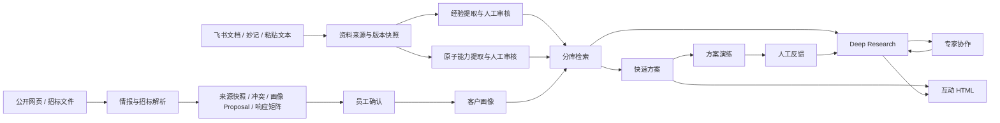

# 淘到宝引擎 V2.0 最终产品与真实运行 PRD

状态：冻结交付版

更新时间：2026-08-15
适用范围：业务前端、V0.5/V1/V1.1/V2 增量后端、AI 可信服务、飞书联动与比赛演示

## 1. 产品目标

淘到宝引擎服务神州数码销售与售前员工，把企业内部资料、公开情报与客户沟通转成可核验、可复用、可协作的售前资产。V2.0 以一次客户磋商为主线：

1. 磋商前：公开情报、客户画像建议、招标要求拆解与响应矩阵；
2. 磋商中：快速方案、客户异议演练、互动 HTML 交付；
3. 磋商后：Deep Research、专家协作、事实审计与经验沉淀；
4. 全程底座：资料、经验、原子能力、来源快照、权限与审核状态。

## 2. 真实运行原则

- 生产运行只允许真实 Provider；未配置时明确返回 `not_configured`、HTTP 503，或将异步任务标记为失败/跳过。
- 禁止前端、API、Worker 或模型适配器在运行时回退到固定业务答案、哈希向量、零向量、假飞书用户或假公开情报。
- 自动化测试可以在 `tests/` 内显式注入替身，但替身不得进入生产依赖注入。
- 允许使用隔离的内置虚构文档验证索引；必须标记 `is_demo=true` 和 `builtin://` 来源，不得进入正式客户方案。
- 方案中的事实边界固定为 `historical_fact`、`enterprise_capability`、`ai_inference`、`pending_confirmation`。
- 只有已校验且来源仍有效的经验与能力可参与召回；每次运行保留独立检索快照。

## 3. 产品模块与当前承诺

| 阶段 | 模块 | V2.0 承诺 | 关键门禁 |
|---|---|---|---|
| 底座 | 资料中心 | 飞书文档、妙记、粘贴文本统一导入与处理状态 | 权限、原文时效、处理状态 |
| 底座 | 经验库 | 管理企业过去真实做过什么 | 人工审核、有效来源 |
| 底座 | 原子能力库 | 管理企业当前真实能提供什么 | 人工审核、输入/输出/限制完整 |
| 磋商前 | 情报与招标 | 情报任务、来源溯源、冲突治理、画像 Proposal、招标响应矩阵 | Provider 可用、来源快照、Trust Gate |
| 磋商中 | 快速方案 | 单流程检索与生成、多会话、多轮追问 | 可信资产召回、事实边界、快照 |
| 磋商中 | 方案演练 | 基于冻结客户与方案上下文的客户异议演练 | 不扩写未知事实、反馈可追溯 |
| 磋商中 | 互动 HTML | 从已发布方案事实生成可交互网页演示 | FactBinding、安全审计、真实模型 |
| 磋商后 | Deep Research | 多阶段复杂研究、进度、恢复、冲突与报告 | Multi-Agent 仅在此模块使用 |
| 磋商后 | 专家协作 | 从研究缺口发起飞书群协作并回流原任务 | 真实贡献者、员工确认、单活跃协作 |
| 运维 | 今日工作台/AI 运行 | 显示真实资产计数、任务进度和连接状态 | 不展示演示指标、不把 Live 配置等同可用 |

## 4. 核心数据流



## 5. 服务依赖与降级行为

| 服务 | 配置 | 缺失时行为 |
|---|---|---|
| PostgreSQL + pgvector | `APP_DATABASE_URL` | 数据业务不可运行；索引验收 `skipped` |
| 百炼 Chat / Embedding | `DASHSCOPE_API_KEY` 等 | AI/索引接口 503；不生成固定答案 |
| 飞书开放平台 | App ID、Secret、Token、Encrypt Key、加密密钥 | 登录、同步、建群不可用；不创建假用户或假群 |
| 互动 HTML 模型 | `APP_INTERACTIVE_HTML_API_KEY` | 互动 HTML 生成失败；不回退 Mock HTML |
| Open Enrich Sidecar | URL、内部 Token、采集/模型凭据 | 自动公开情报任务失败/跳过；已入库情报仍可查看 |
| 展示解析 Provider | `APP_PRESENTATION_SERVICE_URL` | 历史参考稿解析跳过；不影响已有可信 HTML |

## 6. 内置文档索引验收

内置文档位于 `fixtures/builtin_documents/index_cases.json`，包含两条经验和两条能力。运行：

```powershell
python scripts/verify_builtin_document_index.py
```

脚本执行真实写库、审核、Embedding、pgvector 与检索，并输出 `.local/builtin-index-report.json`。四个查询的第一条结果都必须命中预期标题；缺少真实依赖时只能为 `skipped`，不能假装 `passed`。

## 7. 冻结契约

- 根目录 `openapi.yaml` 是 V0.5 前后端冻结契约；V1/V1.1/V2 只能在 `docs/openapi-*-incremental.yaml` 增量追加。
- `app/contracts/ai.py` 中五个 AIEngine 方法签名不得修改：`extract_profile`、`extract_experience`、`extract_capabilities`、`extract_search_intent`、`generate_solution`。
- Embedding 是共享适配能力，不新增第六个 AIEngine 方法。

## 8. V2.0 验收条件

1. 全量自动化测试、Ruff、compileall 与 Alembic 检查通过；跳过项逐条有可解释的外部依赖。
2. 运行配置拒绝 `mock`，所有未配置 Provider 都有明确状态和错误。
3. 内置文档在真实数据库和真实 Embedding 下完成索引命中验收。
4. 前端空工作区不展示固定客户、方案、采用率或伪造运行记录。
5. 飞书真实登录、资料同步与专家建群至少各完成一次在线冒烟验证。
6. 互动 HTML 只读取已发布事实，生成产物通过 FactBinding 与安全检查。

## 9. 本期明确不做

- 不以 PPTX 作为 V2.0 正式交付目标；正式比赛演示使用互动 HTML。
- 不把快速方案改成 Multi-Agent。
- 不把公开情报未经确认直接覆盖长期客户画像。
- 不把专家回复自动沉淀为已校验经验。
- 不承诺未配置采集 Provider 时的自动公网搜索。
