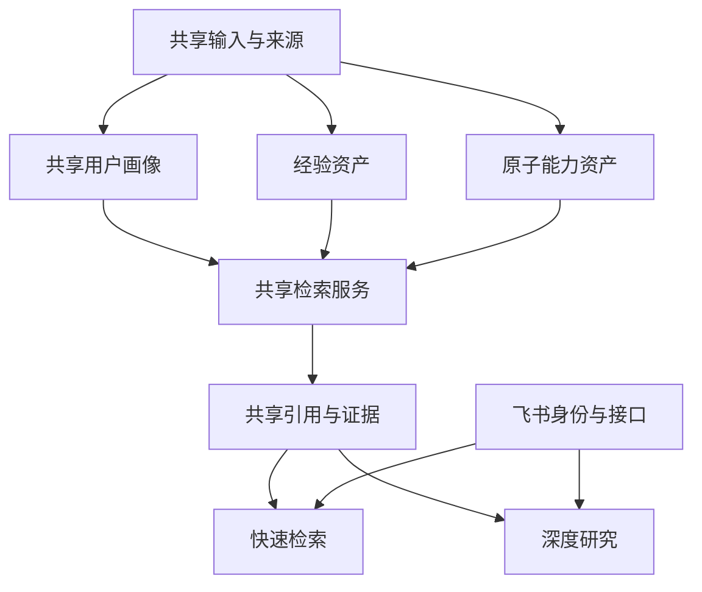

# 能力抽象与MVP范围

## 1.抽象原则

原方案中的“文档解析、经验审核、向量数据库、Multi-Agent、Deep Research、自动建群”等内容不在同一层级：有的是产品能力，有的是业务流程，有的是技术实现。为避免功能重复计算，先统一为一级产品能力，再确定每项能力在MVP中的最小实现。

## 2.十项一级产品能力

|编号|一级能力|包含内容|MVP最小实现|完整版本|
|---|---|---|---|---|
|1|身份与入口|飞书登录、机器人入口、Web入口|飞书登录或模拟登录+Web工作台|单点登录、机器人、工作台、多租户|
|2|客户上下文|客户会话、用户画像、多轮提问、背景更新|一个客户一份画像，可连续提问|画像版本、跨任务复用、权限和生命周期|
|3|内容输入|文字、聊天记录、妙记、文档和附件|文字+一种飞书内容或固定文件格式|通用文档解析、全量清洗、自动同步|
|4|经验资产|项目材料转为Experience Card|固定JSON或少量文档批量提取|自动抽取、人工审核、版本和持续更新|
|5|能力资产|PRD转为Capability Card|固定JSON或少量PRD批量拆分|自动拆分、负责人审核、版本和依赖管理|
|6|快速检索与输出|双资产检索、答案、来源、限制和建议追问|简单检索+一次生成+来源展示|混合检索、重排、权限过滤和质量评测|
|7|深度研究|多步研究、方案编排、证据审核和报告|不进入首个MVP|固定研究流、任务恢复和动态规划|
|8|专家协作|推荐专家、员工确认、建群和反馈归纳|不进入首个MVP|专家网络、自动建群、任务追踪和反馈沉淀|
|9|成果发布|结果页、研究报告、飞书云文档和PPT|Web快速结果页|报告版本、云文档、PPT和正式方案|
|10|平台治理|权限、审计、成本、评测和资产治理|密钥安全、基础日志和演示隔离|多租户、完整权限、监控、审核与合规|

结论：完整产品有10项一级能力；有数据的首个MVP只需要完整实现前6项，同时实现第9项中的Web快速结果页和第10项中的最低安全要求。

## 3.原始功能的归属

|原始功能|所属一级能力|MVP处理|
|---|---|---|
|通用文档解析平台|内容输入|不做平台，只支持粘贴文字或一种固定格式|
|全量数据自动清洗|内容输入|不做，只处理少量演示数据|
|经验审核工作流|经验资产|不做完整工作流，提取结果由团队人工检查|
|PRD自动治理|能力资产|不做治理，只形成最小原子能力卡|
|复杂向量数据库|快速检索与输出|不做复杂基础设施，使用简单检索或托管服务|
|Multi-Agent|深度研究的技术实现|不进入首个MVP|
|Deep Research|深度研究|进入后续版本|
|自动建群和专家反馈|专家协作|进入比赛增强版|
|飞书云文档和PPT|成果发布|首个MVP只做Web结果页|
|专家图谱|专家协作|后续版本|
|经验持续更新|经验资产与平台治理|后续版本|

## 4.需要优先复用的共享能力



|共享能力|快速检索中的用途|深度研究中的用途|
|---|---|---|
|客户方案会话|保存问题和追问|绑定研究任务和报告|
|内容输入与来源|提供即时检索上下文|形成完整研究上下文和证据|
|共享用户画像|约束快速答案|约束方案编排|
|经验资产|返回相似项目|分析结果、条件和风险|
|原子能力资产|返回当前可用能力|组合能力并检查边界|
|检索服务|单次召回和轻量重排|多轮检索和补充研究|
|引用与证据|给快速答案绑定来源|审核报告中的关键结论|
|飞书身份|确定当前员工和可见范围|确定参与人和发布权限|

复用原则：只抽取快速检索和深度研究确定都会调用的模块，不提前建设通用中台。

## 5.有数据时的MVP

### 5.1范围

|能力|MVP实现|
|---|---|
|身份与入口|飞书登录；若权限未就绪，保留相同返回结构的模拟登录|
|客户上下文|创建客户会话、生成用户画像、连续多轮提问|
|内容输入|销售文字+一种聊天记录、妙记或文件输入|
|经验资产|从少量材料提取10—20条经验卡并人工检查|
|能力资产|从少量PRD拆分10—30条原子能力并人工检查|
|快速检索与输出|分别检索经验与能力，输出答案、来源、限制、信息缺口和建议追问|

### 5.2黄金路径

```text
飞书登录
→创建客户会话
→输入客户背景
→形成并确认共享用户画像
→提出问题
→检索经验资产和原子能力资产
→输出快速答案、来源、限制和建议追问
→继续提问时复用同一用户画像
```

### 5.3验收

- [ ] 一个客户会话可以保存背景和用户画像。
- [ ] 第二轮提问无需重复输入客户背景。
- [ ] 经验与原子能力分开存储、检索和展示。
- [ ] 每条有效结果至少有一个来源。
- [ ] 无有效结果时返回信息缺口，不自由编造。
- [ ] 页面刷新后可以恢复演示状态。
- [ ] 完整流程连续演示三次。

## 6.无数据时的MVP底座

没有赛方数据时，不停工，也不把“非数据线”开发成另一套产品。

### 6.1真实实现

- 飞书登录或模拟登录。
- 客户方案会话。
- 用户画像生成、修改和保存。
- 多轮提问和上下文复用。
- 内容输入入口。
- 快速结果页面结构。

### 6.2 Mock实现

- 5条经验卡。
- 8—10条原子能力卡。
- 快速检索结果。
- 来源引用。

### 6.3必须预留的替换边界

真实数据和Mock数据必须使用相同的Experience Card、Capability Card和检索输出结构。赛方数据到达后只替换数据导入和检索实现，不修改前端页面和用户流程。

### 6.4验收

- [ ] 模拟数据能够走通完整快速线路。
- [ ] 用户画像可被连续两轮提问复用。
- [ ] 数据读取通过统一服务，不在页面中写死。
- [ ] 替换为真实数据时不需要修改前端组件。

## 7.一至两天边界

### 第一天

- 冻结共享数据结构和接口。
- 完成登录、客户会话和用户画像。
- 完成快速结果页面。
- 使用Mock数据第一次打通完整流程。

### 第二天

有数据时：将Mock经验和能力替换为少量真实卡片，接入简单检索。

无数据时：完善多轮上下文、画像编辑和异常状态，确保真实数据适配层已经存在。

### 不进入本阶段

- 通用文档解析平台。
- 全量数据清洗。
- 完整经验审核工作流。
- Deep Research。
- Multi-Agent。
- 专家推荐和自动建群。
- 飞书专家反馈。
- 正式研究报告和PPT。
- 完整企业权限与治理。
