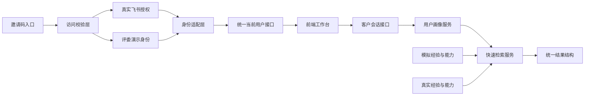
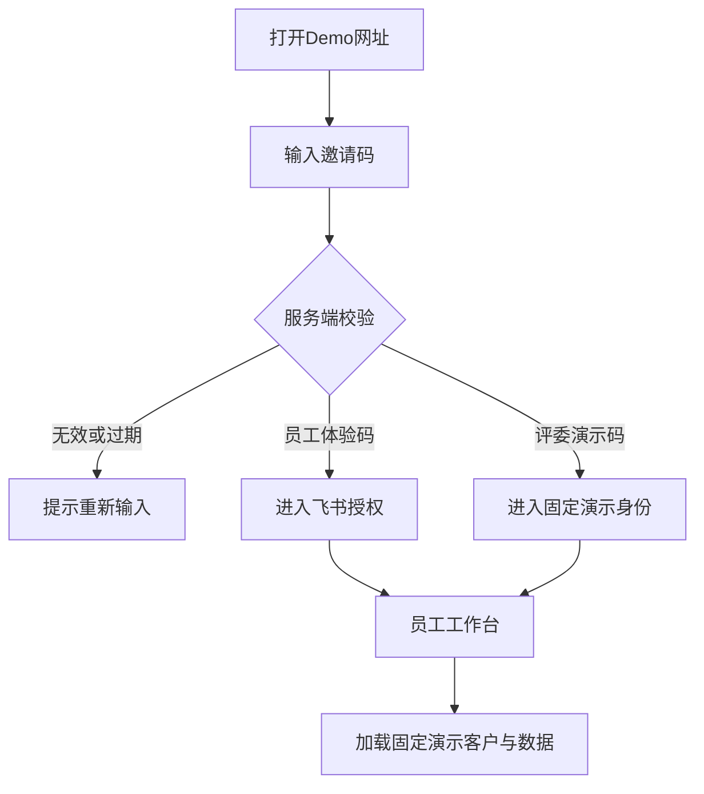
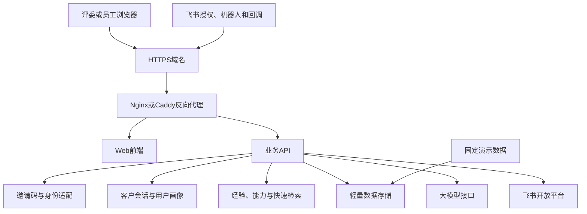

# 三人协作与集成方案

## 1.协作目标

三个人不能各自完成模块后再第一次集成。第一天必须先用Mock服务打通同一条黄金流程，第二天再分别把Mock替换为真实飞书登录、真实AI能力和真实数据。

黄金流程是唯一集成主线：

```text
输入邀请码
→飞书登录或评委演示身份
→进入工作台
→创建客户会话
→输入客户背景
→生成用户画像
→提出问题
→检索经验与能力
→展示快速答案和来源
```

## 2.推荐分工

|成员|主要职责|必须提供的稳定输出|
|---|---|---|
|成员A：飞书与集成|飞书应用、授权登录、回调、邀请码校验、环境配置和部署联调|统一访问状态和当前用户对象|
|成员B：前端与客户上下文|邀请码页面、工作台、客户会话、背景输入、用户画像、多轮提问、结果展示|可调用统一接口的完整页面流程|
|成员C：AI、资产与检索|画像提取、经验卡、能力卡、检索和答案生成|统一画像和检索输出|

成员A负责外部接入边界，但不能成为其他两人的前置阻塞。成员A必须尽早提供Mock访问状态和Mock当前用户；成员B和成员C只依赖统一接口，不直接使用飞书SDK，因此真实飞书授权和部署尚未完成时也能继续开发。

## 3.模块边界



隔离规则：

1.邀请码只控制Demo访问资格，不替代企业员工身份。
2.邀请码明文和飞书Token只存在于服务端，前端只接收访问状态和用户状态。
3.前端不关心当前用户来自真实飞书还是评委演示身份。
4.用户画像服务不读取页面内部状态，只读取客户会话输入。
5.检索服务不读取前端组件，只接收统一的画像和问题。
6.Mock数据与真实数据返回相同结构。

## 4.第一天必须冻结的五个契约

### 4.1访问状态

```text
accessGranted
accessMode
expiresAt
```

### 4.2当前用户

```text
userId
name
avatar
tenantId
loggedIn
```

### 4.3客户方案会话

```text
sessionId
customerName
messages[]
inputs[]
profile
```

### 4.4共享用户画像

```text
goals[]
currentSituation[]
existingSystems[]
constraints[]
unknowns[]
sources[]
```

### 4.5快速检索输出

```text
answer
experiences[]
capabilities[]
citations[]
limitations[]
gaps[]
followUpQuestions[]
```

共享契约一旦冻结，不允许任何成员单独修改。确需修改时必须同时通知三人，并在同一次合并中更新Mock、后端和前端。

## 5.建议接口边界

|动作|输入|输出|负责人|
|---|---|---|---|
|验证邀请码|邀请码|访问状态|成员A|
|获取当前用户|无|当前用户|成员A|
|创建客户会话|客户名称|客户方案会话|成员B或成员C后端部分|
|提交背景|会话ID、文字或文件标识|更新后的输入记录|成员B与成员C共同确认|
|生成用户画像|会话ID|共享用户画像|成员C|
|快速检索|会话ID、用户问题|快速检索输出|成员C|
|渲染结果|快速检索输出|页面答案和来源|成员B|

不需要在第一天设计大量REST接口。只要上述七个动作的输入输出稳定，就可以完成MVP集成。

## 6.代码仓库建议

三人使用一个代码仓库：

```text
apps
├─web             前端工作台
└─api             后端、AI接口和飞书回调
packages
└─contracts       三人共用的数据结构
data
└─demo            Mock客户、经验和能力数据
infra
├─docker          容器与反向代理配置
└─deploy          部署、回滚和健康检查脚本
```

`contracts`是三人协作的唯一事实来源。禁止在前端、飞书模块和AI模块分别复制一份相似但不同的数据结构。

## 7.分支与合并规则

1.主分支始终保持可启动、可进入工作台。
2.每个人使用短功能分支，分支存活不超过一天。
3.第一天中午和晚上至少各合并一次。
4.第二天下午停止开发新能力，只合并、回归和修复阻断问题。
5.每次合并前必须从登录开始执行一次黄金流程。
6.真实服务失败时可以切换Mock，但页面必须明确当前是演示数据。
7.禁止三个人分别维护三个无法一起启动的项目。
8.部署配置与代码同时进入仓库，禁止只存在于某个人电脑的手工步骤。

## 8.两天协作节奏

### 开始后两小时

三人共同完成：

- 冻结五个共享契约。
- 确认七个关键动作。
- 准备Mock当前用户、客户、经验和能力数据。
- 确认黄金流程和验收标准。

### 第一天中午：第一次合并

- 成员A提交Mock访问状态、Mock当前用户接口、邀请码校验和真实飞书授权骨架。
- 成员B完成邀请码页、登录后工作台和客户会话框架。
- 成员C提交固定用户画像和固定检索输出。
- 三者第一次在主分支联通。

### 第一天晚上：Mock全链路

必须能够完成：

```text
输入测试邀请码
→模拟登录
→创建客户会话
→输入背景
→生成画像
→模拟检索
→展示答案和来源
```

如果第一天晚上仍未联通，第二天不得继续增加功能。

### 第二天上午：替换Mock

- 成员A：完成邀请码、真实飞书登录和测试环境部署，保持访问状态和当前用户结构不变。
- 成员B：完善用户画像、多轮提问和异常状态。
- 成员C：有数据时接入真实经验与能力；无数据时完善统一数据适配层。

### 第二天下午：集成冻结

- 不再修改共享契约。
- 合并所有可运行功能。
- 连续执行三次黄金流程。
- 保存一个稳定版本标签。
- 保留模拟登录和模拟数据作为备用。

## 9.合并验收清单

- [ ] 真实登录与模拟登录返回相同用户结构。
- [ ] 邀请码只决定访问资格，不直接伪造飞书员工身份。
- [ ] 邀请码明文不出现在前端代码、URL和普通日志中。
- [ ] 前端没有读取飞书Token。
- [ ] 客户会话、用户画像和检索使用同一个会话ID。
- [ ] 用户画像提取结果可以直接传给检索服务。
- [ ] Mock检索与真实检索返回相同结果结构。
- [ ] 前端不需要根据真实或Mock数据编写两套页面。
- [ ] 第二轮提问继续使用同一用户画像。
- [ ] 所有成员能够在本地启动完整项目。
- [ ] 主分支可以独立完成黄金流程。
- [ ] 任一真实外部服务失败时存在可演示的降级方案。

## 10.最容易导致无法合并的问题

|风险|表现|预防方式|
|---|---|---|
|等待真实飞书登录|其他成员无法进入工作台|第一小时提供Mock当前用户|
|邀请码与登录耦合|邀请码逻辑修改导致工作台无法进入|访问校验和身份认证使用两个独立接口|
|三人各自定义数据结构|字段名称、层级和含义不同|只允许`contracts`保存共享结构|
|前端写死演示数据|真实接口接入后需要重写页面|所有数据通过统一服务读取|
|真实数据和Mock结构不同|切换数据源后页面崩溃|两个适配器执行同一契约|
|功能分支长期不合并|最后一天出现大量冲突|每天至少合并两次|
|接口完成后才设计页面|交互和数据无法对应|先用固定返回结构打通页面|
|同时追求真实和完整|两天内没有稳定版本|先Mock全链路，再逐项替换|

最终协作原则：第一天先把三个人的模块连起来，第二天再提高每个模块的真实性；任何功能只有进入主分支并通过黄金流程，才算完成。

## 11.邀请码功能方案

### 11.1产品目的

邀请码用于比赛Demo的受控访问和仪式感，解决三个问题：

1.限制未授权人员访问公网Demo。
2.让评委进入一个准备好的稳定演示环境。
3.在飞书租户或账号条件不满足时提供明确的评委演示模式。

邀请码不是企业账号系统，不承担员工身份、权限或租户隔离。通过邀请码后，用户仍需飞书登录；只有专门配置的评委演示码才允许进入固定演示身份，并在界面中明确显示“评委演示模式”。

### 11.2推荐流程



### 11.3 MVP范围

必须完成：

- 一个简洁的邀请码输入页面。
- 服务端校验邀请码。
- 邀请码有效期和启用状态。
- 校验成功后签发短期访问会话。
- 员工体验码和评委演示码两种模式。
- 错误、过期和网络失败提示。

暂不完成：

- 邀请码管理后台。
- 用户自行注册和找回。
- 邀请关系、裂变和统计报表。
- 复杂的一人一码系统。
- 邮件、短信或飞书自动发码。

### 11.4最小服务端数据

```text
codeHash
label
mode            feishu_required或guest_demo
enabled
expiresAt
maxUses
usedCount
```

Demo早期可以通过服务端环境变量保存一个或两个邀请码哈希；只有需要多个评委码时再使用轻量数据库或JSON配置。禁止将有效邀请码明文写入前端代码。

### 11.5最小接口

|接口|用途|返回|
|---|---|---|
|POST /api/access/redeem|校验邀请码|访问状态并设置HttpOnly访问Cookie|
|GET /api/access/status|恢复访问状态|是否通过、模式和过期时间|
|POST /api/access/logout|退出Demo访问|清除访问Cookie|

### 11.6基础安全要求

- 邀请码仅通过请求体提交，不放在URL中。
- 服务端保存邀请码哈希，不记录邀请码明文。
- 校验接口增加简单频率限制，例如每个IP每分钟5次。
- 访问Cookie使用HttpOnly、Secure和SameSite属性。
- 演示身份只读取固定演示数据，不接触真实企业数据。
- 比赛结束后可以统一关闭邀请码或停用Demo环境。

### 11.7演示体验建议

邀请码页面只保留产品名、一句话价值、邀请码输入框和“进入体验”按钮。验证成功后直接进入飞书授权或评委演示身份，避免增加注册、协议确认和多步引导。完整过程控制在10秒内。

## 12.环境规划

|环境|用途|身份模式|数据模式|访问方式|
|---|---|---|---|---|
|本地环境|个人开发和单元联调|Mock优先，可连接飞书测试应用|Mock数据|localhost|
|测试环境|三人每日集成和飞书回调|真实飞书+评委演示身份|Mock或少量真实数据|固定HTTPS测试域名|
|演示环境|评委体验和现场展示|邀请码+真实飞书或评委演示身份|固定、脱敏、可重置的演示数据|固定HTTPS正式域名|

三套环境必须使用相同的数据契约和页面代码，只通过服务端配置切换：

```text
AUTH_MODE=mock或feishu
DATA_MODE=mock或real
INVITE_MODE=off或on
DEMO_GUEST_MODE=off或on
```

环境变量名称可以调整，但开关含义必须固定。前端不得根据部署环境维护三套业务逻辑。

## 13.部署架构

### 13.1比赛Demo推荐拓扑



### 13.2云资源建议

比赛阶段使用一台阿里云ECS即可：

- 推荐4核8GB，外部调用大模型，不在服务器本地运行大模型。
- 使用Docker Compose运行反向代理、Web和API。
- 小规模数据使用JSON、SQLite或现有轻量数据库，不建设复杂数据库集群。
- 需要上传文件时再使用阿里云OSS。
- 已有备案域名时优先国内节点；未完成备案时可使用中国香港节点，并提前测试飞书回调延迟。

### 13.3端口与公网边界

- 公网只开放80和443，80跳转443。
- Web、API和数据服务使用内部容器网络。
- 数据库和调试端口不得直接暴露公网。
- 飞书回调、授权回调和健康检查使用固定HTTPS地址。
- 服务器管理入口限制来源IP或使用密钥登录。

## 14.部署步骤

### 14.1首次部署

1.购买或准备ECS，安装Docker和Docker Compose。
2.配置域名解析和HTTPS证书。
3.部署反向代理、Web和API容器。
4.在服务端配置飞书应用凭据、大模型密钥和邀请码哈希。
5.配置飞书授权回调和事件回调地址。
6.导入固定演示数据。
7.执行健康检查和黄金流程。
8.创建第一个稳定版本标签。

### 14.2日常更新

```text
代码合并到主分支
→自动或手动构建容器镜像
→部署到测试环境
→执行黄金流程
→标记候选版本
→手动发布到演示环境
```

演示环境不建议每次提交自动更新。测试环境可以跟随主分支，演示环境只接收通过回归的版本标签。

### 14.3发布责任

|事项|主负责人|协助人|
|---|---|---|
|服务器、域名、HTTPS和环境变量|成员A|成员B|
|前端构建和静态资源检查|成员B|成员A|
|API、AI依赖和演示数据初始化|成员C|成员A|
|发布前黄金流程回归|成员B|全员|
|演示环境最终放行|成员A|全员确认|

任何成员都必须能够根据仓库文档重新部署，不能只有成员A知道服务器手工配置。

## 15.版本、回滚与数据重置

### 15.1版本策略

- `main`：当前可运行的集成版本。
- `mvp-v0.1`：首个稳定MVP。
- `demo-v0.x`：每次通过演示回归的候选版本。
- `demo-final`：比赛现场使用版本。

### 15.2回滚

- 服务器至少保留当前版本和上一个稳定版本的镜像。
- 发布失败时切换到上一个镜像，不在演示服务器现场修改代码。
- 环境变量和反向代理配置纳入备份。
- 每次正式发布前导出演示数据快照。

### 15.3演示数据重置

评委可能多次操作同一客户会话，因此需要可重复演示：

- 准备固定种子数据。
- 每次演示前一键恢复初始会话、画像、经验和能力。
- 重置操作只允许团队内部执行，不对邀请码用户开放。
- 真实飞书群、文档和消息不得在重置时被误删；Demo阶段优先使用固定测试群或Mock外部标识。

## 16.监控与现场降级

### 16.1最低监控

- `/health`返回Web、API和数据读取状态。
- 记录请求时间、错误类型和调用链标识。
- 不记录飞书Token、邀请码明文和完整客户敏感原文。
- 演示前检查飞书、大模型和数据服务是否可用。

### 16.2三级降级

|故障|第一降级|最终保障|
|---|---|---|
|飞书授权失败|使用评委演示邀请码进入固定身份|展示预录的真实飞书授权片段|
|赛方数据未到|使用结构一致的Mock经验和能力|展示数据替换边界说明|
|大模型超时|返回固定演示问题的缓存结果|切换本地演示快照|
|云端网络异常|使用本地启动版本|播放备用演示录屏|
|发布版本故障|回滚上一个稳定镜像|使用冻结的`demo-final`包|

降级必须明确标识，不能伪造实时模型或真实专家反馈。

## 17.部署验收清单

- [ ] 邀请码有效、无效和过期状态均有明确反馈。
- [ ] 邀请码通过后可以分别进入飞书登录和评委演示模式。
- [ ] HTTPS、域名、飞书授权回调和事件回调可访问。
- [ ] 前端代码和日志中没有邀请码明文、飞书Token和模型密钥。
- [ ] 测试环境和演示环境使用相同代码与数据契约。
- [ ] 演示环境只发布经过黄金流程回归的版本标签。
- [ ] 可以在10分钟内回滚到上一个稳定版本。
- [ ] 可以恢复固定演示数据。
- [ ] 本地备用版本能够在云服务不可用时完成主要演示。
- [ ] 三名成员都知道部署、回滚和现场降级步骤。
