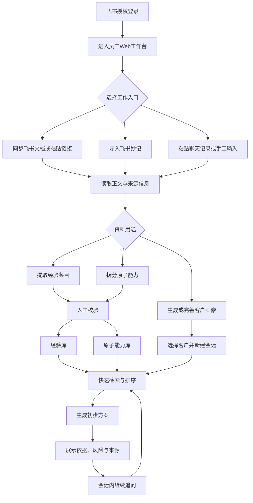

# 淘到宝引擎V0.5 MVP方案

## 1.版本定义

V0.5不是完整产品，也不是一次性演示页面，而是后续快速检索、深度检索和经验智能平台共同复用的产品骨架。

本版本只完成一条稳定闭环：

> 飞书登录与资料导入→AI结构化处理→人工校验→客户画像复用→快速检索→生成有来源的初步方案→会话内继续追问。

V0.5优先证明三件事：

1.企业文档可以转化为可复用的经验和原子能力，而不只是被全文搜索。
2.同一客户画像可以被不同任务持续复用。
3.系统能够依据已校验资产快速生成方案，并区分企业依据与AI建议。

## 2.产品骨架原则

1.数据先进入资产层，再进入检索和生成链路。
2.快速检索与未来深度检索共用客户画像、经验库和原子能力库。
3.V0.5只做单流程快速检索，不使用多Agent。
4.所有结论保留来源，不使用难以解释的可信度百分比。
5.先保证资产可复用、状态可追踪、会话可恢复，再扩展高级能力。

## 3.功能抽象

|抽象模块|V0.5职责|是否纳入|
|---|---|---|
|身份与权限接入|飞书授权登录、识别当前员工|是|
|业务资料接入|选择飞书文档、粘贴飞书链接、导入飞书妙记、粘贴聊天记录、手工输入|是|
|文档读取|读取正文、作者、更新时间、来源链接等必要信息|是|
|AI标签系统|对资料进行可编辑的业务标签提取|是|
|客户画像|一个客户一个画像，供快速检索与未来深度检索共用|是|
|经验沉淀|从历史方案、复盘等资料中提取主要经验并人工校验|是|
|原子能力拆分|从PRD中拆分可复用、可组合的企业能力并人工校验|是|
|会话管理|一个客户可建立多个独立会话，支持追问和恢复|是|
|快速检索|检索已校验经验与原子能力，排序后生成初步方案|是|
|最小结果页|展示需求理解、建议、依据、风险、来源与追问入口|是|
|复杂文档解析平台|统一解析PDF、图片、表格、扫描件等复杂格式|否|
|全量数据自动清洗|批量去重、纠错、合并和质量治理|否|
|复杂向量数据库|多路召回、重排、知识图谱等复杂检索设施|否|
|多Agent|任务规划、并行研究、审计等多角色协作|否|
|深度检索|多轮检索、补充研究、专家协作|否|
|飞书自动建群|自动邀请专家并组织反馈闭环|否|
|飞书文档发布|把结果创建为飞书云文档或推送到群|否|

## 4.总体流程

## 5.范围边界

### 5.1必须完成

- 飞书授权登录。
- 飞书文档选择与飞书链接导入至少打通一种主路径，另一种作为降级路径。
- 飞书妙记导入；无权限或导出失败时允许粘贴转写文本。
- 正文、来源链接、作者、最近修改时间同步。
- AI标签生成、人工修改和空标签容错。
- 一个客户一个可复用画像。
- 经验提取与人工校验。
- PRD原子能力拆分与人工校验。
- 一个客户多个独立会话，多轮追问，刷新后恢复。
- 已校验资产的快速检索、优先级排序和方案生成。
- 最小结果页和来源跳转。

### 5.2明确不做

- 自动枚举员工有权限访问的全部飞书资料。
- 递归同步全部文件夹和知识库。
- 任意文档的实时更新监听。
- 飞书聊天记录直接批量同步。
- 图片、扫描件、复杂表格和附件的完整解析。
- 用户画像自动增量合并、版本管理和冲突处理。
- 段落级、块级精确引用。
- 复杂向量库、混合检索、知识图谱和重排模型。
- Deep Research和Multi-Agent。
- 自动拉群、专家自动邀请和反馈回写。
- 创建飞书云文档、结果导出和群内推送。
- PPT自动生成、复杂权限体系和多租户商业能力。

## 6.飞书接入与资料导入

### 6.1登录

员工通过飞书网页授权登录Web工作台。系统只保存完成业务所需的最小身份信息和令牌，不把邀请码作为第二套账号体系。若比赛演示需要限制访问，可在飞书登录后增加一次性邀请码校验。

### 6.2飞书文档

主路径：登录后由员工选择飞书云空间中的文档。

降级路径：员工复制飞书文档链接到工作台，系统解析令牌并读取文档。

V0.5同步以下信息：

- 文档标题。
- 文档正文纯文本。
- 文档所有者或创建者。
- 最近修改时间。
- 原始飞书链接。

不承诺自动列出员工可访问的全部文档。官方文件列表接口以文件夹为范围，V0.5只列出根目录或当前选择目录；知识库或子文件夹由用户继续选择或使用链接导入。

### 6.3飞书妙记

飞书妙记用于补充新客户背景和生成客户画像。系统搜索用户可访问的妙记并导出转写文本；若妙记尚未转写完成、用户无导出权限或接口失败，则提示员工粘贴转写文本，不能伪装成导入成功。

### 6.4聊天记录

V0.5只支持员工粘贴与客户的聊天记录。直接同步个人聊天记录不纳入本版本，因为官方消息历史接口要求应用机器人在目标会话中，且受权限和可见范围约束。

### 6.5技术可行性与官方依据

|能力|V0.5判断|官方依据|
|---|---|---|
|飞书网页授权登录|可实现|[获取用户访问凭证](https://open.feishu.cn/document/authentication-management/access-token/get-user-access-token)、[获取登录用户信息](https://open.feishu.cn/document/server-docs/authentication-management/login-state-management/get)|
|列出指定目录文档|可实现，但不是全企业全量枚举|[获取文件夹中的文件清单](https://open.feishu.cn/document/server-docs/docs/drive-v1/folder/list)|
|通过链接读取新版文档|可实现，需授权与文档权限|[获取文档纯文本内容](https://open.feishu.cn/document/server-docs/docs/docs/docx-v1/document/raw_content)|
|读取所有者和修改时间|可实现|[批量获取文件元数据](https://open.feishu.cn/document/server-docs/docs/drive-v1/meta/batch_query)|
|搜索飞书妙记|可实现，受用户权限范围限制|[搜索妙记](https://open.feishu.cn/document/uAjLw4CM/ukTMukTMukTM/minutes-v1/minute/search)|
|导出妙记转写文本|可实现，妙记需完成转写且允许导出|[获取妙记转写文本](https://open.feishu.cn/document/minutes-v1/minute-transcript/get)|
|直接同步个人聊天历史|V0.5拒绝|[获取会话历史消息](https://open.feishu.cn/document/server-docs/im-v1/message/list?lang=zh-CN)|
|AI结构化标签与字段提取|可实现|[结构化输出](https://www.volcengine.com/docs/85637/1860299?lang=zh)|
|任意飞书文档实时监听|V0.5拒绝；仅在打开页面或手动刷新时比对更新时间|[订阅文档事件](https://open.feishu.cn/document/server-docs/docs/drive-v1/event/overview)|

## 7.资料列表、标签与状态

### 7.1资料类型

“资料类型”表示业务内容类型，不表示DOCX、PDF等文件格式。它是可空标签，示例包括：

- PRD。
- 方案。
- 复盘。
- 会议纪要。
- 聊天记录。

### 7.2最小标签维度

|标签维度|数量规则|示例|
|---|---|---|
|资料类型|0至1个|PRD、方案、复盘|
|行业|0至多个|制造、零售、金融|
|业务场景|0至多个|售前调研、智能质检|
|客户问题|0至多个|人工成本高、响应慢|
|能力|0至多个|知识检索、工单生成|
|产品或系统|0至多个|飞书妙记、客服系统|
|适用条件|0至多个|已有知识库、允许私有化|
|风险或限制|0至多个|缺少样本、依赖人工确认|

所有标签都允许为0个，不强迫AI猜测。系统优先从可维护的标签词表中选择，员工可以修改、删除和补充。作者、更新时间、来源链接和飞书文件格式属于元数据，不属于标签。

### 7.3失败降级

- 文档同步成功但AI处理失败：保留原文和来源，标记“待校验”，允许人工补标签。
- 文档过长：明确提示未完整分析，分段处理或等待重新处理；不能静默截断后声称已完成。
- 模型输出格式错误：自动重试一次；再次失败后保留原文并转人工处理。
- 不显示无法解释的可信度百分比。

### 7.4审核状态与时效信息

所有AI生成的标签、经验条目和原子能力统一使用三种审核状态：

- 待校验：AI已生成，尚未经过人工确认。
- 已校验：人工确认后可以参与检索和方案生成。
- 已打回：内容不成立，保留记录但不参与检索。

原文时效不是审核状态，单独显示：

- 原文最新。
- 原文有更新。
- 最近修改时间。

界面可组合展示为“已校验｜原文最新”“已校验｜原文2小时前有更新”“待校验｜10分钟前生成”“已打回｜昨天审核”。若原文更新，系统继续保留上一已校验版本供检索，但必须显示“可能过期”，等待重新校验。

## 8.可复用客户画像

### 8.1核心规则

- 一个客户只对应一个客户画像。
- 一个客户可以创建多个会话，所有会话读取同一份画像。
- 快速检索和未来深度检索读取同一份画像。
- 当前任务问题属于会话，不写入长期画像。
- V0.5不处理新信息自动更新、增量合并、历史版本和冲突。

### 8.2画像来源

- 飞书妙记转写。
- 同步的飞书文档。
- 粘贴的客户聊天记录。
- 员工手工输入。

### 8.3画像字段

|字段|说明|
|---|---|
|客户基本信息|名称、行业、地区、规模等|
|业务背景|客户所处业务和当前阶段|
|现有环境|已使用的产品、系统和流程|
|核心问题|客户明确或可从材料中提取的问题|
|业务目标|希望达到的结果|
|约束条件|预算、周期、合规、技术和组织限制|
|决策相关人|已知角色及其关注点|
|沟通偏好|客户表达、决策和材料偏好|
|信息缺口|当前资料中仍未确认的信息|

所有字段允许为空。AI只能从来源中提取和归纳，不得补写不存在的客户事实。画像字段保留来源引用，员工可以人工修改。

## 9.经验库

### 9.1目标

经验库回答“企业过去真实做过什么”。AI不是把整篇文档直接当作方案，而是从历史方案或复盘中提取一条可复用的主要经验，再交给人工校验。

V0.5默认一份资料提取一条主要经验，避免把范围扩展为复杂知识抽取平台。

### 9.2经验字段

|字段|说明|
|---|---|
|经验名称|对经验的简短概括|
|适用场景|该经验适合处理的业务场景|
|核心问题|当时解决了什么问题|
|主要方案|实际采用的主要做法|
|前置条件|方案成立所需条件|
|实际结果|资料中明确记录的结果|
|后续铺垫|该方案为哪些后续能力或动作提供基础|
|适用边界|不适用情况和限制|
|来源信息|文档链接、所有者、修改时间|
|业务标签|行业、场景、问题、能力等|

所有字段允许为空，尤其不能凭空生成实际结果。若“后续铺垫”不是原文事实而是模型推断，必须标记为“AI推断”，只有人工确认后才作为已校验事实使用。

### 9.3审核规则

- 内容合格：标记“已校验”。
- 部分不合格：员工修改错误字段，确认后标记“已校验”。
- 整体不成立：标记“已打回”。
- 只有已校验经验参与快速检索。
- 待校验和已打回内容不得进入生成上下文。
- V0.5只保留文档级来源链接，不做段落级精确定位。

## 10.原子能力库

### 10.1目标

原子能力库回答“企业现在能够提供什么”。系统从PRD中拆分多个可独立描述、可复用、可组合的能力，供方案生成时排列组合。

### 10.2原子能力判断标准

- 只描述一个主要能力。
- 具有明确的输入和输出。
- 可以被多个方案复用和组合。
- 不绑定某个具体客户。
- 不是一整套完整方案。
- 不是按钮、页面等单纯交互动作。

### 10.3能力字段

|字段|说明|
|---|---|
|能力名称|能力的业务化名称|
|解决问题|能力主要解决什么问题|
|输入|能力需要什么信息或数据|
|处理动作|能力执行的核心动作|
|输出|能力产生什么结果|
|前置条件|运行所需条件|
|依赖能力|必须配合的其他能力|
|适用场景|能力适合的业务场景|
|限制|能力不能做什么或有哪些边界|
|来源|对应PRD链接、所有者和修改时间|

输入、输出、限制是通过人工校验前必须补全的核心字段。AI可先留空，但字段不完整时不得标记为已校验。

### 10.4审核规则

- 一份PRD可以拆分多个原子能力。
- 每个能力独立执行“待校验→人工修改或确认→已校验/已打回”。
- 只有已校验能力参与快速检索和方案组合。
- 待校验和已打回能力不得进入生成上下文。

## 11.客户会话与上下文

### 11.1会话规则

- 一个客户可以建立多个会话。
- 每个会话处理一个相对独立的业务问题。
- 所有会话共享客户画像，但默认不共享其他会话的聊天历史。
- 会话支持多轮追问、自动标题、保存和刷新恢复。
- 数据结构预留“快速检索/深度检索”任务类型，V0.5只开放快速检索。

### 11.2单次回答使用的上下文

系统只能使用：

1.当前客户画像。
2.当前会话历史。
3.员工本轮输入。
4.检索到的已校验经验。
5.检索到的已校验原子能力。

系统不得使用：

- 其他客户画像。
- 其他会话的聊天历史。
- 待校验或已打回资产。
- 本轮对话中尚未被员工确认的新客户事实。

## 12.快速检索

### 12.1定位

快速检索面向员工在面对面沟通或短时售前场景中的即时使用。它只执行一次检索和一次生成，不启动多Agent，不进行多轮自动研究。

### 12.2硬过滤

进入候选集前必须同时满足：

- 资产状态为“已校验”。
- 当前员工拥有对应来源的访问权限。
- 来源未被删除。

### 12.3经验排序

经验排序优先级从高到低为：

1.与当前客户问题直接匹配。
2.与客户约束条件匹配。
3.适用场景相同。
4.客户画像和行业相似。
5.经验字段完整。
6.来源更新时间，仅用于同等匹配时的排序。

核心原则：同问题但不同行业的经验，应高于同行业但不同问题的经验。

### 12.4原子能力排序

1.能够直接解决当前核心问题。
2.输入和输出与当前需求匹配。
3.前置条件已满足。
4.依赖能力完整。
5.限制不会阻断当前场景。
6.来源更新时间，仅用于同等匹配时的排序。

### 12.5召回数量与分层

- 经验最多优先展示3条。
- 原子能力最多优先展示5条。
- 不展示伪精确的相似度或可信度百分比。
- 结果按“核心依据、补充依据、参考材料”分层。

若没有匹配的企业资产，系统必须明确提示“当前知识库无匹配依据”。此时只能另列“AI探索建议”，不得伪装为企业已有能力或正式企业方案，也不得虚构客户名、产品名和效果数字。

### 12.6V0.5技术方案

V0.5先使用结构化字段过滤、标签匹配和关键词全文检索完成最小RAG，不强制引入向量数据库。数据量增加后再扩展向量召回、重排和混合检索。

官方依据：

- [CloudBase数据库索引](https://cloud.tencent.com/document/product/876/19371)
- [CloudBase数据库查询](https://cloud.tencent.com/document/product/876/46897)
- [PostgreSQL全文检索函数](https://www.postgresql.org/docs/current/functions-textsearch.html)

## 13.最小结果页

快速检索结果按以下顺序展示：

1.需求理解。
2.首要建议。
3.核心依据：最相关的已校验经验。
4.关键原子能力组合。
5.前置条件与风险。
6.待确认信息。
7.补充依据和全部来源链接。
8.建议追问。

优先呈现最能支持员工继续沟通的内容，但前置条件和风险不得隐藏。结果保存在当前会话中，员工可继续追问，刷新页面后可以恢复。

V0.5不创建飞书云文档、不导出文件、不推送群聊，也不做正式方案版本管理。

## 14.最小数据对象

V0.5只保留七类核心对象，避免为普通Demo引入复杂数据模型：

1.用户：飞书身份和最小权限信息。
2.来源资料：标题、正文、来源、所有者、更新时间、标签和状态。
3.客户画像：客户长期背景、问题、目标、约束和信息缺口。
4.经验条目：从历史方案或复盘中提取的已校验经验。
5.原子能力：从PRD中拆分的已校验能力。
6.会话：客户、任务类型、标题和当前会话上下文。
7.消息与结果：员工输入、AI回答、命中依据、来源链接和生成时间。

这七类对象已经能够支持V0.5快速检索闭环，并为未来Deep Research复用同一客户画像、经验库和原子能力库保留扩展空间。
