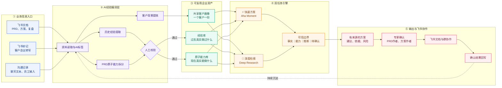

# 淘到宝引擎方案与数据需求

## 1.方案如何设计

淘到宝引擎是一款面向神州数码销售与售前员工的方案副驾驶。它不是在企业文档上再加一个聊天框，而是把散落的客户信息、历史经验和产品能力“编译”为可校验、可组合、可持续复用的组织资产。

整个方案可以概括为：

> 一份共享客户画像＋两类企业资产＋两条任务引擎＋一套可信边界＋一个经验反馈飞轮。

### 1.1产品全景思维图

### 1.2五个核心机制

|核心机制|设计方式|解决的问题|
|---|---|---|
|共享客户画像|一个客户只维护一份画像，快速方案与深度检索共同读取|避免每次任务重复介绍客户，也避免两条流程产生不同理解|
|经验库|把方案和复盘提取为问题、方案、前置条件、结果、风险与来源|让员工复用真实项目经验，而不是只得到相似文档片段|
|原子能力库|把PRD拆成有输入、输出、依赖和限制的可组合能力|避免AI虚构产品能力，并支持针对不同客户重新编排方案|
|可信边界|输出中区分历史事实、企业能力、AI推断和待确认信息|让员工知道哪些可以引用、哪些必须进一步确认|
|经验反馈飞轮|员工或专家确认结果后，重新沉淀到经验库|让企业在每次方案工作后积累新的组织资产|

### 1.3两条任务线路

#### 快速方案：现场获得“Aha Moment”

员工在Web工作台选择客户并输入本轮问题。系统加载共享画像，用已校验经验回答“过去怎样解决”，用已校验原子能力回答“现在能够提供什么”，再快速组合成初步方案。

输出优先展示需求理解、首要建议、关键能力组合、最相关经验、前置条件、风险、来源和下一步建议。快速方案只执行简化检索流程，不启动多Agent，以响应速度和稳定性优先。

#### 深度检索：在飞书中完成研究与确认

复杂任务由员工在飞书中发起。系统围绕同一客户画像进行多轮资料检索、方案比较和事实审核；遇到关键缺口时，根据PRD作者或历史方案作者推荐相关人员，经员工确认后进入飞书群协作，并把研究结果整理成飞书文档。

深度检索可以使用职责明确的多个Agent，但多Agent只是完成复杂研究的手段，不是产品本身的创新点。

### 1.4最终输出

淘到宝引擎输出的不是一份无法验证的“漂亮答案”，而是一份内部可继续加工的方案底稿，至少包含：

- 客户需求理解。
- 推荐的总体方向。
- 可以组合的企业原子能力。
- 支撑判断的历史经验。
- 前置条件、风险和能力边界。
- 企业来源、AI推断和待确认信息。
- 建议追问的问题和相关专家。

Web负责快速工作，飞书负责资料接入、深度研究和协作；两者始终共用同一套客户画像、经验库和原子能力库。

## 2.需要哪些数据

### 2.1最低数据需求

|数据类型|建议数量|需要包含的内容|用途|
|---|---:|---|---|
|客户需求资料|1至3组|客户背景、当前情况、核心问题、目标和约束|生成客户画像并提供检索上下文|
|历史方案、案例或项目复盘|5至10份|业务问题、主要方案、使用能力、前置条件、结果、风险|建立经验库并匹配过去的解决方式|
|产品PRD或能力说明|3至5份|能力说明、输入、输出、前置条件、依赖和限制|建立原子能力库并组合当前可提供的能力|
|资料基本信息|随资料提供|资料类型、作者或匿名角色、更新时间、来源标识|展示来源、时效并支持后续专家确认|

以上资料可以完全脱敏，不需要真实客户名称、人员姓名、金额或敏感技术参数。可以使用“客户A”“方案作者B”“产品负责人C”等匿名标识，但希望保留问题、方案、能力和限制之间的真实业务关系。

### 2.2有条件时希望补充的数据

|数据类型|用途|
|---|---|
|飞书妙记或会议纪要|验证从自然沟通内容生成客户画像|
|与需求不相关的方案或PRD|验证系统能否正确排序，而不是所有资料都返回|
|明确不能支持的需求样例|验证系统能否识别能力边界并拒绝编造|
|业务人员认可的参考答案|验证应该匹配哪些能力、经验和来源|
|PRD作者和历史方案作者的匿名映射|验证复杂任务中寻找相关专家的逻辑|

## 3.为什么需要这些数据

|所需数据|必要性|没有数据会出现的问题|
|---|---|---|
|客户需求资料|让AI理解当前客户，而不是只回答通用问题|无法生成可复用画像，方案缺少客户约束|
|历史方案和复盘|证明企业过去真实做过什么|经验库为空，产品会退化成通用聊天或普通搜索|
|PRD和能力说明|证明企业现在真实能够提供什么|AI只能凭常识生成方案，可能虚构不存在的能力|
|结果、风险和适用条件|判断历史经验是否真的适合当前客户|只能找到相似方案，但不知道能否复用|
|作者和更新时间|保证来源可追溯，并支持寻找相关人员确认|无法判断资料是否过期，也无法形成飞书协作闭环|
|相关与不相关资料|验证检索排序是否正确|只能做固定案例演示，不能证明系统真的会匹配|
|不能支持的需求|验证系统是否知道边界|无法证明产品可以控制AI幻觉|
|业务参考答案|提供客观的业务判断标准|只能判断页面是否好看，不能判断结果是否正确|

我们申请数据不是为了简单填充Demo，而是为了验证三个核心问题：

1.AI能否把历史资料转化为可复用经验。
2.AI能否把PRD拆成可组合、有限制的真实企业能力。
3.AI能否针对具体客户，把正确的经验和能力组合成有依据的方案，并在没有依据时明确拒绝编造。

只要具备少量脱敏但业务关系真实的数据，淘到宝引擎就可以完成一条完整验证链路：

> 客户需求→客户画像→匹配历史经验→匹配当前能力→生成初步方案→展示来源、限制与待确认信息。
