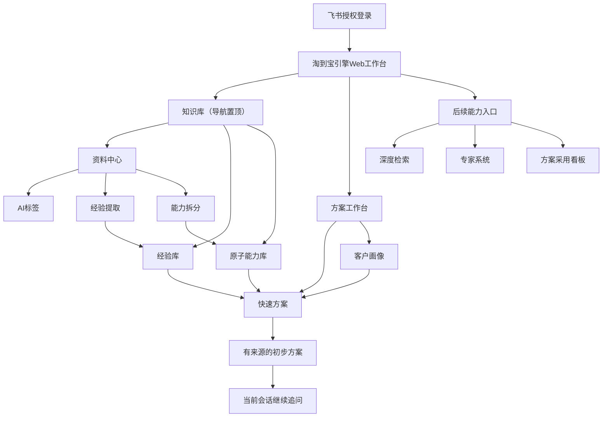
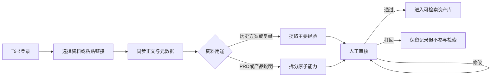
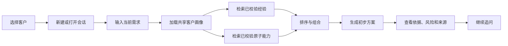

# 淘到宝引擎V0.5产品需求文档

## 0.文档信息

|项目|内容|
|---|---|
|产品名称|淘到宝引擎|
|版本|V0.5 MVP|
|文档状态|产品评审稿|
|更新时间|2026年8月4日|
|目标用户|神州数码销售、售前及经验审核人员|
|产品形态|飞书授权的员工Web工作台|

## 1.产品概述

淘到宝引擎V0.5是一款面向企业销售与售前员工的方案副驾驶。

它把客户背景、历史方案和产品PRD分别转化为三类可复用资产：

1.客户画像：描述客户背景、现状、目标、约束和信息缺口。
2.经验库：描述企业过去真实解决过什么问题、采用了什么方案、取得了什么结果。
3.原子能力库：描述企业现在能够提供什么能力，以及能力的输入、输出、前置条件和限制。

员工选择客户并输入当前需求后，系统读取同一份客户画像，分别检索已校验经验和已校验原子能力，生成有来源、有限制、可继续追问的初步方案。

V0.5只完成快速方案闭环，不实现Deep Research、多Agent、自动建群和飞书结果文档。

## 2.背景与核心问题

### 2.1业务问题

- 历史方案、项目复盘和PRD分散在飞书文档及员工个人经验中。
- 员工能找到文档，但难以判断哪些经验适用于当前客户。
- PRD描述产品功能，却不能直接用于客户方案组合。
- 同一客户背景在不同任务中被重复整理。
- 普通RAG容易混合历史事实、企业能力和AI推断。
- 新员工依赖资深员工记忆，企业经验没有形成持续复用机制。

### 2.2V0.5核心假设

V0.5需要验证：

1.AI能否把历史资料转化为可人工校验、可复用的经验条目。
2.AI能否把PRD拆分为可组合且包含明确边界的原子能力。
3.同一客户画像能否被多个方案会话复用。
4.快速检索能否优先返回真正解决同类问题的经验和能力。
5.系统能否在没有企业依据时明确说明，而不是虚构客户、产品和效果。

### 2.3本版本成功条件

- 员工可以通过飞书授权进入Web工作台。
- 员工可以同步或导入资料，并看到正文来源、作者和更新时间。
- AI可以生成可编辑标签、经验条目、原子能力和客户画像。
- 员工可以确认、修改或打回AI生成的企业资产。
- 只有已校验经验和能力可以参与快速方案生成。
- 一个客户可以建立多个会话，所有会话读取同一份客户画像。
- 快速方案可以展示建议、经验依据、能力组合、风险、待确认项和来源。
- 当前会话支持继续追问，刷新页面后可以恢复。

当前没有业务真值集，因此V0.5不承诺准确率数字。效果评估优先检查检索是否合理、来源是否支持结论、无依据时是否拒绝编造。

## 3.用户与使用场景

### 3.1销售或售前员工

主要任务：

- 登录并导入客户背景。
- 选择或创建客户画像。
- 输入明确需求或未经专业翻译的模糊需求。
- 获取快速方案并继续追问。
- 查看方案所依据的经验、能力和原始资料。

产品不要求销售先把客户表达翻译成行业专家语言。销售可以直接输入原始需求，系统负责结构化理解，并把无法判断的信息列为待确认项。

### 3.2经验审核人员

主要任务：

- 查看AI从历史资料中提取的主要经验。
- 修改错误或不完整字段。
- 将内容标记为已校验或已打回。

### 3.3产品或PRD审核人员

主要任务：

- 查看AI从PRD中拆分的原子能力。
- 确认输入、输出、前置条件和限制。
- 修改、校验或打回能力条目。

## 4.版本范围

### 4.1P0：必须实现

|模块|V0.5能力|
|---|---|
|飞书登录|飞书网页授权、识别当前员工、退出登录|
|资料导入|粘贴飞书文档链接；读取正文、所有者、更新时间和来源|
|飞书资料选择|登录后选择根目录或当前目录中的文档；若开发受阻，保留链接导入主路径|
|妙记与文本|选择可访问妙记或粘贴转写文本；粘贴客户聊天记录和手工背景|
|资料中心|查看资料类型、作者、更新时间、标签、处理状态和原文时效|
|AI标签|生成可为空、可编辑的业务标签|
|客户画像|一个客户一份画像；支持AI生成、人工修改和确认|
|经验库|从历史方案或复盘提取一条主要经验并人工审核|
|原子能力库|从一份PRD拆分多个原子能力并逐条审核|
|客户会话|一个客户多个会话；自动绑定画像；支持多轮追问和恢复|
|快速检索|分别检索已校验经验与能力，按业务优先级排序|
|快速方案|展示需求理解、建议、依据、能力组合、风险、待确认项和来源|

### 4.2P1：不阻断主流程

- 比赛演示环境邀请码；飞书登录后进行一次校验，不替代飞书身份。
- 登录后可视化选择飞书文档；如果权限或目录接口无法稳定完成，继续使用粘贴链接。
- 资料批量选择与批量处理。
- 会话自动标题优化。
- 结果复制为Markdown文本。

### 4.3明确不做

- Deep Research。
- Multi-Agent。
- 飞书机器人研究流程。
- 自动创建群聊和邀请专家。
- 创建或写入飞书结果文档。
- 自动同步个人聊天历史。
- 自动枚举员工有权限访问的全部飞书资料。
- 递归同步全部文件夹和知识库。
- 任意飞书文档的实时更新监听。
- 图片、扫描件、复杂表格和附件的完整解析。
- 用户画像自动增量更新、版本管理和冲突处理。
- 段落级、块级精确引用。
- 复杂向量数据库、知识图谱、混合检索和重排模型。
- PPT生成、完整企业权限体系和多租户商业能力。

## 5.产品信息架构

登录后的默认首页仍是快速方案，但侧边导航将知识库置顶，先呈现资料中心、经验库和原子能力库，再呈现方案工作台。V0.5不把低频数据看板设为默认首页。

### 5.1一级导航

1.知识库。
   - 资料中心。
   - 经验库。
   - 原子能力库。
2.方案工作台。
   - 快速方案。
   - 客户画像。
3.后续能力。
   - 深度检索。
   - 专家系统。
   - 方案采用看板。

深度检索、专家系统和方案采用看板可以显示为“V1.0规划”入口，但不得触发虚假的研究、专家匹配、建群、文档发布或数据统计流程。看板中的演示数据必须明确标记为模拟数据。

专家系统未来根据PRD作者、历史方案撰写者、经验贡献者与审核人推荐相关专家，并通过飞书机器人承接建群、问题同步和反馈回写。

方案采用看板未来展示每个方案的生成次数、实际采用次数和采用率。采用必须来自员工明确标记或已确认项目协作记录，查看、复制和生成行为不计为采用。

## 6.黄金用户流程

### 6.1首次建立企业资产

### 6.2建立客户画像

### 6.3快速方案

## 7.详细功能需求

## 7.1飞书登录与演示访问控制

### 功能目标

确认员工身份，并让后续资料读取遵循当前用户的飞书权限。

### 功能要求

|编号|优先级|要求|
|---|---|---|
|AUTH-01|P0|未登录用户只能看到产品介绍和“使用飞书登录”按钮|
|AUTH-02|P0|点击登录后进入飞书网页授权，成功后返回原页面|
|AUTH-03|P0|登录后显示员工头像、姓名和当前飞书空间|
|AUTH-04|P0|用户可以主动退出；退出后清除本地访问凭证|
|AUTH-05|P0|授权失败、取消或过期时显示可理解的错误和重试入口|
|AUTH-06|P1|演示环境开启邀请码时，员工在飞书登录后输入邀请码；同一账号通过一次后无需重复输入|

### 业务规则

- 邀请码只用于限制比赛演示访问，不替代飞书登录和飞书资料权限。
- 令牌不得展示在前端页面或写入前端日志。
- 登录成功不等于可以读取全部资料，系统仍需按具体文档权限处理。

## 7.2资料同步与导入

### 支持的输入方式

1.登录后选择飞书根目录或当前目录中的新版文档。
2.粘贴飞书新版文档链接。
3.选择可访问的飞书妙记。
4.粘贴妙记转写文本。
5.粘贴客户聊天记录或手工背景。

### 同步字段

- 文档标题。
- 纯文本正文。
- 飞书文档标识。
- 原始链接。
- 所有者或创建者。
- 最近修改时间。
- 同步时间。
- 资料类型。

### 功能要求

|编号|优先级|要求|
|---|---|---|
|DOC-01|P0|员工粘贴新版飞书文档链接后，系统识别文档标识并检查访问权限|
|DOC-02|P0|权限通过后读取正文、标题、所有者、最近修改时间和来源链接|
|DOC-03|P0|同一飞书文档重复导入时更新原记录，不重复创建资料|
|DOC-04|P0|同步成功后自动进入AI标签及对应的经验提取或能力拆分流程|
|DOC-05|P0|同步失败时保留错误原因和重试按钮，不生成空白资产|
|DOC-06|P0|员工可以粘贴聊天记录或妙记文本用于生成客户画像|
|DOC-07|P0|资料列表分别展示审核状态、原文时效和最近修改时间|
|DOC-08|P1|员工可以从根目录或当前目录选择一份或多份文档|

### 限制

- V0.5优先支持新版飞书文档纯文本，不承诺旧版文档、表格、附件和图片完整解析。
- 系统不自动递归全部目录，不宣称可以看到员工所有资料。
- 妙记未完成转写、无导出权限或接口失败时，必须允许粘贴文本降级。
- 聊天历史只支持员工主动粘贴，不直接同步个人会话。

## 7.3资料标签与状态

### 标签维度

|维度|数量规则|示例|
|---|---|---|
|资料类型|0至1个|PRD、方案、复盘、会议纪要、聊天记录|
|行业|0至多个|制造、零售、金融|
|业务场景|0至多个|售前调研、智能质检|
|客户问题|0至多个|人工成本高、异常响应慢|
|能力|0至多个|知识检索、工单生成|
|产品或系统|0至多个|飞书妙记、客服系统|
|适用条件|0至多个|已有知识库、允许私有化|
|风险或限制|0至多个|样本不足、依赖人工确认|

### 功能要求

|编号|优先级|要求|
|---|---|---|
|TAG-01|P0|AI根据全文生成结构化标签，所有维度都允许为空|
|TAG-02|P0|AI不得为了满足数量而猜测标签|
|TAG-03|P0|员工可以添加、删除和修改标签|
|TAG-04|P0|作者、更新时间、来源链接和文件格式属于元数据，不属于标签|
|TAG-05|P0|界面不显示无法解释的可信度百分比|
|TAG-06|P0|AI标签失败时资料仍保存，状态保持待校验并允许人工补充|

### 审核状态

- 待校验：AI已生成内容，等待人工确认。
- 已校验：人工确认，可以参与检索和方案生成。
- 已打回：内容不成立，保留记录但不参与检索。

### 原文时效

- 原文最新。
- 原文有更新。
- 最近修改时间。

审核状态和原文时效必须分开。资料列表可以显示“已校验｜原文最新”或“已校验｜原文2小时前有更新”。

当一份PRD拆出多个能力时，资料级审核状态按以下规则展示：

- 任一能力仍待校验：资料显示“待校验”。
- 所有保留能力均已审核，且至少一项已校验：资料显示“已校验”。
- 所有能力均被打回：资料显示“已打回”。

## 7.4客户画像

### 核心规则

- 一个客户只对应一份客户画像。
- 一个客户可以创建多个会话，所有会话读取同一份画像。
- 当前会话问题不自动写入长期画像。
- V0.5不处理自动增量更新、版本历史和冲突合并。

### 画像字段

|字段|说明|
|---|---|
|客户基本信息|名称、行业、地区、规模|
|业务背景|客户当前业务和项目阶段|
|现有环境|正在使用的产品、系统和流程|
|核心问题|客户明确表达或可从材料中提取的问题|
|业务目标|客户希望达到的结果|
|约束条件|预算、周期、合规、技术和组织限制|
|决策相关人|已知角色及其关注点|
|沟通偏好|客户表达和材料偏好|
|信息缺口|当前仍未确认的信息|

### 功能要求

|编号|优先级|要求|
|---|---|---|
|CUS-01|P0|员工可以新建客户，并导入妙记、文档、聊天记录或手工背景|
|CUS-02|P0|AI按固定字段生成客户画像，不存在的信息保留为空或进入信息缺口|
|CUS-03|P0|每个画像字段保留来源类型和来源名称|
|CUS-04|P0|员工可以修改画像字段并确认画像|
|CUS-05|P0|未经员工确认的信息不得被标记为客户已确认事实|
|CUS-06|P0|快速方案自动读取当前客户的唯一画像|
|CUS-07|P0|客户列表展示名称、行业、核心问题、画像状态和最近更新时间|

### 画像状态

- 待确认：AI已生成，员工尚未确认。
- 已确认：员工已核对，可作为快速方案的客户事实。

待确认画像仍可进入快速方案，但结果页必须提示“客户画像尚未确认”，且待确认字段不能被写成确定事实。

## 7.5经验库

### 目标

回答“企业过去真实做过什么”。V0.5默认从一份历史方案、案例或复盘中提取一条主要经验。

### 经验字段

|字段|说明|
|---|---|
|经验名称|对主要经验的简短概括|
|适用场景|经验适用的业务场景|
|核心问题|当时解决的问题|
|主要方案|实际采用的做法|
|前置条件|方案成立所需条件|
|实际结果|资料中明确记录的结果|
|后续铺垫|为哪些后续能力或动作提供基础|
|适用边界|不适用情况和限制|
|来源信息|文档链接、所有者、修改时间|
|业务标签|行业、场景、问题和能力等|

### 功能要求

|编号|优先级|要求|
|---|---|---|
|EXP-01|P0|AI读取全文后提取一条主要经验，不把全文直接作为经验|
|EXP-02|P0|资料未明确记录实际结果时，实际结果保持为空|
|EXP-03|P0|AI推断的“后续铺垫”必须标记为AI推断|
|EXP-04|P0|审核人员可以编辑任意字段、标记已校验或已打回|
|EXP-05|P0|只有已校验经验进入快速检索|
|EXP-06|P0|经验详情必须展示来源文档、作者和更新时间|
|EXP-07|P0|原文更新后继续保留上一已校验版本，但显示“可能过期”并等待重新校验|

## 7.6原子能力库

### 目标

回答“企业现在真实能够提供什么”。一份PRD可以拆分多个原子能力。

### 原子能力判断标准

- 只描述一个主要能力。
- 有明确输入和输出。
- 可以被多个方案复用和组合。
- 不绑定某个具体客户。
- 不是一套完整解决方案。
- 不是按钮、页面等单纯交互动作。

### 能力字段

|字段|说明|
|---|---|
|能力名称|能力的业务化名称|
|解决问题|主要解决的问题|
|输入|运行所需信息或数据|
|处理动作|执行的核心动作|
|输出|产生的结果|
|前置条件|运行所需条件|
|依赖能力|必须配合的其他能力|
|适用场景|适合的业务场景|
|限制|不能做什么或有哪些边界|
|来源|PRD链接、作者和修改时间|

### 功能要求

|编号|优先级|要求|
|---|---|---|
|CAP-01|P0|AI可以从一份PRD拆分多个候选原子能力|
|CAP-02|P0|每个能力独立审核，支持修改、已校验和已打回|
|CAP-03|P0|输入、输出和限制是通过审核前必须补全的字段|
|CAP-04|P0|不完整能力可以保存为待校验，但不能进入快速检索|
|CAP-05|P0|只有已校验能力参与方案组合|
|CAP-06|P0|能力详情展示来源PRD、作者和更新时间|

## 7.7客户会话

### 核心规则

- 一个客户可以创建多个会话。
- 每个会话处理一个相对独立的业务问题。
- 会话共享客户画像，但不共享其他会话的聊天历史。
- 数据结构预留任务类型，V0.5只允许“快速方案”。

### 单次回答允许使用的上下文

1.当前客户画像。
2.当前会话历史。
3.员工本轮输入。
4.本轮检索到的已校验经验。
5.本轮检索到的已校验原子能力。

不得使用：

- 其他客户画像。
- 其他会话历史。
- 待校验或已打回资产。
- 当前会话中尚未被员工确认的新客户事实。

### 功能要求

|编号|优先级|要求|
|---|---|---|
|SES-01|P0|员工必须先选择客户，再创建快速方案会话|
|SES-02|P0|新会话自动绑定该客户唯一画像|
|SES-03|P0|会话支持输入、生成结果和多轮追问|
|SES-04|P0|刷新或重新登录后可以恢复会话标题、历史消息和最后结果|
|SES-05|P0|会话列表按最近更新时间排序|
|SES-06|P1|系统根据首次问题自动生成简短标题，员工可以修改|

## 7.8快速检索

### 定位

快速检索服务于面对面沟通和短时售前场景，只执行一次召回和一次生成，不启动多Agent或自动研究。

### 硬过滤

候选资产必须同时满足：

- 审核状态为已校验。
- 当前员工拥有对应来源的访问权限。
- 来源未被删除。

### 经验排序优先级

1.与当前客户问题直接匹配。
2.与客户约束条件匹配。
3.适用场景相同。
4.客户画像和行业相似。
5.经验字段完整。
6.来源更新时间，仅用于同等匹配时排序。

核心规则：同问题但不同行业的经验，高于同行业但不同问题的经验。

### 原子能力排序优先级

1.能够直接解决当前核心问题。
2.输入和输出与当前需求匹配。
3.前置条件已经满足。
4.依赖能力完整。
5.限制不会阻断当前场景。
6.来源更新时间，仅用于同等匹配时排序。

### 召回与展示

- 经验最多优先展示3条。
- 原子能力最多优先展示5条。
- 结果按“核心依据、补充依据、参考材料”分层。
- 不展示相似度或可信度百分比。

### 无命中规则

- 有已校验企业依据：生成“基于企业依据的初步方案”。
- 无企业依据：明确显示“当前知识库无匹配依据”。
- 无依据时只允许另列“AI探索建议”，不得将其写成企业已有产品或正式方案。
- 不得虚构客户名称、产品名称、项目结果和效果数字。

### 功能要求

|编号|优先级|要求|
|---|---|---|
|RET-01|P0|经验和能力分别检索、分别排序|
|RET-02|P0|待校验和已打回资产在检索前被过滤|
|RET-03|P0|排序首先考虑问题和约束，不以行业相同作为最高优先级|
|RET-04|P0|每个命中项保留来源资料标识|
|RET-05|P0|没有命中时执行无依据降级，不调用虚假的兜底企业案例|
|RET-06|P0|处理时间超过15秒时显示明确进度；超过60秒时提示重试|

V0.5先使用结构化字段过滤、标签匹配和关键词全文检索完成最小RAG，不强制引入向量数据库。

## 7.9快速方案结果与追问

### 展示顺序

1.需求理解。
2.首要建议。
3.核心依据：最相关的已校验经验。
4.关键原子能力组合。
5.前置条件与风险。
6.待确认信息。
7.补充依据与全部来源链接。
8.建议追问。

### 内容边界

结果必须区分：

- 历史事实：来自已校验经验。
- 企业能力：来自已校验原子能力。
- AI推断：模型根据事实和能力进行的组合建议。
- 待确认信息：当前资料无法确定的内容。

### 功能要求

|编号|优先级|要求|
|---|---|---|
|RES-01|P0|首屏先展示需求理解和首要建议，不先堆叠检索列表|
|RES-02|P0|前置条件和风险不能折叠到不可见区域或被省略|
|RES-03|P0|经验和能力条目可以展开查看详情与来源链接|
|RES-04|P0|员工可以在同一会话继续追问，回答继续使用本轮命中资产|
|RES-05|P0|新追问不会自动修改长期客户画像|
|RES-06|P0|结果随当前会话保存并可恢复|
|RES-07|P1|员工可以复制结果为Markdown文本|

V0.5不创建飞书云文档、不发送群聊、不导出文件，也不做正式方案版本管理。

## 8.页面需求

## 8.1登录页

- 展示产品名称“淘到宝引擎”和一句产品定位。
- 主操作为“使用飞书登录”。
- 清楚说明产品供员工内部使用。
- 演示环境启用邀请码时，在飞书授权成功后展示邀请码输入框。

## 8.2快速方案页

- 作为登录后的默认首页。
- 左侧展示客户和会话列表；主区展示当前会话；右侧或抽屉展示客户画像与命中来源。
- 空状态引导用户选择客户、新建客户或导入背景。
- 输入框支持员工原始表达，不要求专业格式。
- 生成结果后按既定优先级展示，并保留继续追问入口。

## 8.3客户画像页

- 展示客户数量；新环境从0开始。
- 支持搜索、创建客户、查看画像、修改和确认。
- 客户卡片显示行业、核心问题、画像状态、来源数量和更新时间。
- 画像详情显示字段内容及对应来源。

## 8.4资料中心

- 展示资料数量；新环境从0开始。
- 支持同步飞书资料、粘贴链接和粘贴文本。
- 列表展示标题、资料类型、作者、业务标签、审核状态、原文时效和更新时间。
- 点击资料可查看正文摘要、AI标签、提取资产和处理错误。

## 8.5经验库

- 展示已校验、待校验和已打回数量。
- 支持按状态、行业、场景和关键词筛选。
- 卡片优先显示核心问题、主要方案、前置条件和来源。
- 待校验详情提供“修改后通过”“直接通过”“打回”操作。

## 8.6原子能力库

- 展示已校验、待校验和已打回数量。
- 支持按状态、能力类别、场景和关键词筛选。
- 卡片显示能力名称、输入、输出、限制、来源PRD和作者。
- 待校验能力缺少输入、输出或限制时，禁用“通过”并提示必填字段。

## 9.统一状态与异常处理

|场景|系统行为|
|---|---|
|新环境没有数据|所有数量从0开始，并分别引导导入资料、新建客户|
|飞书授权取消|保留登录页，说明未读取任何资料并允许重试|
|文档无权限|显示文档无权限，不创建空资料或资产|
|文档链接格式不支持|提示当前只支持的资料类型，并保留原输入|
|正文为空|标记同步失败，不进入AI处理|
|正文过长|提示需要分段处理；不得静默截断后声称完整分析|
|AI结构化输出错误|自动重试一次；再次失败后保留资料并转人工处理|
|AI处理超时|显示当前阶段、重试操作和原资料状态|
|原文更新|保留上一已校验资产，标记可能过期并重新进入待校验|
|没有检索命中|显示无企业依据，并将AI探索建议单独分区|
|来源权限变化|来源标记不可访问，相关资产不再进入新检索|
|会话保存失败|保留当前页面内容并提示重新保存，不清空员工输入|

## 10.最小数据对象

V0.5只保留七类核心对象，不为普通Demo引入复杂数据模型。

|对象|最小字段|
|---|---|
|用户|用户标识、飞书身份、姓名、头像、登录时间|
|来源资料|资料标识、标题、正文、类型、作者、来源链接、更新时间、标签、审核状态、原文时效|
|客户画像|客户标识、画像字段、字段来源、确认状态、更新时间|
|经验条目|来源资料、经验字段、审核状态、审核人、更新时间|
|原子能力|来源资料、能力字段、审核状态、审核人、更新时间|
|会话|客户标识、任务类型、标题、创建人、更新时间|
|消息与结果|会话标识、角色、内容、命中经验、命中能力、来源、生成时间|

关系规则：

- 一个客户对应一份画像。
- 一个客户对应多个会话。
- 一份资料默认提取一条主要经验。
- 一份PRD可以拆分多个原子能力。
- 一条消息或结果只属于一个会话。

## 11.权限与数据安全

- 产品默认运行在企业员工Web端，通过飞书授权识别用户。
- 资料读取遵循用户或应用在飞书中的实际权限。
- 后端保存访问凭证，前端不得持久化完整令牌。
- 日志不得记录完整令牌、客户敏感正文和未经脱敏的聊天内容。
- 员工只能检索自己有权限访问来源的经验和能力。
- 比赛使用测试租户或脱敏数据副本，不接触生产环境。
- 删除来源后，相关资产应停止参与新检索。

## 12.技术可行性与官方依据

|能力|V0.5结论|官方依据|
|---|---|---|
|飞书网页授权登录|可实现|[获取用户访问凭证](https://open.feishu.cn/document/authentication-management/access-token/get-user-access-token)、[获取登录用户信息](https://open.feishu.cn/document/server-docs/authentication-management/login-state-management/get)|
|列出指定目录文档|可实现，但不是员工全部资料|[获取文件夹中的文件清单](https://open.feishu.cn/document/server-docs/docs/drive-v1/folder/list)|
|通过链接读取新版文档|可实现，前提是用户或应用有权限|[获取文档纯文本内容](https://open.feishu.cn/document/server-docs/docs/docs/docx-v1/document/raw_content)|
|读取所有者和修改时间|可实现|[批量获取文件元数据](https://open.feishu.cn/document/server-docs/docs/drive-v1/meta/batch_query)|
|搜索飞书妙记|可实现，受用户权限限制|[搜索妙记](https://open.feishu.cn/document/uAjLw4CM/ukTMukTMukTM/minutes-v1/minute/search)|
|导出妙记转写|可实现，妙记需完成转写且允许导出|[获取妙记转写文本](https://open.feishu.cn/document/minutes-v1/minute-transcript/get)|
|直接同步个人聊天历史|V0.5拒绝；只支持主动粘贴|[获取会话历史消息](https://open.feishu.cn/document/server-docs/im-v1/message/list?lang=zh-CN)|
|AI结构化标签与字段提取|可实现|[结构化输出](https://www.volcengine.com/docs/85637/1860299?lang=zh)|
|任意飞书文档实时监听|V0.5拒绝；打开页面或手动刷新时比对更新时间|[订阅文档事件](https://open.feishu.cn/document/server-docs/docs/drive-v1/event/overview)|
|最小关键词检索|可实现，不要求向量数据库|[CloudBase数据库索引](https://cloud.tencent.com/document/product/876/19371)、[PostgreSQL全文检索](https://www.postgresql.org/docs/current/functions-textsearch.html)|

## 13.数据准备原则

- 新建环境中的客户、资料、经验和原子能力数量均从0开始，产品必须提供清晰空状态。
- 比赛演示可以预置脱敏数据，但预置数据不能在产品中冒充实时同步的真实企业数据。
- 如果主办方提供真实或脱敏资料，优先使用其校准字段、标签和业务关系。
- 如果资料数量不足，团队可以基于业务样例模拟扩充，但应标记为演示数据，并尽可能由业务人员确认逻辑合理性。

完成一条可演示闭环建议至少准备：

- 1组客户需求或沟通材料。
- 3份历史方案、案例或项目复盘。
- 2份PRD或产品能力说明。
- 上述资料对应的匿名作者角色、更新时间和来源标识。

## 14.验收清单

### 登录与资料

- [ ] 未登录用户无法进入员工工作台。
- [ ] 飞书登录成功后可以显示当前员工信息。
- [ ] 至少一条稳定路径可以导入新版飞书文档，优先粘贴链接。
- [ ] 成功导入后可以看到标题、正文、作者、更新时间和来源链接。
- [ ] 失败时有明确原因，不创建空白资产。

### 资产沉淀

- [ ] 标签允许为空并可以人工修改。
- [ ] 历史资料可以生成一条待校验经验。
- [ ] PRD可以生成多个待校验原子能力。
- [ ] 审核人员可以修改、通过或打回。
- [ ] 待校验和已打回资产不会进入快速检索。
- [ ] 经验和能力详情可以回到来源资料。

### 客户画像与会话

- [ ] 可以通过妙记文本、聊天记录或手工输入生成客户画像。
- [ ] 一个客户始终只读取一份画像。
- [ ] 同一客户的两个会话共享画像但不共享聊天历史。
- [ ] 当前会话可以多轮追问并在刷新后恢复。

### 快速方案

- [ ] 快速检索分别返回经验和原子能力。
- [ ] 结果优先展示与当前问题直接相关的资产。
- [ ] 结果包含建议、依据、能力、前置条件、风险、待确认项和来源。
- [ ] 历史事实、企业能力、AI推断和待确认信息可以被用户区分。
- [ ] 无企业依据时明确提示，不生成虚假的企业产品或项目结果。
- [ ] 快速方案不会触发多Agent、自动建群或飞书文档发布。

## 15.已确认的产品决策

1.产品名称统一为“淘到宝引擎”。
2.Web默认供员工使用，需要飞书授权，不直接面对客户。
3.登录后的默认首页是快速方案，不先展示低频数据Dashboard。
4.销售可以输入模糊需求，不强制先做专业翻译。
5.一个客户只对应一份可复用画像。
6.快速方案和未来Deep Research共用同一客户画像、经验库和原子能力库。
7.经验库与原子能力库必须经过人工审核后才能参与检索。
8.原文更新时间与审核状态分开显示。
9.快速方案使用简化检索流程，不使用Multi-Agent。
10.Multi-Agent只在未来Deep Research中使用。
11.V0.5不输出飞书文档，不自动建群，不做专家反馈闭环。
12.产品不展示难以量化的可信度百分比，以来源、状态、限制和待确认项表达可信程度。
13.知识库在侧边导航中置顶，快速方案仍作为登录后的默认工作页。
14.专家系统与方案采用看板属于V1.0后续能力，V0.5只展示清晰标注的规划入口。
15.方案采用次数必须反映真实采用事件，不使用浏览量、复制量或生成量替代。
