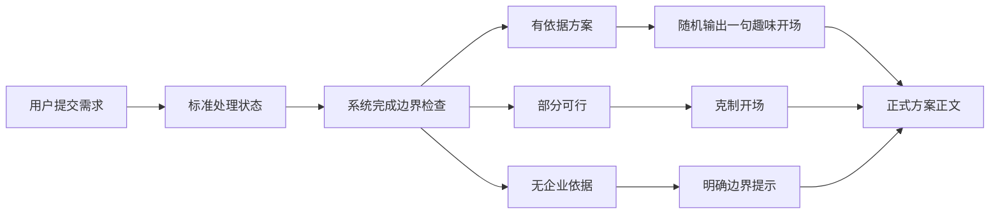

# 尤里卡！V0.5.1用户交互PRD

|项目|内容|
|-|-|
|产品名称|尤里卡！|
|版本|V0.5.1|
|文档类型|用户交互PRD|
|核心能力|方案输出瞬间的随机人格化开场|
|核心目标|员工拿到结果时感受到一次短暂、有趣、有记忆点的“灵光时刻”|
|适用用户|神州数码销售、售前、产品与交付员工|

## 1.本次收束

V0.5.1不把趣味文案铺满整个思考过程。等待期间只显示真实、简洁的处理状态，例如“正在检索已校验经验”“正在检查能力边界”。

趣味表达只在方案完成、关键洞察形成或部分结果出现的瞬间展示一次。它是一句输出开场，不进入方案正文，也不改变业务结果。



## 2.核心体验

员工等待方案生成后，结果区先出现一句短暂的开场，例如：

> 我去，我想到了！

随后立即展示正式结果：

> 建议先采用“旁路接入＋单产线试点”路线……

开场只负责提供情绪反馈，正文继续负责准确、专业和可追溯。

## 3.设计原则

1. 只在输出瞬间出现一次，不在等待阶段反复轮播。
2. 开场与正文分层展示，复制方案时默认不复制开场。
3. 只有存在已校验依据时才能使用庆祝式、兴奋式开场。
4. 部分可行结果使用“有思路，但先别急”的克制表达。
5. 无企业依据、权限错误和系统错误不使用玩笑。
6. 同一用户最近10次结果不得重复同一句。
7. 单句建议不超过22个汉字，最多使用一个主要感叹号。
8. 古风、网络梗和强烈口语只出现在内部员工界面。
9. 共享屏幕或安静模式下只使用标准、克制和极简风格。
10. 文案不能暗示“最优”“百分百可行”或“已经落地”。

## 4.输出结果分级

|结果等级|触发条件|允许风格|
|-|-|-|
|S1充分依据|命中已校验经验与已校验能力，边界检查通过|全部风格|
|S2关键洞察|识别出改变方案方向的关键约束|Aha、洞察、侦探、研究|
|S3部分可行|只有部分依据或存在关键缺口|克制、同事、极简|
|S4无企业依据|没有可支持正式方案的企业资料|仅边界文案|
|S5错误|权限、网络、解析或系统错误|仅错误文案|

## 5.输出组件

### 5.1展现位置

- 位于方案结果卡片顶部。
- 与方案标题之间保留8至12像素距离。
- 开场字号略小于结果标题，但高于普通说明文字。
- 展示后保持可见，不循环、不闪烁。
- 用户复制、导出或同步方案时默认排除该开场。

### 5.2动效

- 文案使用180至260毫秒淡入和轻微上浮。
- 尤里卡、Aha类允许一次柔和光点扩散。
- 网络口语和职场幽默不使用夸张抖动。
- 无依据结果不使用庆祝动画。
- 尊重`prefers-reduced-motion`，减少动效时直接显示文字。

### 5.3风格控制

|模式|可用文案池|默认状态|
|-|-|-|
|年轻标准|品牌、Aha、同事、爽感、工程师、业务、极简|默认|
|好玩一点|增加网络口语、侦探、拼装、游戏、拟声、幽默、文艺|可选|
|彩蛋全开|在“好玩一点”基础上增加古风和稀有文案|默认关闭|
|会议模式|只使用克制、业务和极简文案|可选|

## 6.文案选择机制

```json
{
  "id":"OUT-WEB-01",
  "resultLevel":"S1",
  "style":"网络口语",
  "text":"我去，我想到了！",
  "weight":8,
  "meetingSafe":false,
  "rare":false,
  "internalOnly":true
}
```

选择顺序：

1. 根据结果等级筛选文案。
2. 根据用户模式筛选风格。
3. 排除最近10次出现过的文案。
4. 按权重随机选择一条。
5. 如果没有符合条件的文案，回退到“有了，我先说结论”。

默认权重建议：

|文案池|年轻标准|好玩一点|彩蛋全开|会议模式|
|-|-|-|-|-|
|标准与业务|55%|30%|25%|80%|
|年轻趣味|30%|50%|45%|0%|
|极简与克制|15%|15%|15%|20%|
|古风与稀有彩蛋|0%|5%|15%|0%|

## 7.充分依据结果话术库

### 7.1尤里卡品牌风格

|编号|文案|
|-|-|
|OUT-EUR-01|尤里卡！我找到方案了！|
|OUT-EUR-02|尤里卡！一条可行路线出现了。|
|OUT-EUR-03|尤里卡！经验和能力对上了。|
|OUT-EUR-04|尤里卡！这次有据可循。|
|OUT-EUR-05|尤里卡！这条路可以往下走。|
|OUT-EUR-06|尤里卡！关键拼图齐了。|
|OUT-EUR-07|尤里卡！我找到那个交点了。|
|OUT-EUR-08|尤里卡！方案骨架搭起来了。|
|OUT-EUR-09|尤里卡！旧经验接上新问题了。|
|OUT-EUR-10|尤里卡！有一条路值得先试。|

### 7.2Aha洞察风格

|编号|文案|
|-|-|
|OUT-AHA-01|Aha！原来关键在这里。|
|OUT-AHA-02|Aha！这下问题对上了。|
|OUT-AHA-03|Aha！真正的约束找到了。|
|OUT-AHA-04|Aha！这条经验正好能用。|
|OUT-AHA-05|Aha！能力和场景接上了。|
|OUT-AHA-06|Aha！原来应该先走这一步。|
|OUT-AHA-07|Aha！答案藏在前置条件里。|
|OUT-AHA-08|Aha！客户真正担心的是这个。|
|OUT-AHA-09|Aha！这次不需要一步到位。|
|OUT-AHA-10|Aha！解题方向终于清楚了。|

### 7.3网络口语风格

|编号|文案|
|-|-|
|OUT-WEB-01|我去，我想到了！|
|OUT-WEB-02|等等，这事有解。|
|OUT-WEB-03|好家伙，线索全对上了。|
|OUT-WEB-04|诶，这么搭还真行。|
|OUT-WEB-05|有点东西，路出来了。|
|OUT-WEB-06|妙啊，卡点原来在这。|
|OUT-WEB-07|懂了，应该这么走。|
|OUT-WEB-08|这下对味了。|
|OUT-WEB-09|可以，这条路线站得住。|
|OUT-WEB-10|行，答案自己浮出来了。|
|OUT-WEB-11|嚯，还真让前人做过。|
|OUT-WEB-12|这波经验接得漂亮。|

### 7.4同事搭档风格

|编号|文案|
|-|-|
|OUT-MATE-01|有了，我先说结论。|
|OUT-MATE-02|我找到一条比较稳的路。|
|OUT-MATE-03|思路清楚了，我们这么走。|
|OUT-MATE-04|先看这条主路线。|
|OUT-MATE-05|我把能复用的部分拼好了。|
|OUT-MATE-06|找到一个值得讨论的切口。|
|OUT-MATE-07|这题可以从小处破局。|
|OUT-MATE-08|有一版靠谱底稿了。|
|OUT-MATE-09|先别铺太大，这么做更稳。|
|OUT-MATE-10|我帮你把第一步收出来了。|

### 7.5爽感与干脆风格

|编号|文案|
|-|-|
|OUT-COOL-01|有解！|
|OUT-COOL-02|通了！|
|OUT-COOL-03|对上了！|
|OUT-COOL-04|路找到了！|
|OUT-COOL-05|这题能做。|
|OUT-COOL-06|方案成形。|
|OUT-COOL-07|关键链路接通。|
|OUT-COOL-08|可以开题了。|
|OUT-COOL-09|方向确定。|
|OUT-COOL-10|这条路线可用。|

### 7.6冷静克制风格

|编号|文案|
|-|-|
|OUT-CALM-01|好，思路清楚了。|
|OUT-CALM-02|找到一条相对稳妥的路线。|
|OUT-CALM-03|可以先从这一步开始。|
|OUT-CALM-04|目前最合适的是这条路径。|
|OUT-CALM-05|依据已经足够形成初稿。|
|OUT-CALM-06|先给结论，再看依据。|
|OUT-CALM-07|这条方案具备继续讨论的条件。|
|OUT-CALM-08|方案方向已经收束。|
|OUT-CALM-09|可以进入下一轮确认。|
|OUT-CALM-10|先按这条路线展开。|

### 7.7侦探与线索风格

|编号|文案|
|-|-|
|OUT-DET-01|线索对上了。|
|OUT-DET-02|找到关键证据了。|
|OUT-DET-03|拼图最后一块出现了。|
|OUT-DET-04|原来答案藏在这份复盘里。|
|OUT-DET-05|线索闭环，可以结案。|
|OUT-DET-06|关键条件已经锁定。|
|OUT-DET-07|顺着这条线，方案出来了。|
|OUT-DET-08|找到前人留下的路标了。|
|OUT-DET-09|这条旧线索，现在派上用场了。|
|OUT-DET-10|证据齐了，开始看结论。|

### 7.8工程师与跑通风格

|编号|文案|
|-|-|
|OUT-ENG-01|跑通了！|
|OUT-ENG-02|链路接上了。|
|OUT-ENG-03|输入、能力和结果对齐了。|
|OUT-ENG-04|这条路径可以闭环。|
|OUT-ENG-05|依赖条件已经排清。|
|OUT-ENG-06|方案主链路已连通。|
|OUT-ENG-07|边界通过，结果可用。|
|OUT-ENG-08|最小可行链路找到了。|
|OUT-ENG-09|这套组合可以先跑起来。|
|OUT-ENG-10|核心路径验证通过。|

### 7.9拼装与搭建风格

|编号|文案|
|-|-|
|OUT-BUILD-01|拼上了！|
|OUT-BUILD-02|这几块能力正好能搭起来。|
|OUT-BUILD-03|方案骨架已经立住。|
|OUT-BUILD-04|最后一块拼图归位。|
|OUT-BUILD-05|经验打底，能力接上。|
|OUT-BUILD-06|这套组合严丝合缝。|
|OUT-BUILD-07|路线搭好了，开始看细节。|
|OUT-BUILD-08|几项能力终于串成了一条线。|
|OUT-BUILD-09|材料够了，可以搭方案。|
|OUT-BUILD-10|积木齐了，先拼主路线。|

### 7.10游戏与解锁风格

|编号|文案|
|-|-|
|OUT-GAME-01|新路线已解锁。|
|OUT-GAME-02|关键路径解锁成功。|
|OUT-GAME-03|隐藏经验已命中。|
|OUT-GAME-04|主线任务有答案了。|
|OUT-GAME-05|方案地图已点亮。|
|OUT-GAME-06|第一阶段路线已解锁。|
|OUT-GAME-07|找到一个低风险开局。|
|OUT-GAME-08|经验加成生效。|
|OUT-GAME-09|能力组合完成。|
|OUT-GAME-10|这次可以走主线了。|

### 7.11研究与实验风格

|编号|文案|
|-|-|
|OUT-RES-01|假设成立，可以看方案了。|
|OUT-RES-02|证据支持这条路线。|
|OUT-RES-03|关键变量已经明确。|
|OUT-RES-04|相似经验通过适用性检查。|
|OUT-RES-05|一条可验证路线已经形成。|
|OUT-RES-06|条件对齐，结论可以成立。|
|OUT-RES-07|经验与能力形成交叉验证。|
|OUT-RES-08|这条路径值得进入试验。|
|OUT-RES-09|研究结果开始收束。|
|OUT-RES-10|先用小范围验证这个判断。|

### 7.12售前与业务风格

|编号|文案|
|-|-|
|OUT-BIZ-01|找到一个客户更容易接受的切口。|
|OUT-BIZ-02|这条路线更适合拿去继续沟通。|
|OUT-BIZ-03|可以先从客户最关心的地方讲。|
|OUT-BIZ-04|第一阶段的价值点找到了。|
|OUT-BIZ-05|方案已经收束到可讨论范围。|
|OUT-BIZ-06|这版可以作为售前底稿。|
|OUT-BIZ-07|客户约束已经进入方案。|
|OUT-BIZ-08|建议先讲这条主路线。|
|OUT-BIZ-09|找到一个风险更低的开场。|
|OUT-BIZ-10|这份结果可以继续向专家确认。|

### 7.13职场幽默风格

|编号|文案|
|-|-|
|OUT-HUM-01|没白翻旧资料。|
|OUT-HUM-02|前人种树，这次真乘上凉了。|
|OUT-HUM-03|这回不是拍脑袋。|
|OUT-HUM-04|PPT终于有依据了。|
|OUT-HUM-05|不用从第一页重新编了。|
|OUT-HUM-06|这次可以少开一轮会。|
|OUT-HUM-07|老方案没白躺在知识库里。|
|OUT-HUM-08|新人不用再靠猜了。|
|OUT-HUM-09|这题，不用硬刚。|
|OUT-HUM-10|终于不是“回头再确认”了。|
|OUT-HUM-11|放心，这个数字我没编。|
|OUT-HUM-12|这条经验终于等到复用了。|

### 7.14拟声与节奏风格

|编号|文案|
|-|-|
|OUT-SFX-01|叮！方案已到账。|
|OUT-SFX-02|咔哒，经验和能力接上了。|
|OUT-SFX-03|啪，关键约束对齐。|
|OUT-SFX-04|噔噔，一条新路线。|
|OUT-SFX-05|叮咚，前人经验已送达。|
|OUT-SFX-06|咔，最后一块拼图归位。|
|OUT-SFX-07|唰，主路线出来了。|
|OUT-SFX-08|滴，边界检查通过。|
|OUT-SFX-09|当，灵光到了。|
|OUT-SFX-10|啪嗒，方案落地。|

### 7.15古风彩蛋风格

正确写法为“噫吁嚱”，不是“噫嘘唏”。

|编号|文案|
|-|-|
|OUT-OLD-01|噫吁嚱！吾得一策。|
|OUT-OLD-02|噫吁嚱！旧案与新策相合。|
|OUT-OLD-03|妙哉，此策有据。|
|OUT-OLD-04|善，前事可鉴，新策已成。|
|OUT-OLD-05|得之矣，此路可行。|
|OUT-OLD-06|山重水复，今见一途。|
|OUT-OLD-07|旧卷有痕，新策有路。|
|OUT-OLD-08|且看此策，可解眼前之题。|
|OUT-OLD-09|众里寻他，原在旧案之中。|
|OUT-OLD-10|前人之智，今可为用。|
|OUT-OLD-11|此中有真意，方案已成形。|
|OUT-OLD-12|一策既出，尚待诸君斟酌。|

### 7.16文艺与灵光风格

|编号|文案|
|-|-|
|OUT-LIT-01|灵光落下，路径渐明。|
|OUT-LIT-02|旧经验里，长出了一条新路。|
|OUT-LIT-03|散落的线索终于汇成答案。|
|OUT-LIT-04|前人的脚印，接上了今天的问题。|
|OUT-LIT-05|答案没有凭空出现，它一直藏在经验里。|
|OUT-LIT-06|路不是新造的，是重新被看见。|
|OUT-LIT-07|一束旧光，照亮了新的问题。|
|OUT-LIT-08|方案从经验的缝隙里浮出来了。|
|OUT-LIT-09|过去留下的答案，在今天重新发芽。|
|OUT-LIT-10|那些沉睡的经验，终于醒了。|

### 7.17未来感与智能风格

|编号|文案|
|-|-|
|OUT-FUT-01|经验网络已连接。|
|OUT-FUT-02|方案路径已生成。|
|OUT-FUT-03|关键知识节点已命中。|
|OUT-FUT-04|能力组合完成。|
|OUT-FUT-05|经验与需求完成对齐。|
|OUT-FUT-06|可行路径已点亮。|
|OUT-FUT-07|组织记忆响应成功。|
|OUT-FUT-08|历史经验正在转化为新方案。|
|OUT-FUT-09|方案引擎已完成收束。|
|OUT-FUT-10|当前任务获得一条可信路径。|

### 7.18极简风格

|编号|文案|
|-|-|
|OUT-MIN-01|有方案了。|
|OUT-MIN-02|找到路径。|
|OUT-MIN-03|方案已生成。|
|OUT-MIN-04|结论如下。|
|OUT-MIN-05|建议如下。|
|OUT-MIN-06|主路线已确定。|
|OUT-MIN-07|已完成边界检查。|
|OUT-MIN-08|可以继续讨论。|
|OUT-MIN-09|结果已就绪。|
|OUT-MIN-10|先看结论。|

## 8.部分可行结果话术库

部分可行时不能使用“我找到方案了”等确定表达。

|编号|文案|
|-|-|
|OUT-PART-01|有思路，但先别急着下结论。|
|OUT-PART-02|找到半条路，还差一个关键条件。|
|OUT-PART-03|方向有了，依据还需要补一块。|
|OUT-PART-04|可以先讨论，但暂时不能承诺。|
|OUT-PART-05|这条路线值得探索，边界先说清。|
|OUT-PART-06|我找到相关经验，但适用条件还没对齐。|
|OUT-PART-07|方案有雏形，关键数据仍待确认。|
|OUT-PART-08|有一条候选路线，需要专家再看一眼。|
|OUT-PART-09|可以往下推，但这一步不能省。|
|OUT-PART-10|思路出现了，先把缺口补上。|
|OUT-PART-11|暂时只能形成建议，不能形成企业承诺。|
|OUT-PART-12|我先给一版探索路线。|

## 9.无企业依据结果话术库

无依据时不随机使用趣味文案，只从以下安全文案中选择：

|编号|文案|
|-|-|
|OUT-NO-01|先等等，这里还缺少企业依据。|
|OUT-NO-02|当前知识库不足以支持正式方案。|
|OUT-NO-03|我没有找到可以支撑这项承诺的资料。|
|OUT-NO-04|这条需求可以探索，但不能写成已有能力。|
|OUT-NO-05|没有已校验经验，我不建议硬凑方案。|
|OUT-NO-06|当前只能提出假设，不能形成正式结论。|
|OUT-NO-07|先补充一个关键问题，再继续会更可靠。|
|OUT-NO-08|相关能力仍待确认，暂时不能进入主方案。|
|OUT-NO-09|这里没有结果数据，我不会补写一个数字。|
|OUT-NO-10|这一步超出当前企业能力边界。|
|OUT-NO-11|资料还不够，我先把缺口列出来。|
|OUT-NO-12|这次不硬编，比给出错误答案更重要。|

## 10.错误话术库

|编号|文案|
|-|-|
|OUT-ERR-01|这次没有生成成功，可以重新试一次。|
|OUT-ERR-02|资料读取失败，请检查飞书权限。|
|OUT-ERR-03|当前网络不稳定，输入内容已经保留。|
|OUT-ERR-04|检索暂时不可用，请稍后重试。|
|OUT-ERR-05|这份资料暂时无法完整解析。|
|OUT-ERR-06|生成中断，不完整结果没有被保存。|
|OUT-ERR-07|会话还在，可以继续重试。|
|OUT-ERR-08|同步没有完成，已处理部分不会重复执行。|

## 11.木鱼宠物关系

木鱼继续作为独立桌面彩蛋，不与方案输出文案联动，避免一次结果同时出现开场动画、木鱼声音和“功德＋1”。

- 方案输出动效播放时，木鱼不自动发声。
- 木鱼悬停敲击不改变输出文案概率。
- 安静模式同时关闭木鱼声音和非必要输出动效。
- 木鱼计数不进入方案、看板和业务数据。

## 12.前端实现建议

V0.5.1使用前端静态配置即可：

```javascript
const OUTPUT_COPY = {
  S1: {
    standard: [],
    fun: [],
    rare: []
  },
  S2: [],
  S3: [],
  S4: [],
  S5: []
}
```

前端保存：

- 当前互动模式；
- 最近10条已展示文案ID；
- 是否开启安静模式；
- 古风彩蛋最近一次触发时间。

后端只需要返回结果等级、是否发现关键洞察和是否通过边界检查，不需要参与随机文案选择。

## 13.验收标准

- [ ] 趣味文案只在结果输出时出现一次。
- [ ] 等待期间不轮播网络梗、古风或拟人化内容。
- [ ] 文案与正式方案正文分层展示。
- [ ] 复制、导出和飞书同步默认排除趣味开场。
- [ ] S1结果可以使用全部已启用风格。
- [ ] S2只使用洞察相关风格。
- [ ] S3不使用确定性庆祝表达。
- [ ] S4和S5不使用玩笑。
- [ ] 最近10次结果不重复同一句。
- [ ] 会议模式不出现“我去”“好家伙”“噫吁嚱”等强风格文案。
- [ ] 古风和彩蛋默认关闭或保持低频。
- [ ] 文案配置可以独立新增，不修改方案业务逻辑。

## 14.最终原则

V0.5.1只做一件事：在员工真正拿到结果的那一刻，让系统说一句有性格的话。

一句“我去，我想到了！”可以让产品显得年轻，但它后面必须紧跟一份有来源、有边界、能继续讨论的正式方案。有趣只负责让人记住，可信才负责让人采用。
