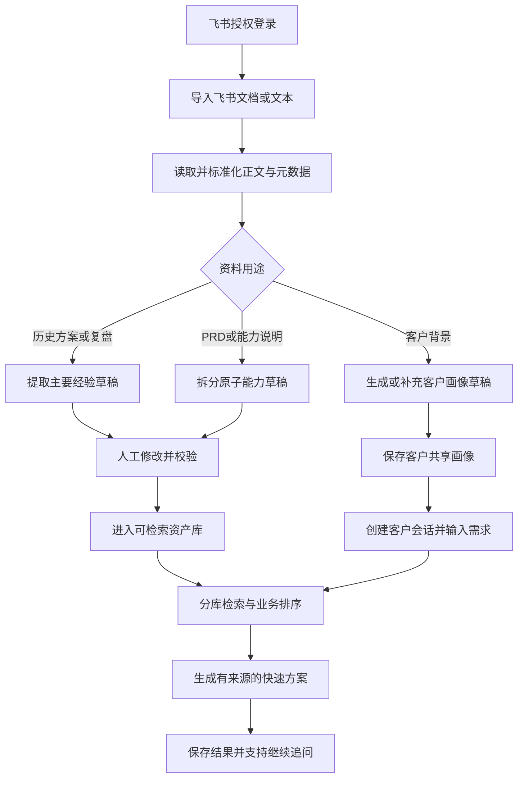
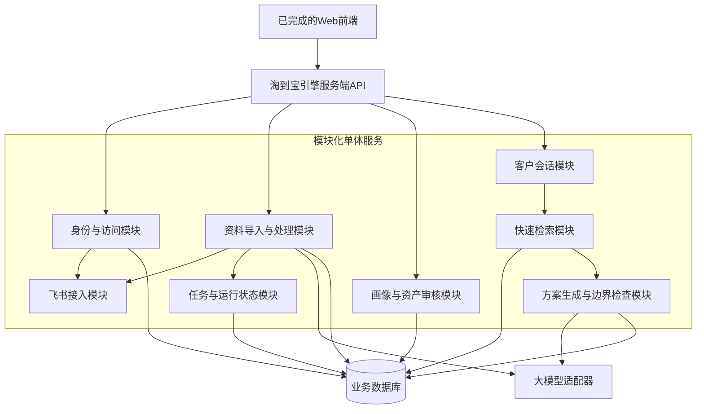

# 淘到宝引擎V0.5服务端产品需求文档

## 0.文档信息

|项目|内容|
|---|---|
|产品名称|淘到宝引擎|
|版本|V0.5 MVP|
|文档范围|服务端，不包含前端页面与视觉交互|
|文档状态|开发评审稿|
|更新时间|2026年8月4日|
|目标读者|产品、后端开发、AI开发、联调与测试人员|

## 1.服务端目标

淘到宝引擎V0.5服务端负责把已经完成的前端原型连接成一条可运行的业务闭环：员工使用飞书身份进入系统，导入飞书资料或文本，系统将资料处理为可审核的客户画像、经验和原子能力，再基于同一客户画像检索已校验资产，生成有来源、有边界、可继续追问的快速方案。

本版本验证的不是复杂算法，而是以下核心假设：

1.飞书中的历史资料可以低成本进入企业经验处理流程。
2.历史方案与PRD可以分别沉淀为经验资产和原子能力资产。
3.一个客户对应一份可复用画像，并可供该客户的多个方案会话共同读取。
4.快速检索可以优先返回更符合问题、场景和约束的已校验资产。
5.生成结果能够明确区分历史事实、企业能力、AI推断和待确认信息。

## 2.版本边界

### 2.1 P0：必须实现

- 飞书网页授权登录、登录态维护、退出登录。
- 粘贴飞书文档链接并读取正文、标题、作者或所有者、源更新时间和来源链接。
- 粘贴飞书妙记转写、客户聊天记录或普通文本作为资料来源。
- 资料处理任务、状态查询、失败原因和手动重试。
- AI业务标签生成与人工编辑。
- 一客户一画像；画像生成、修改、确认和多会话复用。
- 历史方案或复盘提取主要经验；人工修改、通过或打回。
- PRD拆分多个原子能力；逐条修改、通过或打回。
- 一客户多会话、多轮消息保存与恢复。
- 已校验经验和原子能力的分库检索、排序和数量限制。
- 快速方案生成、来源回传、事实边界标识和继续追问。
- 基础权限隔离、操作日志、错误码和服务健康检查。

### 2.2 P1：完成P0后再做

- 邀请码校验，用于控制比赛演示访问范围。
- 登录后选择飞书根目录或当前目录中的文档。
- 直接选择可访问的飞书妙记并读取转写。
- 批量导入与批量处理。
- 生成过程的流式输出；P0可使用任务轮询。
- 将最终结果复制为Markdown所需的服务端格式化接口。
- 资料手动刷新时展示字段级变化摘要。

### 2.3 本版本明确不做

- 深度检索、Deep Research和多Agent流程。
- 飞书机器人、自动建群、专家邀请与专家反馈回写。
- 自动创建或写入飞书结果文档。
- 自动读取个人聊天历史。
- 企业全量资料同步、递归文件夹同步和实时变更订阅。
- 图片、扫描件、复杂表格和附件的完整解析。
- 复杂向量数据库、知识图谱、GraphRAG、混合检索和重排模型。
- 客户画像自动增量更新、版本冲突处理和多人实时协作。
- 完整多租户、企业组织架构同步和商用级权限体系。
- 方案采纳看板、专家系统和PPT自动生成。

## 3.黄金服务流程



## 4.服务架构原则

V0.5采用模块化单体服务，不拆微服务。所有模块共用一个数据库和一套身份上下文，通过清晰的模块边界与接口为后续拆分保留空间。



架构约束：

- 前端只调用淘到宝引擎服务端，不直接持有飞书访问令牌或大模型密钥。
- 飞书能力通过统一适配器调用，避免业务模块直接依赖具体接口。
- 大模型通过统一适配器调用，便于切换供应商、模型或Mock结果。
- 文档处理和方案生成均记录任务状态；局部失败不得造成整条数据丢失。
- 检索结果必须先于生成结果固化，保证每次方案可追溯到当次使用的资产。

### 4.1 部署拓扑约束

- 正式演示时，前端静态资源与服务端API应使用同一主域名，由反向代理将`/api`转发到服务端，以保证飞书授权回调和安全Cookie稳定工作。
- 本地联调时，前端必须通过`http://localhost`启动，不使用`file://`页面直接连接真实登录接口。
- 黄金流程依赖的服务必须可以在中国大陆网络环境直接访问，不得要求评委使用代理工具。
- V0.5只需一个服务端实例、一个PostgreSQL数据库和一个域名；不要求微服务、容器编排或多可用区。

## 5.服务模块需求

### 5.1 身份与访问模块

#### 目标

确认员工身份，维护安全登录态，并使资料读取遵循当前用户的飞书授权范围。

#### 功能要求

|编号|优先级|要求|
|---|---|---|
|S-AUTH-01|P0|生成飞书授权地址，并使用不可预测的state防止伪造回调|
|S-AUTH-02|P0|使用飞书回调code换取用户访问凭证并读取登录用户信息|
|S-AUTH-03|P0|在服务端保存访问凭证；不得将飞书访问令牌返回前端|
|S-AUTH-04|P0|建立HttpOnly、Secure、SameSite登录会话|
|S-AUTH-05|P0|访问令牌过期时自动刷新；刷新失败则要求重新授权|
|S-AUTH-06|P0|提供当前用户信息与退出登录接口|
|S-AUTH-07|P1|支持邀请码校验、有效期、最大使用次数和停用|
|S-AUTH-08|P0|所有业务请求必须携带用户与工作空间上下文|

#### 业务规则

- V0.5仅支持一个比赛演示工作空间，不建设完整多租户系统。
- 邀请码只控制是否可以进入演示环境，不替代飞书身份认证。
- 同一飞书用户重复登录应复用本地账户，不重复创建用户。
- 所有外部凭证只允许在服务端加密保存，日志不得输出明文令牌。

### 5.2 飞书接入模块

#### 目标

把飞书登录、文档读取、元数据读取和妙记读取封装为稳定的内部能力。

#### 功能要求

|编号|优先级|要求|
|---|---|---|
|S-FS-01|P0|解析飞书文档链接，识别资源类型和资源标识|
|S-FS-02|P0|使用当前用户授权读取可访问的文档正文|
|S-FS-03|P0|读取标题、所有者或作者、源更新时间和来源链接|
|S-FS-04|P0|明确区分无权限、资源不存在、链接不支持和飞书接口失败|
|S-FS-05|P0|保存最近同步时间和源更新时间，不承诺实时同步|
|S-FS-06|P0|支持用户手动刷新资料；刷新后重新处理相关草稿资产|
|S-FS-07|P1|列出当前用户可访问目录中的文档供前端选择|
|S-FS-08|P1|搜索妙记并读取转写文本|

#### 可实现性与降级规则

- 飞书登录、用户信息读取、文档正文读取和元数据查询均有官方开放接口，可作为正式服务能力。
- “登录后直接选择所有文档”受应用权限、用户权限和目录接口能力影响，定为P1；P0必须保留粘贴链接导入。
- 妙记接口受租户权限和应用开通情况影响；接口不可用时，允许用户粘贴妙记转写文本。
- V0.5通过“导入时同步+手动刷新”维护更新时间，不实现文档变更事件订阅。

#### 飞书官方接口依据

- [获取用户访问凭证](https://open.feishu.cn/document/authentication-management/access-token/get-user-access-token)
- [获取登录用户信息](https://open.feishu.cn/document/server-docs/authentication-management/login-state-management/get)
- [获取文档纯文本内容](https://open.feishu.cn/document/server-docs/docs/docs/docx-v1/document/raw_content)
- [批量查询文件元数据](https://open.feishu.cn/document/server-docs/docs/drive-v1/meta/batch_query)
- [获取文件夹中的文件清单](https://open.feishu.cn/document/server-docs/docs/drive-v1/folder/list)
- [搜索妙记](https://open.feishu.cn/document/uAjLw4CM/ukTMukTMukTM/minutes-v1/minute/search)
- [获取妙记转写文本](https://open.feishu.cn/document/minutes-v1/minute-transcript/get)

开发接入前必须依据比赛应用的实际权限配置复核接口参数、授权范围和可访问资源类型；若P1能力无法稳定打通，不得阻塞P0链接导入。

### 5.3 资料导入与处理模块

#### 目标

把飞书链接和用户粘贴文本转换为统一的可处理资料，并提供可恢复的任务状态。

#### 功能要求

|编号|优先级|要求|
|---|---|---|
|S-DOC-01|P0|支持飞书文档链接、普通文本、聊天记录和妙记转写文本导入|
|S-DOC-02|P0|导入时必须指定或确认用途：客户背景、历史经验、原子能力|
|S-DOC-03|P0|保存原始来源、标准化纯文本、作者、源更新时间和同步时间|
|S-DOC-04|P0|相同工作空间、相同飞书资源标识重复导入时更新原记录，不产生重复资料|
|S-DOC-05|P0|为资料生成可为空、可人工修改的业务标签|
|S-DOC-06|P0|资料处理失败时保留原资料，并支持重试|
|S-DOC-07|P0|记录处理状态、处理阶段、错误摘要和最后成功时间|
|S-DOC-08|P1|批量导入时逐条返回成功与失败结果，不因单条失败整体回滚|

#### 处理状态

```text
待处理 -> 正在读取 -> 正在解析 -> 正在提取 -> 待校验 -> 已完成
                                             \-> 处理失败
```

状态定义：

|状态|含义|前端可执行动作|
|---|---|---|
|pending|已创建任务，等待执行|查看、取消|
|fetching|正在从飞书读取正文和元数据|查看|
|parsing|正在清洗和标准化文本|查看|
|extracting|正在生成标签或资产草稿|查看|
|pending_review|草稿已生成，等待人工校验|查看、编辑、校验、打回|
|completed|资料和资产处理完成|查看、刷新|
|failed|处理失败且已保留上下文|查看原因、重试|

#### 时效状态

|状态|判断方式|
|---|---|
|最新|源更新时间等于最近一次成功同步记录|
|源文档有更新|手动刷新时发现源更新时间更新|
|暂时无法访问|刷新时无权限或源接口暂时失败|
|源文档已删除|飞书明确返回资源不存在|

### 5.4 客户画像模块

#### 目标

为每个客户维护一份可被多个快速方案会话复用的共享画像。

#### 画像字段

|字段|是否必需|说明|
|---|---|---|
|客户名称|是|客户唯一显示名称|
|行业|否|不确定时为空，不允许编造|
|客户背景|否|企业与业务背景摘要|
|当前问题|否|客户正在解决的主要问题|
|目标|否|期望结果|
|约束|否|预算、周期、技术、合规等限制|
|已有系统或能力|否|客户当前条件|
|关键信息缺口|否|后续需要销售确认的问题|
|来源标识|是|使用了哪些资料或手工输入|
|确认状态|是|待确认或已确认|

#### 功能要求

|编号|优先级|要求|
|---|---|---|
|S-PROFILE-01|P0|一个客户在一个工作空间内只对应一份当前画像|
|S-PROFILE-02|P0|支持用多条资料和手工文本生成画像草稿|
|S-PROFILE-03|P0|AI无法确定的信息必须进入“关键信息缺口”，不得自动补齐|
|S-PROFILE-04|P0|支持人工修改、保存和确认|
|S-PROFILE-05|P0|同一客户的新会话自动读取同一画像|
|S-PROFILE-06|P0|画像更新不得改写历史会话消息；新一轮生成读取最新保存画像|
|S-PROFILE-07|P1|展示画像字段所依据的资料来源|

V0.5不实现画像版本树和自动增量合并。用户主动重新生成画像时，服务端返回新草稿，由用户确认后覆盖当前画像。

### 5.5 经验资产模块

#### 目标

把历史方案或复盘转化为可人工校验、可检索、可追溯的主要经验。

#### 经验字段

|字段|是否必需|说明|
|---|---|---|
|经验名称|是|概括本条主要经验|
|适用问题|是|解决了什么问题|
|主要方案|是|当时采用了什么做法|
|前置条件|否|采用方案前必须具备什么|
|结果|否|原文明确记载的结果；无数据时为空|
|风险或失败点|否|原文明确提及的风险|
|后续铺垫|否|该方案可为哪些后续工作提供基础|
|适用条件|否|可以复用到什么场景|
|业务标签|否|支持检索的人工可编辑标签|
|来源|是|原资料标识与链接|
|校验状态|是|待校验、已校验、已打回|

#### 功能要求

|编号|优先级|要求|
|---|---|---|
|S-EXP-01|P0|一份历史方案或复盘默认提取一条主要经验|
|S-EXP-02|P0|只提取原文能够支持的事实；缺失结果不得生成虚构指标|
|S-EXP-03|P0|审核人可修改任一字段后通过，或填写原因后打回|
|S-EXP-04|P0|只有已校验经验可参与快速检索|
|S-EXP-05|P0|源资料刷新后，原已校验经验仍保留，但标记“来源有更新，待复核”并暂时退出检索|
|S-EXP-06|P0|打回经验保留记录，但不得参与检索和生成|

### 5.6 原子能力资产模块

#### 目标

把一份PRD或能力说明拆分为多个可组合、边界明确的原子能力。

#### 原子能力字段

|字段|是否必需|说明|
|---|---|---|
|能力名称|是|最小可独立理解的能力名称|
|能力说明|是|该能力解决什么问题|
|输入|是|使用该能力需要什么输入|
|输出|是|该能力可以产生什么输出|
|前置条件|否|运行或交付所需依赖|
|限制|是|明确不能做什么或适用边界|
|业务标签|否|支持检索的人工可编辑标签|
|来源|是|原PRD标识与链接|
|校验状态|是|待校验、已校验、已打回|

#### 功能要求

|编号|优先级|要求|
|---|---|---|
|S-CAP-01|P0|一份PRD可以拆分为多条原子能力|
|S-CAP-02|P0|每条能力独立保存和校验，不要求整份PRD一次性通过|
|S-CAP-03|P0|输入、输出或限制为空时不得校验通过|
|S-CAP-04|P0|审核人可修改任一字段后通过，或填写原因后打回|
|S-CAP-05|P0|只有已校验原子能力可参与快速检索|
|S-CAP-06|P0|源资料刷新后，相关能力标记“来源有更新，待复核”并暂时退出检索|

### 5.7 客户会话模块

#### 目标

让一个客户可以建立多个独立会话，同时复用同一客户画像并保留多轮上下文。

#### 功能要求

|编号|优先级|要求|
|---|---|---|
|S-CHAT-01|P0|创建会话时必须绑定一个客户|
|S-CHAT-02|P0|一个客户可创建多个会话，不同会话消息互不混合|
|S-CHAT-03|P0|服务端持久化用户消息、AI回复、创建时间和顺序|
|S-CHAT-04|P0|刷新或重新登录后可以恢复历史会话|
|S-CHAT-05|P0|每轮生成读取客户最新保存画像与当前会话上下文|
|S-CHAT-06|P0|后续追问可引用本会话之前的方案，但不得读取其他客户会话|
|S-CHAT-07|P1|根据首轮需求自动生成会话标题|

### 5.8 快速检索模块

#### 目标

在短时间内从已校验经验和已校验原子能力中返回少量、高优先级、可追溯的候选资产。

#### 检索规则

1.经验与原子能力分别检索，禁止混在同一个候选池。
2.只检索当前工作空间内、已校验、来源仍有效的资产。
3.先排除与客户硬约束明显冲突的资产。
4.剩余资产依次按“问题匹配→约束匹配→场景匹配→行业匹配→更新时间”排序。
5.经验最多返回3条，原子能力最多返回5条。
6.不对用户展示难以解释的“可信度百分比”；只返回排序原因和匹配标签。
7.没有合适结果时返回空集合和缺口说明，不用低相关内容凑数。

#### V0.5实现方式

使用结构化字段、业务标签、关键词和数据库全文检索即可。V0.5不依赖向量数据库。检索算法必须封装为独立模块，使后续可以替换为向量检索、混合检索或重排模型，而不改变前端接口。

#### 功能要求

|编号|优先级|要求|
|---|---|---|
|S-RET-01|P0|根据客户画像和当前需求生成检索条件|
|S-RET-02|P0|分别查询经验与原子能力，并执行硬条件过滤|
|S-RET-03|P0|按业务优先级排序并限制返回数量|
|S-RET-04|P0|为每个结果返回匹配原因、来源和校验状态|
|S-RET-05|P0|保存当轮检索快照，后续资产变化不得改写历史方案依据|
|S-RET-06|P0|无可用结果时返回明确状态，不触发虚构资产|

### 5.9 快速方案生成与边界检查模块

#### 目标

把当前需求、共享画像、经验候选和能力候选组合为可追溯的初步方案。

#### 固定输出结构

|区块|内容要求|
|---|---|
|需求理解|复述当前问题、目标和约束；不确定内容列为待确认|
|初步建议|给出适合继续讨论的方案方向，不冒充正式交付方案|
|历史经验依据|说明哪些建议参考了哪些已校验经验|
|原子能力组合|说明使用哪些已校验能力及其输入、输出和限制|
|前置条件与风险|列出实施依赖、冲突和无法确认的信息|
|待确认信息|列出影响方案判断的关键问题|
|资料来源|返回可点击的原资料信息|
|建议追问|为下一轮会话生成少量问题|

#### 边界类型

|类型|服务端标识|生成规则|
|---|---|---|
|历史事实|historical_fact|只能来自已校验经验|
|企业能力|enterprise_capability|只能来自已校验原子能力|
|AI推断|ai_inference|必须使用推测性表达，不得写成已验证事实|
|待确认信息|pending_confirmation|来源不足、字段冲突或客户未说明时使用|

#### 功能要求

|编号|优先级|要求|
|---|---|---|
|S-GEN-01|P0|生成前固化画像版本、会话上下文和检索快照|
|S-GEN-02|P0|模型输入只包含必要资料片段和结构化字段，避免整库灌入|
|S-GEN-03|P0|输出必须符合固定JSON结构，服务端校验后再返回前端|
|S-GEN-04|P0|每项历史事实和企业能力必须关联资产标识与来源|
|S-GEN-05|P0|无来源内容只能标为AI推断或待确认，不得伪装为企业案例或能力|
|S-GEN-06|P0|经验为空或能力为空时允许返回追问与边界说明，但不得虚构完整方案|
|S-GEN-07|P0|生成失败时保留用户消息并允许重试，不重复创建用户消息|
|S-GEN-08|P0|保存最终结构化结果和展示文本，支持历史恢复|
|S-GEN-09|P1|支持流式输出；流式结束后仍需执行结构校验与落库|

“尤里卡！我找到方案了！”等开场语属于前端交互与文案策略。服务端只需返回可选的`opening_key`或由前端本地决定，不得让随机文案污染结构化方案正文和检索结果。

### 5.10 任务、日志与可观测性模块

#### 功能要求

|编号|优先级|要求|
|---|---|---|
|S-OPS-01|P0|为资料处理和方案生成创建唯一任务标识|
|S-OPS-02|P0|记录任务阶段、开始时间、结束时间、失败原因和重试次数|
|S-OPS-03|P0|同一导入请求重复提交时通过幂等键避免重复处理|
|S-OPS-04|P0|记录飞书调用、大模型调用和数据库操作的耗时，但不记录明文令牌|
|S-OPS-05|P0|提供健康检查接口，分别说明服务、数据库和必要外部依赖状态|
|S-OPS-06|P0|所有错误响应返回统一错误码和`request_id`，便于前后端定位|
|S-OPS-07|P1|统计模型耗时、失败率和单次生成消耗，用于比赛前稳定性检查|

## 6.最小数据对象

V0.5不建设复杂领域模型，使用以下九类对象即可完成闭环：

|对象|用途|关键字段|
|---|---|---|
|用户|保存飞书身份与登录状态|id、feishu_user_id、name、avatar、workspace_id|
|资料|统一保存飞书文档和粘贴文本|id、type、purpose、title、content、source_url、author、source_updated_at、synced_at、tags、status|
|客户画像|一个客户一份当前画像|id、customer_name、profile_json、source_ids、status、updated_at|
|经验资产|历史方案提取结果|id、source_id、experience_json、review_status、review_note|
|原子能力|PRD拆分结果|id、source_id、capability_json、review_status、review_note|
|会话|区分同一客户的不同方案任务|id、customer_profile_id、title、created_by、updated_at|
|消息|保存多轮提问与回复|id、session_id、role、content、sequence、created_at|
|方案运行|保存检索快照与最终结果|id、session_id、request_message_id、profile_snapshot、retrieval_snapshot、result_json、status|
|后台任务|保存异步处理状态|id、type、target_id、status、stage、error_code、retry_count|

约束：

- 资产结构在V0.5可使用JSON字段保存，但字段名称和必填规则必须由服务端Schema固定。
- 资料正文只保存标准化纯文本；暂不建设原文件对象存储。
- 经验和原子能力必须分别存储，不能只用一个通用“知识片段”表代替。
- 删除采用软删除；已被历史方案引用的对象不得物理删除。

## 7.前后端接口契约

### 7.1 通用约定

- 基础路径：`/api/v1`
- 数据格式：`application/json; charset=utf-8`
- 登录态：安全Cookie；前端不保存飞书访问令牌。
- 时间格式：ISO 8601，服务端统一保存UTC，前端按本地时区展示。
- 列表接口统一支持`page`、`page_size`、`status`和关键词筛选。
- 写接口支持`Idempotency-Key`请求头。
- 前后端以OpenAPI文件作为唯一契约来源；字段变更必须先更新契约。

统一成功结构：

```json
{
  "request_id":"req_xxx",
  "data":{}
}
```

统一失败结构：

```json
{
  "request_id":"req_xxx",
  "error":{
    "code":"FEISHU_PERMISSION_DENIED",
    "message":"当前飞书账号无权读取该资料",
    "retryable":false,
    "details":{}
  }
}
```

### 7.2 接口清单

|优先级|方法|路径|用途|
|---|---|---|---|
|P0|GET|`/auth/feishu/start`|获取飞书授权地址|
|P0|GET|`/auth/feishu/callback`|处理飞书授权回调并建立登录态|
|P0|GET|`/me`|获取当前用户与工作空间信息|
|P0|POST|`/auth/logout`|退出登录|
|P1|POST|`/invite-codes/verify`|校验比赛邀请码|
|P0|POST|`/sources/import-link`|通过飞书文档链接导入资料|
|P0|POST|`/sources/import-text`|导入妙记转写、聊天记录或普通文本|
|P0|GET|`/sources`|查询资料列表|
|P0|GET|`/sources/{source_id}`|查询资料详情与处理状态|
|P0|POST|`/sources/{source_id}/refresh`|手动刷新飞书来源|
|P0|POST|`/sources/{source_id}/retry`|重试失败任务|
|P0|PATCH|`/sources/{source_id}`|修改用途、标题或业务标签|
|P0|GET|`/jobs/{job_id}`|查询异步任务状态|
|P0|POST|`/customer-profiles`|创建客户与空画像|
|P0|GET|`/customer-profiles`|查询客户画像列表|
|P0|GET|`/customer-profiles/{profile_id}`|查询画像详情|
|P0|POST|`/customer-profiles/{profile_id}/generate`|根据资料与文本生成画像草稿|
|P0|PATCH|`/customer-profiles/{profile_id}`|修改画像|
|P0|POST|`/customer-profiles/{profile_id}/confirm`|确认画像|
|P0|GET|`/experiences`|查询经验资产|
|P0|GET|`/experiences/{experience_id}`|查询经验详情与来源|
|P0|PATCH|`/experiences/{experience_id}`|修改经验字段|
|P0|POST|`/experiences/{experience_id}/review`|通过或打回经验|
|P0|GET|`/capabilities`|查询原子能力|
|P0|GET|`/capabilities/{capability_id}`|查询能力详情与来源|
|P0|PATCH|`/capabilities/{capability_id}`|修改能力字段|
|P0|POST|`/capabilities/{capability_id}/review`|通过或打回能力|
|P0|POST|`/sessions`|创建客户会话|
|P0|GET|`/sessions`|查询会话列表|
|P0|GET|`/sessions/{session_id}`|恢复会话与消息|
|P0|POST|`/sessions/{session_id}/turns`|提交一轮需求或追问并启动快速方案任务|
|P0|GET|`/solution-runs/{run_id}`|轮询生成状态并获取结构化结果|

### 7.3 核心请求示例

导入飞书文档：

```json
{
  "url":"https://example.feishu.cn/docx/xxxx",
  "purpose":"experience"
}
```

导入粘贴文本：

```json
{
  "title":"A客户7月会议纪要",
  "content":"客户沟通记录正文……",
  "content_type":"meeting_transcript",
  "purpose":"customer_profile",
  "customer_profile_id":"profile_xxx"
}
```

提交一轮快速方案请求：

```json
{
  "content":"客户希望两周内上线一套不依赖专用硬件的质检方案",
  "mode":"quick"
}
```

任务接受响应：

```json
{
  "request_id":"req_xxx",
  "data":{
    "run_id":"run_xxx",
    "message_id":"msg_xxx",
    "status":"queued",
    "poll_after_ms":1000
  }
}
```

## 8.异步任务与幂等规则

### 8.1 异步范围

- 资料读取、AI标签、经验提取、能力拆分和画像生成使用后台任务。
- 快速方案默认也使用后台任务并由前端轮询，避免HTTP长连接不稳定。
- P1可增加SSE流式输出，但不能改变最终结构化结果接口。

### 8.2 幂等规则

- 同一工作空间、同一飞书资源标识只保留一条资料主记录。
- 相同`Idempotency-Key`在24小时内重复提交，返回第一次任务结果。
- 方案任务重试复用原用户消息，并创建新的运行记录，避免对话中出现重复问题。
- 审核接口重复提交相同动作时返回当前状态，不重复记录副作用。

### 8.3 重试规则

- 飞书限流、网络超时和模型临时错误可自动重试，最多2次，采用递增等待。
- 无权限、资源不存在、无效链接和必填字段缺失不得自动重试。
- 自动重试仍失败后进入`failed`，由用户手动触发下一次重试。

## 9.统一错误码

|错误码|含义|是否可重试|
|---|---|---|
|AUTH_REQUIRED|未登录或登录态失效|否，需重新登录|
|INVITE_CODE_INVALID|邀请码无效、过期或次数耗尽|否|
|FEISHU_AUTH_EXPIRED|飞书授权已失效|否，需重新授权|
|FEISHU_PERMISSION_DENIED|无权访问目标资料|否|
|SOURCE_NOT_FOUND|源资料不存在或已删除|否|
|SOURCE_TYPE_UNSUPPORTED|链接或资料类型不支持|否|
|SOURCE_TEMPORARILY_UNAVAILABLE|飞书接口或网络暂时异常|是|
|CONTENT_EMPTY|读取后没有可处理正文|否|
|VALIDATION_FAILED|请求或资产字段不符合Schema|否|
|NO_VERIFIED_EXPERIENCE|没有可用的已校验经验|否，按边界结果处理|
|NO_VERIFIED_CAPABILITY|没有可用的已校验能力|否，按边界结果处理|
|MODEL_TEMPORARILY_UNAVAILABLE|模型调用暂时失败|是|
|JOB_FAILED|后台任务执行失败|视内部错误而定|
|RATE_LIMITED|请求过于频繁|是|
|INTERNAL_ERROR|未分类服务错误|是|

## 10.安全、权限与数据规则

### 10.1 MVP权限模型

- 所有数据必须带`workspace_id`，所有查询必须按工作空间过滤。
- V0.5的受邀成员共享一个比赛工作空间中的已导入资产。
- 用户导入资料即代表将该资料用于当前比赛工作空间；正式商业版必须增加细粒度共享确认和源文档权限映射。
- 读取飞书资料时使用导入用户的授权并立即校验可访问性。
- 未经人工校验的经验和能力只对审核流程可见，不参与检索。

### 10.2 敏感数据

- 飞书访问令牌、刷新令牌和大模型密钥必须加密保存或放入密钥管理服务。
- 运行日志不得记录完整客户资料、完整提示词、令牌和Cookie。
- 错误日志只保留资源标识、调用阶段、错误码和脱敏摘要。
- 演示数据与真实数据必须带明确环境标识，禁止将生产资料复制到公开演示环境。

### 10.3 AI数据边界

- 模型输出在入库前必须通过JSON Schema校验。
- 经验结果中的客户、指标和结果必须能在源资料中找到依据。
- 原子能力必须关联PRD来源；模型不得凭常识补充企业未声明的能力。
- 生成模型只能使用检索快照中的已校验资产作为“历史事实”和“企业能力”。
- 模型调用超时或格式连续不合法时返回失败，不把未校验文本作为正式结果。

## 11.性能与稳定性目标

以下指标用于比赛演示环境，不等同于商业SLA：

|场景|目标|
|---|---|
|普通列表和详情接口|95%请求在1秒内返回，不含飞书与模型调用|
|飞书登录回调|外部接口正常时5秒内完成|
|单份文档处理|5万中文字符以内，目标120秒内生成草稿|
|快速方案|目标15秒内、最长60秒内完成；超时后返回可重试状态|
|会话恢复|100条消息以内，2秒内返回|
|重复导入|不产生第二条资料主记录|
|服务异常|前端收到明确错误码，不出现无限加载|

## 12.无真实数据时的开发与演示方案

当前赛事数据尚未到位，因此服务端必须支持真实模式和演示模式共用同一套接口：

1.飞书适配器支持`live`与`mock`两种实现；Mock返回固定的正文、作者和更新时间。
2.大模型适配器支持`live`与`mock`两种实现；Mock返回符合正式Schema的固定结果。
3.经验、原子能力和画像使用同一数据库结构，不为Mock另建页面或另写接口。
4.模拟数据必须在数据对象中带`is_demo=true`，前端可以明确标识。
5.真实数据到位后，只替换适配器与种子数据，不修改接口路径和核心对象。
6.比赛正式演示前至少准备一条完整成功链路和一条“无依据时不编造”的边界链路。

## 13.推荐技术路线

本节是实现建议，不构成必须使用的技术栈。

|模块|V0.5推荐|后续扩展|
|---|---|---|
|服务框架|FastAPI或NestJS任选其一，保持单体部署|按访问量拆分文档处理、检索和生成服务|
|数据库|PostgreSQL；团队已有Supabase经验时可使用其PostgreSQL能力|托管PostgreSQL、只读副本和备份体系|
|检索|结构化过滤、标签、关键词、PostgreSQL全文检索|向量检索+关键词检索+重排|
|后台任务|数据库任务表+进程内工作器|Redis队列或云任务服务|
|模型接入|统一模型适配器+固定JSON Schema|多模型路由、成本控制和评测平台|
|部署|一个后端实例+一个数据库；部署在中国大陆可直接访问的云环境|容器化、多环境、灰度和自动扩缩容|
|文件存储|只保存标准化纯文本|对象存储保存附件与解析中间件产物|

不建议在V0.5引入微服务、Kafka、Kubernetes、知识图谱、复杂向量数据库或多Agent编排。这些能力不会提高当前黄金流程的完成度，却会增加联调和部署风险。

## 14.前后端协作要求

由于前端已经完成，服务端开发必须优先冻结契约，而不是让前端等待真实逻辑完成：

1.第一步产出`openapi.yaml`，覆盖P0接口、枚举、示例和错误码。
2.前端继续使用Mock时，响应字段必须与OpenAPI完全一致。
3.服务端每完成一个模块即替换对应Mock，不允许一次性切换所有接口。
4.联调顺序固定为：登录→资料导入→任务状态→资产审核→客户画像→会话→快速方案。
5.所有枚举由服务端定义，前端不得自行创造第二套状态名称。
6.接口字段新增可以向后兼容；删除或改名必须同步修改契约并通知前端。
7.每次合并前至少通过一条黄金流程自动化接口测试。

## 15.验收标准

### 15.1 登录与资料导入

- 未登录用户无法访问业务接口。
- 用户能够完成飞书授权并获得稳定登录态。
- 用户粘贴一条有权限的飞书文档链接后，服务端能保存正文、作者、来源和更新时间。
- 无权限链接返回明确错误，不创建空资产。
- 相同链接重复导入不会生成重复资料。

### 15.2 资产沉淀

- 历史方案能够生成一条主要经验草稿。
- PRD能够生成多条原子能力草稿。
- 审核人可以修改、通过和打回。
- 未校验、已打回或来源有更新待复核的资产不参与快速检索。
- AI未从原文获得的结果、指标和能力不会被写成事实。

### 15.3 客户画像与会话

- 一个客户只有一份当前画像。
- 同一客户的两个会话可以共享画像，但消息不互相混合。
- 刷新页面后会话和消息仍可恢复。
- 画像缺失字段以待确认信息保存，不被模型自动编造。

### 15.4 快速检索与方案

- 检索只返回当前工作空间内的已校验资产。
- 检索结果按问题、约束、场景和行业优先级排序。
- 返回不超过3条经验和5条原子能力，并包含排序原因和来源。
- 方案包含固定八个区块，且每项历史事实和企业能力可追溯。
- 没有经验或能力时，系统明确说明缺口并给出追问，不生成虚假案例、能力或数字。
- 同一会话支持至少三轮连续追问。

### 15.5 稳定性

- 飞书或模型临时失败时任务进入可重试状态，不丢失用户输入。
- 所有错误均返回`request_id`和统一错误码。
- 服务重启后已保存任务、资料、资产、画像、会话和结果仍可恢复。
- 演示模式与真实模式使用相同接口，切换后前端无需修改业务代码。

## 16.服务端完成定义

满足以下条件才视为V0.5服务端完成：

1.P0接口已经写入OpenAPI并通过接口校验。
2.黄金流程可以在一套部署环境中从登录完整走到多轮追问。
3.至少一份历史方案和一份PRD完成导入、提取、人工校验和检索。
4.至少一个客户画像被两个不同会话复用。
5.方案结果能够追溯到经验、能力和原资料。
6.无依据场景能够稳定拒绝编造。
7.飞书接口不可用、模型超时和数据为空均有明确降级结果。
8.前端已从Mock切换到真实P0接口，且无需修改页面信息架构。

## 17.后续扩展接口预留

V0.5只预留边界，不实现功能：

- 深度检索继续复用客户画像、资料、经验、原子能力和会话对象。
- 多Agent只作为深度检索内部工作流，不影响快速检索接口。
- 专家系统可在来源作者、资产贡献者和审核人基础上增加专家匹配。
- 飞书机器人可复用会话与方案运行接口，将群消息转换为一轮会话请求。
- 自动建群和结果文档可监听方案运行完成事件，不改写方案生成模块。
- 方案采纳看板可在未来增加显式“已采用”事件，不把查看、复制或生成次数误算为采用。
- 企业经验图谱和混合检索可替换快速检索内部实现，保持检索结果Schema稳定。

以上预留的判断标准只有一个：后续增加能力时允许新增模块和接口，但不需要重写身份、资料、画像、资产、会话和方案运行这六类核心服务能力。
