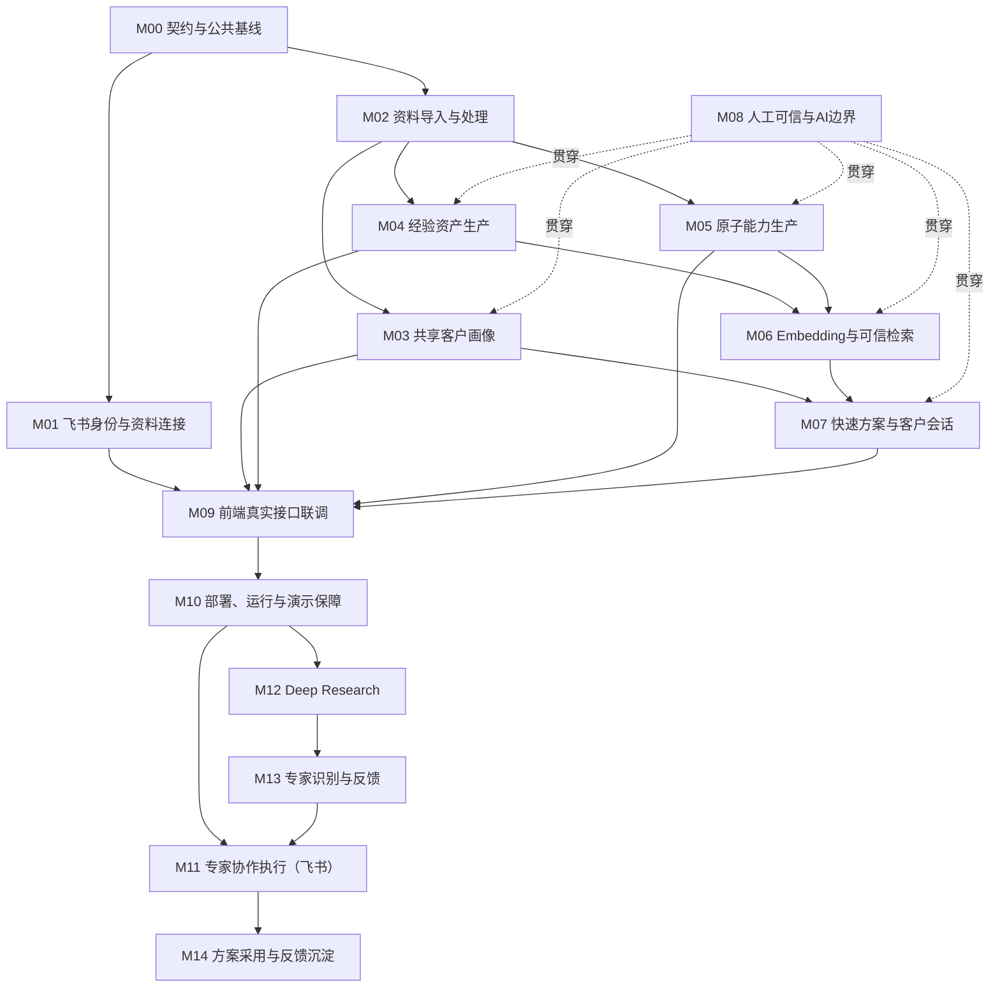

# 淘到宝引擎V0.5至V1模块任务池

## 0.文档定位

本文不是重新分工，也不是重复完整PRD，而是将已确认的产品需求拆成可以独立派单、独立开发、独立联调和独立验收的模块任务池。

任务池遵循以下原则：

1.需求先进入模块，再分配负责人；人员可以调整，模块边界不随人员变化。
2.大需求拆成子需求，子需求必须写清输入、输出、依赖和验收标准。
3.前后端以`后端_开发/openapi.yaml`为唯一HTTP契约，后端与AI服务以`后端_开发/ai.py`中的五个方法为唯一内部调用契约。文件实际名为`ai.py`，不是口头所称的`api.py`。
4.YAML和Schema只定义模块之间如何交互，不替代产品规则和验收标准。
5.整个淘到宝引擎共同构成AI Harness；内部单个服务只能称为AI运行编排器、AI算子或数据服务，不能单独代表AI Harness。
6.V0.5先形成可信快速方案闭环；V1产品层增加Deep Research和专家协作。专家协作内部包含专家匹配、确认、飞书建群、结果同步、群内追问和反馈回写；方案采用看板属于V1之后。

## 1.版本口径

### 1.1 V0.5：可信快速方案骨架

V0.5必须完成：

```text
登录或Mock登录
→导入文本或飞书文档链接
→生成客户画像、经验或原子能力草稿
→人工修改并校验
→已校验资产生成Embedding
→经验与能力分库检索
→生成有来源、有边界的快速方案
→同一客户支持多会话和继续追问
```

V0.5允许飞书和模型使用同Schema的Mock适配器，但黄金流程必须真正通过后端、数据库和AI服务运行，不能继续由前端写死结果。

### 1.2 V1：真实接入与稳定可信版本

V1在V0.5基础上增加：

- 真实飞书OAuth和文档读取。
- 真实Embedding、向量检索和生成模型。
- 大陆网络可访问的部署环境。
- 完整任务状态、重试、幂等、日志和运行追踪。
- 原文更新、权限失效和模型失败的降级处理。
- 真实前后端联调和可重复演示。
- 提示词、模型、Embedding和检索快照版本记录。
- Deep Research长任务、阶段进度与研究报告。
- 专家协作：基于真实作者和贡献记录匹配专家，确认后由飞书机器人建群、同步结果文档、支持群内追问并回写反馈。

### 1.3 V1之后扩展池

以下能力进入任务池，但不属于本轮V1交付：

- 方案采用看板与反馈回写。
- 企业级权限、画像版本和复杂检索优化。

## 2.任务池分层

每项需求使用四级结构：

```text
L1 产品大需求
→L2 子需求
→L3 可开发任务
→L4 验收用例
```

例如：

```text
L1 飞书连接
→L2 飞书登录
→L3 使用授权code换取用户身份并建立登录态
→L4 用户授权后进入工作台，刷新页面仍保持登录
```

任务状态统一使用：

```text
待定义→可开发→开发中→待联调→待产品验收→完成
                         ↘阻塞
```

优先级统一使用：

|优先级|定义|
|---|---|
|S0|契约或环境阻塞项，不完成会阻塞多人|
|S1|黄金流程必需项，不完成无法形成可运行版本|
|S2|可信、稳定和演示保障项|
|S3|体验增强和后续扩展项|

## 3.原型页面与模块映射

|原型入口|对应模块|版本处理|
|---|---|---|
|飞书授权登录|M01飞书身份与资料连接|V0.5支持Mock，V1接入真实飞书|
|资料中心|M02资料导入与处理|V0.5核心|
|客户画像|M03共享客户画像|V0.5核心|
|经验库|M04经验资产生产|V0.5核心|
|原子能力库|M05原子能力生产|V0.5核心|
|快速方案|M06检索、M07方案与会话|V0.5核心|
|资产审核抽屉|M08人工可信与边界控制|V0.5核心|
|深度检索|M12 Deep Research|V1正式能力|
|专家协作|M13专家识别与反馈＋M11专家协作执行|V1正式能力；产品上是一个入口|
|方案看板|M14采用反馈|V1之后扩展，不阻塞V1|

## 4.模块总览

|模块编号|大需求|目标版本|优先级|主要前置依赖|
|---|---|---|---|---|
|M00|契约与公共基线|V0.5|S0|无|
|M01|飞书身份与资料连接|V0.5至V1|S1|M00|
|M02|资料导入与处理|V0.5|S1|M00|
|M03|共享客户画像|V0.5|S1|M00、M02|
|M04|经验资产生产|V0.5|S1|M00、M02|
|M05|原子能力生产|V0.5|S1|M00、M02|
|M06|Embedding与可信检索|V0.5|S1|M04、M05|
|M07|快速方案与客户会话|V0.5|S1|M03、M06|
|M08|人工可信与AI边界|V0.5至V1|S1|贯穿全部模块|
|M09|前端真实接口联调|V0.5至V1|S1|M01至M08|
|M10|部署、运行与演示保障|V1|S2|M09|
|M11|专家协作执行（飞书）|V1|S1|M01、M07、M10、M13|
|M12|Deep Research|V1|S1|M06至M10|
|M13|专家识别与反馈|V1|S1|M01、M04、M05、M12|
|M14|方案采用与反馈沉淀|V1之后|S3|M07、M11|



## 5.M00契约与公共基线

### 5.1 模块目标

冻结前端、后端、AI服务和数据库共同使用的数据结构，保证各模块可以独立开发后直接合并。

### 5.2 子需求

|任务编号|子需求|优先级|输出物|完成标准|
|---|---|---|---|---|
|M00-01|冻结前后端HTTP契约|S0|`openapi.yaml`|覆盖全部V0.5路由、枚举、错误码和示例，前端Mock字段与其一致|
|M00-02|确认后端与AI服务冻结契约|S0|`后端_开发/ai.py`|五个方法名、参数和调用方向保持不变；返回值由调用边界进行Schema校验|
|M00-03|冻结六个核心Schema|S0|Profile、Experience、Capability、SearchIntent、RetrievalSnapshot、Solution|两名开发使用同一Pydantic定义|
|M00-04|冻结状态枚举|S0|资料状态、审核状态、来源时效、任务状态、方案状态|前端、数据库和AI结果不存在第二套命名|
|M00-05|冻结统一错误结构|S0|错误码、提示、是否可重试、request_id|前端能够区分权限、数据、模型和系统错误|
|M00-06|冻结版本字段|S1|schema_version、prompt_version、model_version、embedding_version|每次AI运行可追溯到具体版本|
|M00-07|建立契约测试|S1|Schema与OpenAPI自动测试|契约变更后自动发现字段不兼容|

### 5.3 模块边界

- `openapi.yaml`只管理前端与后端HTTP交互。
- 后端与AI服务同进程时使用Python Protocol和Pydantic Schema。
- AI服务独立部署时，可从同一Schema生成`ai-openapi.yaml`，不得人工维护两套字段。
- 产品负责字段语义和业务规则，开发负责技术类型和实现方式。

## 6.M01飞书身份与资料连接

### 6.1 模块目标

让员工以飞书身份进入系统，并主动选择或指定有权限的飞书资料进入淘到宝引擎。

### 6.2 子需求

|任务编号|子需求|目标版本|优先级|前置依赖|完成标准|
|---|---|---|---|---|---|
|M01-01|Mock登录|V0.5|S1|M00|无需真实飞书即可跑通完整黄金流程|
|M01-02|飞书OAuth授权|V1|S1|M00|用户授权后建立安全登录态并获取基础身份|
|M01-03|登录态与退出|V0.5至V1|S1|M01-01或M01-02|刷新后保持登录，退出后业务接口失效|
|M01-04|工作空间绑定|V0.5|S1|M00|所有数据带workspace_id并按工作空间隔离|
|M01-05|飞书文档链接解析|V0.5|S1|M00|识别受支持链接并提取资源标识|
|M01-06|正文与元数据读取|V1|S1|M01-02、M01-05|读取正文、标题、作者或所有者、更新时间和来源链接|
|M01-07|权限及失效处理|V1|S2|M01-06|无权限、已删除、接口失败返回不同状态|
|M01-08|飞书文档选择器|V1|S1|M01-02|只列出用户有权访问且主动选择的资料|
|M01-09|妙记选择与转写读取|V1|S1|M01-02|不可用时稳定降级为粘贴转写文本|

### 6.3 不包含

- 自动读取员工全部飞书文档。
- 自动读取个人聊天历史。
- 企业知识库全量递归同步。
- 实时事件订阅。

## 7.M02资料导入与处理

### 7.1 模块目标

将飞书链接、聊天记录、妙记转写和普通文本转化为统一资料对象，并进入可追踪的处理任务。

### 7.2 子需求

|任务编号|子需求|优先级|前置依赖|完成标准|
|---|---|---|---|---|
|M02-01|文本资料导入|S1|M00|支持客户背景、历史方案和PRD文本导入|
|M02-02|飞书链接导入|S1|M01-05|链接读取成功后生成资料记录，失败时保留明确原因|
|M02-03|资料用途选择|S1|M00|支持客户画像、经验提取、能力拆分三类用途|
|M02-04|正文标准化|S1|M02-01或M02-02|清理无效字符并保存标准化纯文本|
|M02-05|AI业务标签|S2|M02-04|标签可为空、可编辑，不作为可信度评分|
|M02-06|任务状态与轮询|S1|M00|支持待处理、读取、解析、提取、待校验、完成和失败|
|M02-07|重复导入与幂等|S2|M02-01、M02-02|相同来源重复提交不产生第二条资料主记录|
|M02-08|手动刷新与来源时效|S2|M01-06|识别原文更新、无法访问和已删除|
|M02-09|失败重试|S2|M02-06|可重试错误最多自动重试2次，之后允许人工重试|

### 7.3 资料输出

每份资料至少输出：

```text
source_id、title、content、source_type、purpose、author、source_url、source_updated_at、synced_at、tags、processing_status、freshness_status
```

## 8.M03共享客户画像

### 8.1 模块目标

一个客户维护一份当前共享画像，供该客户的多个快速方案会话共同复用。

### 8.2 子需求

|任务编号|子需求|优先级|前置依赖|完成标准|
|---|---|---|---|---|
|M03-01|新建客户|S1|M00|创建客户后生成唯一profile_id|
|M03-02|绑定画像来源|S1|M02|一份画像可关联多个资料source_id|
|M03-03|AI生成画像草稿|S1|M00、M02|输出背景、问题、目标、约束、已有系统和信息缺口|
|M03-04|信息缺口保留|S1|M03-03|无法判断的字段为空或进入信息缺口，不得补造|
|M03-05|人工修改|S1|M03-03|员工可修改每个画像字段|
|M03-06|画像确认|S1|M03-05|确认后状态变为已确认并可用于方案|
|M03-07|多会话复用|S1|M03-06|同一客户不同会话读取同一当前画像|
|M03-08|防止自动覆盖|S2|M03-07|会话新信息不会自动改写长期画像|
|M03-09|画像重新生成|V1|S2|生成新草稿，经人工确认后覆盖当前画像|
|M03-10|画像版本管理|V1之后|S3|保留历史版本、修改人和变更原因|

### 8.3 画像字段

```text
customer_name、industry、background、current_problems、goals、constraints、existing_systems、stakeholders、information_gaps、source_ids、confirmation_status
```

## 9.M04经验资产生产

### 9.1 模块目标

把历史方案和项目复盘转化为可人工校验、可Embedding、可检索、可追溯的经验资产。

### 9.2 子需求

|任务编号|子需求|优先级|前置依赖|完成标准|
|---|---|---|---|---|
|M04-01|主要经验提取|S1|M02、M00|一份资料默认生成一条主要经验草稿|
|M04-02|来源绑定|S1|M04-01|经验关联source_id和原始链接|
|M04-03|事实约束|S1|M04-01|原文没有的客户、结果和指标不得进入事实字段|
|M04-04|人工修改|S1|M04-01|审核人可修改名称、问题、方案、前置条件、结果和边界|
|M04-05|通过与打回|S1|M04-04|已校验资产可检索，待校验和已打回资产不可检索|
|M04-06|来源更新复核|S2|M02-08|原文更新后保留旧资产但暂时退出检索|
|M04-07|Embedding文本生成|S1|M04-05|使用问题、方案、前置条件、适用场景和风险构建文本|
|M04-08|经验回归测试|S2|模拟数据|6份历史资料均通过Schema和来源检查|

## 10.M05原子能力生产

### 10.1 模块目标

把PRD和能力说明拆分为多个输入、输出、依赖和限制清晰的原子能力。

### 10.2 子需求

|任务编号|子需求|优先级|前置依赖|完成标准|
|---|---|---|---|---|
|M05-01|PRD能力拆分|S1|M02、M00|一份PRD可以产生多条原子能力|
|M05-02|来源绑定|S1|M05-01|每条能力关联source_id和原始链接|
|M05-03|必填字段校验|S1|M05-01|输入、输出或限制为空时不得通过校验|
|M05-04|人工修改|S1|M05-01|审核人可修改名称、说明、输入、输出、依赖和限制|
|M05-05|逐条通过与打回|S1|M05-04|同一PRD中的能力可以独立审核|
|M05-06|来源更新复核|S2|M02-08|原文更新后相关能力暂时退出检索|
|M05-07|Embedding文本生成|S1|M05-05|使用名称、说明、输入、输出、依赖和限制构建文本|
|M05-08|能力回归测试|S2|模拟数据|4份PRD的预期能力通过Schema和边界检查|

## 11.M06 Embedding与可信检索

### 11.1 模块目标

使用客户画像和当前需求召回少量已校验经验与原子能力，并保存当轮检索依据。

### 11.2 子需求

|任务编号|子需求|优先级|前置依赖|完成标准|
|---|---|---|---|---|
|M06-01|Embedding模型适配|S0|M00|可配置模型、密钥、维度和版本|
|M06-02|经验向量入库|S1|M04-07|已校验经验生成向量并写入pgvector|
|M06-03|能力向量入库|S1|M05-07|已校验能力生成向量并写入pgvector|
|M06-04|查询文本构建|S1|M03|由画像摘要、当前需求、目标和约束构建查询文本|
|M06-05|查询Embedding|S1|M06-01、M06-04|同一模型版本生成查询向量|
|M06-06|经验分库召回|S1|M06-02、M06-05|只召回已校验且来源有效的经验|
|M06-07|能力分库召回|S1|M06-03、M06-05|只召回已校验且来源有效的能力|
|M06-08|约束冲突排除|S1|M06-06、M06-07|与客户硬约束冲突的资产不得进入结果|
|M06-09|业务排序|S1|M06-08|按问题、约束、场景、行业和更新时间排序|
|M06-10|数量限制|S1|M06-09|经验最多3条，能力最多5条|
|M06-11|检索快照|S1|M06-10|保存资产ID、匹配原因、来源和版本|
|M06-12|无结果降级|S1|M06-06、M06-07|返回空快照和缺口，不用低相关内容凑数|
|M06-13|检索测试集|S2|模拟数据|至少12条ground truth可自动回归|

### 11.3 明确不做

- 独立复杂向量云服务。
- GraphRAG和知识图谱。
- 多路召回重排模型。
- 向用户展示不可解释的可信度百分比。

## 12.M07快速方案与客户会话

### 12.1 模块目标

在一个客户画像下建立多个独立会话，生成可继续追问的有来源快速方案。

### 12.2 子需求

|任务编号|子需求|优先级|前置依赖|完成标准|
|---|---|---|---|---|
|M07-01|创建客户会话|S1|M03|会话必须绑定一个客户画像|
|M07-02|多会话隔离|S1|M07-01|同一客户不同会话消息互不混合|
|M07-03|提交当前需求|S1|M07-01|保存用户消息并创建SolutionRun|
|M07-04|调用检索|S1|M06|保存画像快照和检索快照|
|M07-05|八区块方案生成|S1|M07-04|固定输出需求理解、建议、经验、能力、风险、待确认、来源和追问|
|M07-06|来源映射|S1|M07-05|历史事实和企业能力必须关联资产及原资料|
|M07-07|方案持久化|S1|M07-05|刷新页面后可以恢复方案和消息|
|M07-08|多轮追问|S1|M07-07|至少支持三轮连续追问|
|M07-09|追问上下文规则|S1|M07-08|只读取当前会话和共享画像，不读取其他客户会话|
|M07-10|重新检索判断|V1|S2|需求范围明显变化时创建新检索快照，否则复用上一快照|
|M07-11|生成失败重试|S2|M07-03|保留用户消息并创建新运行记录，不重复展示问题|

## 13.M08人工可信与AI边界

### 13.1 模块目标

通过人工校验、来源追溯、权限、结构校验和运行记录，将大模型生成转化为可验证的企业结果。

### 13.2 子需求

|任务编号|子需求|优先级|前置依赖|完成标准|
|---|---|---|---|---|
|M08-01|经验人工审核|S1|M04|支持修改、通过和打回|
|M08-02|能力人工审核|S1|M05|支持逐条修改、通过和打回|
|M08-03|画像人工确认|S1|M03|未确认信息明确展示为缺口|
|M08-04|四类边界|S1|M07|区分历史事实、企业能力、AI推断和待确认|
|M08-05|结构化输出校验|S1|M00|模型输出通过Pydantic Schema后才可落库|
|M08-06|引用检查|S1|M04至M07|事实和能力引用的资产必须存在且已校验|
|M08-07|无依据拒绝|S1|M06-12|不得生成虚假案例、能力、客户或指标|
|M08-08|AI运行记录|S2|M07|记录模型、Prompt、Embedding、Schema和检索版本|
|M08-09|人工修改记录|V1|S2|记录修改前后内容、修改人和原因|
|M08-10|回归评测|S2|模拟数据|黄金案例和边界案例每次发布前自动执行|
|M08-11|权限控制|V1|S2|读取和检索遵循用户与工作空间权限|

## 14.M09前端真实接口联调

### 14.1 模块目标

在不重做前端信息架构的前提下，将原型中的本地Mock逐个替换为真实服务。

### 14.2 子需求

|任务编号|子需求|优先级|前置依赖|完成标准|
|---|---|---|---|---|
|M09-01|API客户端与登录态|S1|M00、M01|前端统一调用`/api/v1`并处理登录失效|
|M09-02|资料中心联调|S1|M02|列表、详情、导入、状态轮询和重试可用|
|M09-03|客户画像联调|S1|M03|生成、修改、确认和复用可用|
|M09-04|经验库联调|S1|M04、M08|修改、通过和打回可用|
|M09-05|原子能力库联调|S1|M05、M08|逐条修改、通过和打回可用|
|M09-06|快速方案联调|S1|M06、M07|真实检索和真实方案替代`quickSearch`写死结果|
|M09-07|追问联调|S1|M07|真实会话上下文替代固定关键词回复|
|M09-08|统一加载与错误状态|S2|M00|每个异步动作有加载、失败、重试和空状态|
|M09-09|版本入口控制|S2|原型|V0.5只显示占位；V1中Deep Research和专家协作必须调用真实后端；不得把飞书执行单独展示为并列产品模块|

### 14.3 联调顺序

```text
登录→资料→任务→经验/能力审核→客户画像→会话→检索→方案→追问
```

不得等所有模块完成后一次性联调。

## 15.M10部署、运行与演示保障

### 15.1 模块目标

建立一套团队可共同使用、评委在中国大陆网络可直接访问的稳定环境。

### 15.2 子需求

|任务编号|子需求|优先级|前置依赖|完成标准|
|---|---|---|---|---|
|M10-01|统一Docker配置|S1|M00至M09|新成员按说明可启动前端、后端和数据库|
|M10-02|环境变量模板|S1|M01、M06|提供`.env.example`且不包含真实密钥|
|M10-03|数据库迁移|S1|M02至M07|空数据库可一键建立完整Schema|
|M10-04|大陆可访问部署|S1|M09|不使用代理即可访问登录页和黄金流程|
|M10-05|健康检查|S2|M10-04|分别返回服务、数据库和必要依赖状态|
|M10-06|日志与request_id|S2|M00|一次失败可从前端错误定位到服务端日志|
|M10-07|演示数据初始化|S2|模拟数据|一键导入黄金案例和边界案例|
|M10-08|演示环境重置|S2|M10-07|演示后可恢复初始状态|
|M10-09|降级开关|S2|M01、M06、M07|飞书或模型异常时可切换同Schema Mock|
|M10-10|录屏与静态备份|S2|M10-04|现场服务异常时仍有完整演示证据|

## 16.M11专家协作执行（飞书）

### 16.1 模块目标

作为“专家协作”的执行子模块，在员工确认专家后创建飞书文档和群聊、发送问题、承接群内追问。它不是独立产品入口。

### 16.2 子需求

|任务编号|子需求|优先级|前置依赖|完成标准|
|---|---|---|---|---|
|M11-01|创建飞书结果文档|S1|M01、M07|将结构化方案写入飞书文档并返回链接|
|M11-02|机器人发送结果卡片|S1|M01、M07|群内卡片包含摘要、来源和文档链接|
|M11-03|创建协作群|S1|M13|获得用户确认后创建群并邀请指定人员|
|M11-04|群内追问|S1|M07|群消息可以映射为对应会话的一轮追问|
|M11-05|反馈回写|S2|M08、M14|专家确认内容进入待审核资产，不直接污染知识库|
|M11-06|权限继承|S1|M01|结果文档和群成员遵循飞书权限|
|M11-07|研究任务双向状态同步|S1|M12、M13|建群后研究进入等待专家，回复后恢复研究中|

## 17.M12 Deep Research

### 17.1 模块目标

对快速检索无法回答的复杂问题启动长任务，通过多步骤研究和证据检查形成更完整报告。

### 17.2 子需求

|任务编号|子需求|优先级|前置依赖|完成标准|
|---|---|---|---|---|
|M12-01|深度研究任务入口|S1|M07、M10|用户明确选择后才启动，快速方案不自动升级|
|M12-02|研究问题拆分|S1|M08|生成可执行的研究子问题和完成条件|
|M12-03|多节点AI工作流|S1|M12-02|按业务分析、经验、能力和证据检查分工|
|M12-04|长任务状态|S1|M10|支持阶段进度、失败重试和恢复|
|M12-05|证据冲突处理|S1|M08|冲突信息进入待确认，不由模型自行选择事实|
|M12-06|研究报告|S1|M11|输出来源、结论、限制、待确认和专家问题|
|M12-07|一键发起专家协作|S1|M12-04、M13|携带研究任务、对话、文档、画像、证据和缺口创建协作草稿|
|M12-08|专家回复恢复研究|S1|M11|专家回答进入当前任务上下文并继续未完成阶段|

## 18.M13专家识别与反馈

### 18.1 模块目标

根据PRD作者、历史方案作者、经验贡献者和审核记录，找到能够处理当前缺口的企业人员。

### 18.2 子需求

|任务编号|子需求|优先级|前置依赖|完成标准|
|---|---|---|---|---|
|M13-01|专家候选来源|S1|M01、M04、M05|候选人必须来自真实作者、贡献者或审核人|
|M13-02|专家标签|S1|M13-01|标签来自贡献记录，不凭AI想象生成|
|M13-03|专家匹配|S1|M12|根据缺口、资产和来源推荐少量候选人|
|M13-04|邀请前确认|S1|M13-03|系统不得未经用户确认直接邀请或建群|
|M13-05|专家反馈记录|S1|M11|反馈与问题、会话和来源关联|
|M13-06|反馈转经验|S2|M08|先进入待校验草稿，经审核后才成为资产|
|M13-07|Deep Research任务选择器|S1|M12|按权限列出研究中、等待专家和已完成任务，读取对话与研究文档|
|M13-08|进行中协作唯一性|S1|M11、M12|同一研究任务同时只能存在一个进行中的专家协作|

## 19.M14方案采用与反馈沉淀

### 19.1 模块目标

记录方案是否真正进入业务流程，并将结果反馈到经验和检索优化中。

### 19.2 子需求

|任务编号|子需求|优先级|前置依赖|完成标准|
|---|---|---|---|---|
|M14-01|显式采用事件|S3|M07|员工明确标记采用后才记录采用|
|M14-02|协作流程采用事件|S3|M11|方案进入已确认项目协作流程时生成记录|
|M14-03|采用口径|S3|M14-01、M14-02|查看、复制和生成不计为采用|
|M14-04|方案统计|S3|M14-03|展示生成次数、采用次数和采用率|
|M14-05|资产贡献分析|S3|M06、M14-03|统计哪些经验与能力支持了已采用方案|
|M14-06|反馈进入审核|S3|M08|业务反馈先进入待校验，不直接改变排序|

## 20.任务执行顺序

### 20.1 第一波：冻结接口

```text
M00契约与公共基线
```

完成门槛：OpenAPI、AI Schema、状态枚举和错误码全部冻结，前端Mock可以通过契约测试。

### 20.2 第二波：跑通资料与资产

```text
M02资料导入
→M03客户画像
→M04经验资产
→M05原子能力
→M08人工审核
```

完成门槛：一份客户背景、一份历史方案和一份PRD完成导入、提取、审核和落库。

### 20.3 第三波：跑通Embedding RAG

```text
M04/M05已校验资产
→M06 Embedding
→pgvector
→分库召回
→检索快照
```

完成门槛：黄金查询命中预期资产，边界查询返回空结果和明确缺口。

### 20.4 第四波：跑通快速方案

```text
M03画像
+M06检索
→M07方案与会话
→M08来源和边界检查
```

完成门槛：生成八区块方案并支持至少三轮追问。

### 20.5 第五波：前端真实联调

```text
M09逐页替换Mock
```

完成门槛：现有原型不依赖写死结果即可完成黄金流程。

### 20.6 第六波：真实飞书与部署

```text
M01真实飞书
+M10部署与演示保障
```

完成门槛：大陆网络环境下完成飞书登录、资料导入和快速方案；外部服务失败时可降级。

### 20.7 第七波：V1正式能力

```text
M12 Deep Research
→M13专家识别与反馈
→M11专家协作执行（飞书）
```

M11至M13属于V1。产品上只有Deep Research和专家协作两项，M13与M11只是“专家协作”的两个技术子模块。M14在V1稳定后再启动。

## 21.人员转移规则

任务池不绑定固定人员。某人完成当前模块后，可以认领其他模块，但必须满足以下交接门槛：

1.代码已经合并到共同开发分支。
2.接口和Schema没有未同步的本地修改。
3.自动测试通过。
4.上游和下游至少完成一次联调。
5.启动说明、环境变量和已知问题已经更新。
6.产品按照模块验收标准确认完成。
7.另一名成员能够在没有原负责人帮助的情况下启动该模块。

后端任务完成后，适合优先转入以下AI相关模块：

- M06 Embedding与pgvector。
- M07 AI运行编排与SolutionRun。
- M08 Schema校验、引用检查、重试和运行记录。
- M10评测脚本、日志和部署。

Prompt、经验抽取逻辑、能力拆分逻辑和方案生成策略仍由熟悉AI领域逻辑的人维护，避免多人同时修改同一Prompt。

## 22.标准任务卡

每个子需求进入开发前，必须补全以下字段：

```text
任务编号：
任务名称：
所属模块：
目标版本：
优先级：
状态：
负责人：
依赖任务：

用户价值：
触发条件：
输入：
处理规则：
输出：
异常与降级：
影响的接口或Schema：
使用的验收数据：
完成标准：
```

任务不能仅写“完成接口”“完成AI服务”或“完成联调”。完成标准必须是可观察的用户结果。

## 23.完成定义

子需求只有同时满足以下条件才可标记为完成：

- 代码完成并合并。
- 接口或Schema与契约一致。
- 单元测试或契约测试通过。
- 上下游联调通过。
- 错误和空状态可处理。
- 日志可定位问题。
- 使用指定模拟数据通过验收。
- 产品可以从现有原型入口亲自验证。

## 24.当前立即进入可开发状态的任务

按照现有材料，优先将以下任务置为“可开发”：

1.M00-02确认`openapi.yaml`和`ai.py`冻结基线。
2.M00-03在不修改`ai.py`五个方法签名的前提下补充Pydantic校验层。
3.M02-01文本资料导入。
4.M04-01主要经验提取。
5.M05-01 PRD能力拆分。
6.M08-01至M08-03人工审核与确认。
7.M06-01 Embedding模型适配。
8.M06-02和M06-03已校验资产向量入库。
9.M06-06和M06-07经验与能力分库召回。
10.M07-05八区块方案生成。
11.M09-02至M09-07前端逐模块真实联调。

当前V0.5阶段暂不进入开发：M11至M14。进入V1后，M12 Deep Research以及由M13专家识别、M11飞书执行共同组成的专家协作转为正式开发项；M14继续保留为V1之后的扩展。
