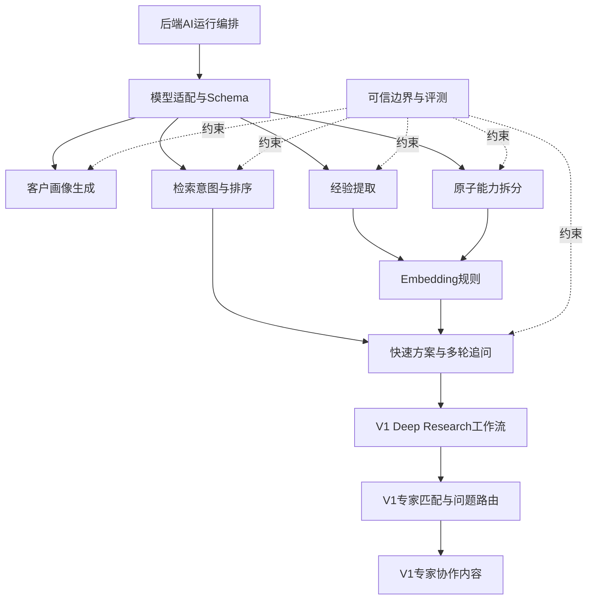

# AI服务需求总PRD与依赖图

## 1.目标

AI服务把原始企业资料编译为可审核资产，把客户问题翻译为检索意图，并基于可用证据生成可追溯方案。它不拥有业务状态，人工审核和数据权限均由后端控制。

## 2.模块架构

## 3.冻结方法映射

|AI方法|主要模块|输出用途|
|---|---|---|
|`extract_profile(raw_text, source_ids)`|画像生成|待确认画像|
|`extract_experience(raw_text, source_id)`|经验提取|待校验经验草稿|
|`extract_capabilities(raw_text, source_id)`|原子能力拆分|待校验能力草稿列表|
|`extract_search_intent(context)`|检索意图/专家缺口|检索文本、过滤条件、硬约束、V1专业缺口|
|`generate_solution(context, retrieval_snapshot)`|快速方案/Deep Research阶段|八区块方案或V1研究阶段输出|

## 4.统一规则

1.没有来源的信息不得标为历史事实或企业能力。
2.模型不知道的字段必须输出空值或待确认，禁止补齐“合理细节”。
3.模型只生成草稿；是否可检索由后端审核状态决定。
4.经验和能力分开提取、分开Embedding、分开召回。
5.快速检索是单流程，不启动多Agent；Deep Research才使用多节点工作流。
6.每项结论标注historical_fact、enterprise_capability、ai_inference或pending_confirmation。
7.每次运行记录model_version、prompt_version、schema_version和embedding_version。
8.专家协作只接受Deep Research上下文包；从研究页一键发起和从专家协作页选择任务必须使用同一输入Schema。
9.专家回答回到原Deep Research任务后，作为带作者和来源的待确认输入继续研究，不直接变成企业事实。

## 5.版本范围

|V0.5|V1|V1之后|
|---|---|---|
|画像、经验、能力、Embedding、检索意图、快速方案、追问、可信边界|Deep Research、专家协作（专家问题路由＋飞书内容）|自动学习采用反馈、复杂图谱推理|

## 6.跨模块验收

- 冻结五个方法均有正常、空文本、缺字段、超长文本、模型失败用例。
- 所有返回值可被后端Schema校验，不输出Markdown包裹的伪JSON。
- 引用ID只能来自输入context或retrieval_snapshot。
- 无证据测试必须拒答；冲突证据必须进入待确认。
- 同一固定输入在同一模型/Prompt版本下结构稳定。
- AI服务不持有飞书token、不绕过后端直接访问业务数据库。
