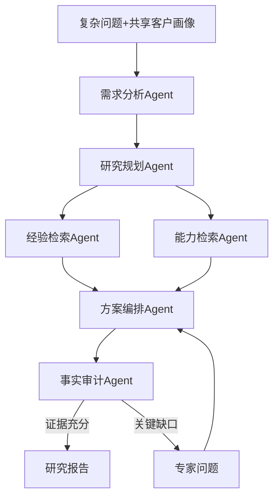

# V1 Deep Research工作流模块PRD

## 1.模块信息

- 编号：AI-09
- 目标版本：V1正式能力。
- 目标：对复杂问题执行多步骤研究，在证据不足时提出专家问题，并输出可追溯研究报告。

## 2.为什么需要多节点

快速方案只需一次检索与生成。Deep Research需要问题拆解、多轮召回、路线比较、证据冲突处理和可能的专家等待，这些步骤状态不同且可单独重试，因此使用职责节点而不是为展示堆Agent数量。

## 3.依赖

|方向|模块|依赖内容|
|---|---|---|
|上游|后端Deep Research任务|问题、画像、阶段、完成条件|
|上游|检索意图/后端检索|分阶段快照|
|上游|可信边界|引用、冲突和拒答规则|
|下游|后端任务|阶段结果、进度、报告、专家问题|
|下游|专家匹配/专家协作内容|统一研究上下文包、knowledge_gaps和报告|

## 4.冻结契约策略

继续使用`generate_solution(context, retrieval_snapshot)`。V1在context内增加版本化字段：mode=deep、stage、research_plan、prior_findings、expert_answers；签名保持不变。正式Schema必须作为V1增量文档冻结。

## 5.工作流

## 6.功能要求

|编号|要求|验收|
|---|---|---|
|AI09-01|拆出有限研究子问题和完成条件|不是无限开放搜索|
|AI09-02|经验与能力分别检索并保存阶段结论|不混淆过去与现在|
|AI09-03|比较最多3条方案路线|说明取舍和不适用条件|
|AI09-04|事实审计检查引用、冲突和缺口|发现问题退回编排或提问|
|AI09-05|关键缺口转成具体专家问题|问题可直接在群里回答|
|AI09-06|最终报告包含结论、依据、路线、风险、限制、待确认和来源|前端可结构化展示|
|AI09-07|输出专家协作上下文包|包含research_task_id、对话摘要、研究文档、画像摘要、证据快照、缺口和问题|
|AI09-08|接收带作者与来源的专家回答继续未完成阶段|不把回答直接当已校验事实|
|AI09-09|两个专家协作入口使用同一上下文构造规则|一键发起与自主选择结果一致|

## 7.异常与降级

某节点失败时只返回该阶段可重试错误；专家未回复时可带缺口完成；恢复研究时不重复已完成节点；证据不足时报告明确“不足以形成确定方案”。

## 8.交接边界

AI模块输出阶段结果，不拥有任务状态、重试次数或群聊。后端负责持久化和调度。
