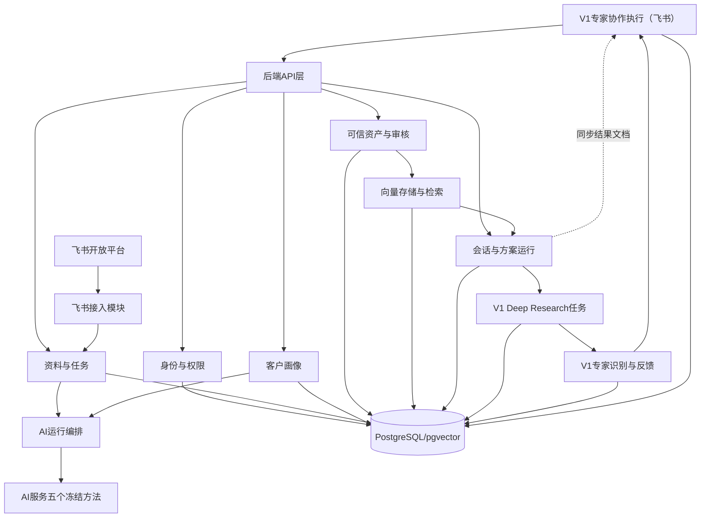

# 后端需求总PRD与依赖图

## 1.产品目标

后端负责把飞书来源、可复用客户画像、可信知识资产、检索、快速方案、Deep Research和专家协作连接为可追溯工作流。V1产品能力只有Deep Research与专家协作；专家协作内部再拆为专家识别和飞书执行两个技术子模块。

## 2.架构边界

## 3.冻结契约

|边界|基线|要求|
|---|---|---|
|Web→后端|`后端_开发/openapi.yaml`|现有路径、请求、响应、枚举、错误结构保持兼容|
|后端→AI|`后端_开发/ai.py`|只调用`extract_profile`、`extract_experience`、`extract_capabilities`、`extract_search_intent`、`generate_solution`|
|V1新增|独立增量契约|先写需求和示例，再添加路由/字段；不得改坏quick模式|

## 4.模块依赖

|模块|直接上游|直接下游|阻塞条件|
|---|---|---|---|
|身份与权限|飞书OAuth或Mock|全部业务模块|无法识别用户/工作空间|
|飞书接入|身份与权限、飞书API|资料、协作、专家|授权或权限不足|
|资料与任务|飞书接入/文本输入|画像、资产、AI编排|正文不可读取|
|客户画像|资料、AI编排|快速方案、Deep Research|画像未确认|
|可信资产与审核|资料、AI编排|向量检索、专家|资产未校验或来源更新|
|向量存储与检索|已校验资产、检索意图|快速方案、Deep Research|无可用资产或向量失败|
|会话与方案运行|画像、检索、AI编排|前端、结果同步、专家协作执行|运行失败或无依据|
|AI运行编排|资料/画像/检索上下文|画像、资产、方案|Schema失败或模型不可用|
|Deep Research任务|会话、画像、检索|专家识别与反馈|V0.5主链未稳定|
|专家识别与反馈|真实作者记录、研究缺口|专家协作执行、资产审核|候选无真实依据|
|专家协作执行|方案/报告、已确认专家、飞书接入|飞书群、文档和资产草稿|用户未确认或权限不足|

## 5.统一业务规则

1.同一工作空间内，一个客户只维护一份长期画像；会话中的信息不自动覆盖画像。
2.只有`verified`且来源仍有效的经验和能力可检索。
3.来源更新后资产转`source_updated`并退出检索，重新审核后恢复。
4.每次方案运行保存独立检索快照，历史答案不随资产更新改变。
5.所有AI结果先经Schema和来源检查；缺失内容保持为空或进入待确认。
6.快速方案使用单工作流；只有Deep Research使用多节点AI工作流。
7.专家必须来自真实作者、贡献者或审核人；建群前必须人工确认。
8.专家协作必须关联一个Deep Research任务，可由研究页一键发起，也可在专家协作页自主选择研究任务。
9.一个Deep Research任务同时只允许一个进行中的专家协作；专家回复必须回到原研究任务后再继续生成。

## 6.V1交付范围

|类别|V1必须完成|不在V1|
|---|---|---|
|基础|真实飞书OAuth、文档选择/链接/妙记同步、原文更新时间、稳定部署|企业级复杂权限|
|智能|真实Embedding检索、快速方案、Deep Research|完整知识图谱|
|专家协作|专家推荐、员工确认、结果文档、机器人卡片、建群、群内追问、反馈转草稿|全自动邀人、自动修改知识|
|度量|日志、运行追踪、演示数据|完整采用看板|

## 7.跨模块完成定义

- 与冻结契约一致，或V1新增契约已单独评审。
- 正常、空数据、无权限、模型失败四类用例均有结果。
- request_id可贯穿前端、后端和AI调用。
- 数据按workspace_id隔离；密钥不进入代码库。
- 上下游至少完成一次真实联调，不接受仅返回写死数据。
- 原型中的正式按钮能够得到真实状态或明确错误。
