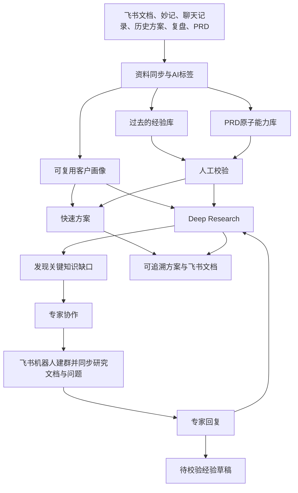

# 淘到宝引擎V1方案与数据需求

## 1.方案概述

淘到宝引擎是一款面向神州数码销售与售前员工的企业经验驱动方案副驾驶。

企业内部沉淀了大量飞书文档、客户沟通记录、飞书妙记、历史方案、项目复盘和产品需求文档，但这些信息通常分散在不同人员和文件中，难以在新的客户场景中快速复用。

淘到宝引擎通过飞书连接这些业务资料，将其整理为三类可复用资产：

- 客户画像：当前客户是谁、希望解决什么问题、有哪些约束和信息缺口。
- 过去的经验库：企业过去在类似场景中实际做过什么、需要哪些前置条件、取得了什么结果。
- PRD原子能力库：企业当前具备哪些可组合能力，以及每项能力的输入、输出、前置条件和限制。

系统在此基础上提供快速方案、Deep Research和专家协作，使方案不仅能够快速生成，还能回到来源、识别边界，并通过真实业务人员完成核验。

## 2.整体流程

## 3.核心使用流程

### 3.1 资料沉淀

员工通过飞书授权选择文档、粘贴飞书链接或导入聊天与妙记文本。系统读取资料标题、作者、正文、来源和修改时间，并根据用途进行AI标签和结构化处理。

历史方案与项目复盘被整理为经验草稿；PRD与产品说明被拆分为原子能力草稿。员工确认、修改或打回后，只有已校验且原文仍有效的内容才能参与后续检索。

### 3.2 快速方案

销售或售前选择一个客户画像，输入当前需求。系统同时检索已校验的历史经验和原子能力，按照客户约束、问题相关性和适用条件进行排序，生成一份内部方案底稿。

输出包括：

- 对客户需求的理解。
- 优先建议和实施路径。
- 可复用的历史经验。
- 可组合的企业能力。
- 前置条件与风险。
- 待确认信息。
- 原始资料来源。
- 建议继续追问的问题。

员工可以在同一客户会话中继续追问，系统始终复用同一份客户画像，不会把其他客户的信息混入当前方案。

### 3.3 Deep Research

当问题涉及多条路线比较、证据冲突或复杂业务约束时，员工可以发起Deep Research。系统对问题进行拆解，分别检索历史经验和当前能力，比较不同路线，并检查结论是否得到资料支持。

Deep Research最终形成带来源、限制和待确认项的研究文档，而不是只有一段无法追溯的AI回答。

### 3.4 专家协作

专家协作与Deep Research直接打通，支持两种入口：

1.在Deep Research中发现关键知识缺口后，一键发起专家协作。
2.在专家协作页面自主选择已有Deep Research任务，读取其对话、研究文档、客户画像、证据与待确认问题。

系统根据PRD作者、历史方案撰写者、经验贡献者和审核记录推荐相关专家。员工确认人员和问题后，飞书机器人创建协作群并同步研究文档。专家回答会返回原Deep Research任务，支持继续研究；如需沉淀，则先形成待校验经验草稿，人工审核后才能进入经验库。

## 4.数据需求

为验证上述流程，希望在条件允许的情况下，尽可能提供以下类型的脱敏业务资料。资料不要求包含真实客户名称或敏感商业信息，可以使用匿名、节选或模拟数据。

|数据类型|建议形式|用于验证什么|为什么需要|
|---|---|---|---|
|客户需求与沟通背景|客户聊天记录、销售记录、飞书妙记、会议纪要或需求描述|客户画像、快速方案和Deep Research输入|验证系统能否从模糊表达中识别目标、问题、约束和信息缺口|
|历史方案或项目复盘|售前方案、项目总结、交付复盘、案例说明|过去的经验库|验证系统能否提取真实做法、前置条件、结果、风险和适用范围|
|PRD或产品能力说明|产品PRD、功能说明、技术能力说明|PRD原子能力库|验证系统能否把完整产品拆成可组合且有边界的原子能力|
|资料基础信息|标题、资料类型、作者或贡献者、修改时间|资料同步、原文时效和专家匹配|验证知识来源、更新状态以及专家推荐是否能够追溯到真实贡献记录|
|可选的结果反馈|方案是否采用、人工修改意见、专家补充回答|审核与后续优化|验证系统能否区分AI草稿、人工确认和真实业务反馈|

## 5.建议的数据组合

为了形成一个完整且可演示的业务闭环，如果条件允许，建议尽可能提供：

- 1—3组客户需求或沟通背景。
- 5—10份历史方案、案例或项目复盘。
- 3—5份PRD、产品说明或能力文档。
- 与上述资料对应的作者、贡献者或更新时间等基础信息。

比数量更重要的是资料之间能够形成同一业务场景的关联。例如，一组客户需求可以对应一份历史方案、一份项目复盘和一份相关PRD，这样能够完整验证“客户画像—经验检索—能力组合—方案生成—专家核验”的流程。

## 6.数据不足时的处理方式

如果暂时无法提供完整数据，可以采用以下方式启动验证：

- 使用脱敏后的真实资料节选。
- 使用主办方提供的字段结构，由项目组补充模拟内容。
- 先提供少量同一业务场景下的关联资料，再逐步扩充。
- 对作者、客户、金额和项目名称等敏感字段进行匿名替换。

系统验证的重点不是读取敏感数据，而是确认企业资料能否被整理为可检索、可验证、可复用的经验与能力，并进入飞书中的真实协作流程。
