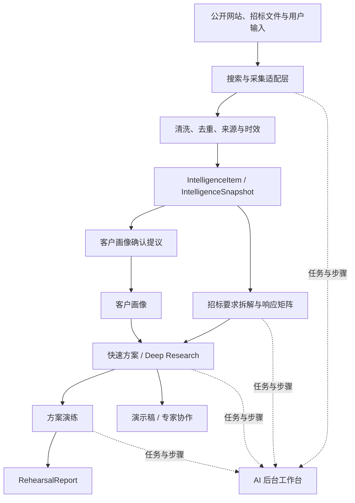

# 淘到宝引擎 V2 后端服务总 PRD 与依赖图

## 0. 文档信息

| 项目 | 内容 |
|---|---|
| 版本 | V2.0 |
| 文档状态 | 产品确认稿，待技术评审 |
| 更新日期 | 2026-08-11 |
| 承接基线 | V1.1 已有资料库、客户画像、快速方案、Deep Research、专家协作、可信服务与演示稿服务 |
| 配套业务 PRD | `01_情报与招标业务PRD.md`、`02_方案演练业务PRD.md` |
| 配套后台 PRD | `v2更新需求.md` |
| 本文范围 | V2 两个新增业务功能共用的后端服务、数据契约、异步任务、可信边界和依赖关系 |

## 1. 背景与目标

V1.1 已经能够利用企业内部资料生成带证据边界的快速方案和 Deep Research 报告，但仍缺少两个业务闭环：

1. 外部公开信息尚未形成统一、可追溯、可确认的情报资产，销售仍需手工搜索客户、项目、招聘、招投标、行业和政策信息。
2. 方案完成后缺少面向销售和售前的客户异议演练，员工无法基于真实画像、研究结果和证据边界进行系统化准备。

V2 后端服务的目标是建立一套可被两个业务功能复用的基础能力：

- 统一公开搜索、采集、清洗、去重、来源和时效管理。
- 将外部情报与内部经验、内部能力严格分开。
- 支持招标文件解析、要求拆解和响应矩阵。
- 支持方案演练会话、逐轮评价和演练报告。
- 所有长任务统一登记到 AI 后台工作台，但业务操作仍在业务页面完成。
- 保持 V0.5/V1/V1.1 冻结接口兼容，不为了 V2 破坏现有流程。

## 2. 产品与技术边界

### 2.1 本期必须完成

- V2 共用数据模型与数据库迁移。
- 外部搜索源适配器协议。
- 搜索运行、采集结果、情报条目和情报快照。
- 情报候选人工确认后写入客户画像的提议流程。
- 招标文件、要求项、响应矩阵和逐项审核。
- 演练会话、演练轮次、回答评价和演练报告。
- 新增任务接入统一 Runtime Task/Step/Trace。
- Workspace 隔离、幂等、审计、脱敏和来源失效处理。
- Mock 与 Live 使用相同 Schema，并明确标识运行模式。

### 2.2 本期不做

- 不建设新的账户、组织和复杂权限系统。
- 不绕过登录、验证码、付费墙、robots 限制或网站访问控制。
- 不抓取非公开个人隐私数据。
- 不把外部案例写成企业历史经验。
- 不把外部厂商能力写成企业原子能力。
- 不让情报自动覆盖长期客户画像。
- 不让演练结论自动写入经验库、能力库或客户画像。
- 不在 AI 后台工作台直接审批、发布或修改业务状态。
- 不在快速方案中引入 Multi-Agent；Multi-Agent 仍只用于 Deep Research。

### 2.3 冻结契约

- 现有 HTTP 路径、字段语义和状态枚举不得破坏性修改。
- `app/contracts/ai.py` 的五个方法签名保持不变：
  - `extract_profile`
  - `extract_experience`
  - `extract_capabilities`
  - `extract_search_intent`
  - `generate_solution`
- Embedding 继续作为共享适配能力，不增加第六个 `AIEngine` 方法。
- V2 新接口采用增量契约，继续使用 `/api/v1` 前缀，产品版本不等于 API 版本。
- AI 返回的建议不能直接改变发布状态；最终可信决策仍由后端 Trust Gate 决定。

## 3. 总体架构



## 4. 两条后端开发线

### 4.1 线路 A：搜索与数据底座

职责：

- 搜索源与采集适配器。
- URL 规范化、正文抽取、指纹、去重和更新检测。
- 搜索运行、采集状态、失败原因和限流。
- 情报条目、情报快照和来源有效性。
- 招标文件安全解析与结构化切分。
- 统一文本检索与 Embedding 接入。

主要产物：

- `SearchProvider`
- `SearchRun`
- `CrawlArtifact`
- `IntelligenceItem`
- `IntelligenceSnapshot`
- `TenderDocument`
- `RequirementItem`

### 4.2 线路 B：业务编排与 AI 应用

职责：

- 情报分类、摘要和客户关联建议。
- 招标要求拆解、证据匹配和响应矩阵。
- 方案与研究上下文组装。
- 演练场景、客户角色、多轮对话、回答评价和报告。
- 将业务执行过程登记到 Runtime Task/Step。

主要产物：

- `ProfileIntelligenceProposal`
- `ResponseMatrix`
- `ResponseItem`
- `RehearsalSession`
- `RehearsalTurn`
- `AnswerEvaluation`
- `RehearsalReport`

## 5. 核心数据对象

### 5.1 SearchProvider

| 字段 | 说明 |
|---|---|
| provider_id | 适配器标识 |
| provider_type | search_api / site_feed / manual_url / document_upload |
| name | 展示名称 |
| mode | mock / live |
| enabled | 是否启用 |
| rate_limit_policy | 限流策略 |
| compliance_policy_version | 合规策略版本 |
| last_health_check_at | 最近健康检查时间 |

### 5.2 SearchRun

| 字段 | 说明 |
|---|---|
| run_id | 搜索任务 ID |
| workspace_id | 工作空间隔离键 |
| initiated_by | 发起人 |
| scene | customer / solution / tender / policy |
| query | 原始查询 |
| normalized_query | 规范化查询 |
| filters | 时间、地区、来源类型等过滤条件 |
| status | queued / running / completed / partial / failed / cancelled |
| provider_runs | 各适配器状态摘要 |
| trace_id | 运行追踪 ID |
| created_at / completed_at | 起止时间 |

`SearchRun` 状态是 V2 模块新增状态，不修改现有方案或研究状态枚举。

### 5.3 IntelligenceItem

| 字段 | 说明 |
|---|---|
| intelligence_id | 情报条目 ID |
| workspace_id | 工作空间隔离键 |
| search_run_id | 来源搜索任务 |
| scene | customer / project / industry / competitor / policy / tender / case |
| entity_type | company / person / project / job / policy / tender / case / other |
| entity_name | 关联实体名称 |
| title | 标题 |
| summary | 可读摘要 |
| facts | 结构化事实候选 |
| source_url | 原始公开地址 |
| source_domain | 来源域名 |
| source_type | 官网、新闻、招聘、政府、招标、案例等 |
| published_at | 原文发布时间 |
| captured_at | 系统采集时间 |
| content_fingerprint | 正文指纹 |
| freshness_status | current / stale / unavailable / deleted |
| confidence_signal | 规则与模型给出的非概率信号 |
| review_status | pending / accepted / rejected / superseded |
| information_origin | 固定为 external_public 或 user_provided |

### 5.4 IntelligenceSnapshot

每次画像补全、方案研究、招标响应或演练必须固化独立快照，至少包含：

- `snapshot_id`
- `workspace_id`
- `purpose`
- `related_customer_profile_id`
- `related_solution_run_id`
- `item_ids`
- 每项来源 URL、指纹、发布时间、采集时间和有效状态
- `created_by`
- `created_at`

快照创建后，后续网页更新不能篡改历史方案或演练使用的内容。

### 5.5 ProfileIntelligenceProposal

| 字段 | 说明 |
|---|---|
| proposal_id | 提议 ID |
| customer_profile_id | 目标画像 |
| intelligence_snapshot_id | 外部情报快照 |
| proposed_changes | 字段级新增或修改建议 |
| conflicts | 与长期画像的冲突 |
| status | pending_confirmation / accepted / rejected |
| confirmed_by / confirmed_at | 人工确认信息 |

只有 `accepted` 后才能由后端更新客户画像，并保留更新前版本。

### 5.6 TenderDocument 与 RequirementItem

`TenderDocument` 保存文件元数据、安全解析状态、原始文件哈希、解析版本和页数，不把文件原文直接写入日志。

`RequirementItem` 至少包含：

- `requirement_id`
- `tender_document_id`
- `original_text`
- `source_location`
- `category`
- `mandatory`
- `acceptance_condition`
- `deadline_or_metric`
- `ambiguities`
- `status`

### 5.7 ResponseMatrix 与 ResponseItem

`ResponseMatrix` 绑定一个招标文件、客户画像、内部检索快照和外部情报快照。

每个 `ResponseItem` 至少包含：

- 招标要求引用
- 内部经验引用
- 内部能力引用
- 外部背景引用
- 回答草稿
- 证据状态
- 风险
- 信息缺口
- 人工审核状态
- 版本

内部经验、内部能力和外部公开信息必须分栏保存，不得合并成无法区分的“知识依据”。

### 5.8 RehearsalSession

| 字段 | 说明 |
|---|---|
| rehearsal_id | 演练 ID |
| workspace_id | 工作空间 |
| created_by | 发起人 |
| customer_profile_id | 客户画像 |
| solution_run_id / research_task_id | 上游方案或研究任务 |
| intelligence_snapshot_id | 使用的外部情报快照 |
| response_matrix_id | 可选招标响应矩阵 |
| scenario_config | 角色、难度、重点和轮数 |
| status | draft / ready / running / completed / failed / archived |
| trace_id | 追踪 ID |

### 5.9 RehearsalTurn、AnswerEvaluation 与 RehearsalReport

`RehearsalTurn` 保存客户问题、员工回答、引用上下文和轮次，不保存模型内部思维过程。

`AnswerEvaluation` 至少包含：

- 事实与证据
- 客户匹配度
- 回答完整性
- 风险与过度承诺
- 表达清晰度
- 遗漏问题
- 改进建议

`RehearsalReport` 汇总整体表现、关键异议、薄弱点、无依据承诺、建议补充资料和下一次演练建议。报告不得用作员工绩效结论。

## 6. 信息来源与可信边界

V2 新增 `information_origin`，用于区分信息来源域，不修改 V1 的四种方案边界：

| information_origin | 含义 | 是否可证明企业经验/能力 |
|---|---|---|
| internal_experience | 已校验企业经验 | 仅可证明历史事实 |
| internal_capability | 已校验企业原子能力 | 仅可证明企业能力 |
| external_public | 外部公开情报 | 否 |
| customer_confirmed | 客户或员工确认信息 | 作为画像上下文，保留确认记录 |
| user_provided | 用户本轮输入 | 仅作为本轮上下文 |

规则：

1. 外部成功案例不能变成 `historical_fact`。
2. 竞品或市场能力不能变成 `enterprise_capability`。
3. 公开情报可以辅助判断和提问，但正式方案必须展示来源和时间。
4. 来源不可用、过期或删除后，历史快照保留；新任务不得继续在线召回。
5. 找不到内部依据时，招标回答必须明确标记缺口，不能使用外部案例替代。

## 7. 异步任务与 AI 后台工作台接入

V2 新增任务类型：

- `intelligence_search`
- `intelligence_extract`
- `tender_parse`
- `response_matrix_generate`
- `rehearsal_prepare`
- `rehearsal_evaluate`
- `rehearsal_report`

典型阶段：

```text
intelligence_search:
queued → searching → fetching → extracting → deduplicating → snapshotting → completed

response_matrix_generate:
queued → parsing → requirement_extraction → internal_retrieval
→ external_context → drafting → evidence_audit → completed

rehearsal_evaluate:
queued → context_loading → role_setup → questioning
→ answer_evaluation → report_generation → completed
```

所有阶段至少持久化：任务 ID、Trace ID、阶段、状态、开始/结束时间、输入摘要、输出摘要、运行模式、错误码和重试次数。AI 后台只读展示，业务处理回到对应业务页面。

## 8. V2 增量接口范围

正式开发前写入单独的增量 OpenAPI 文件，并与现有统一响应信封、身份校验、Workspace 隔离和幂等规则保持一致。

### 8.1 情报接口

```http
POST /api/v1/intelligence/search-runs
GET  /api/v1/intelligence/search-runs
GET  /api/v1/intelligence/search-runs/{run_id}
GET  /api/v1/intelligence/items
GET  /api/v1/intelligence/items/{item_id}
POST /api/v1/intelligence/snapshots
GET  /api/v1/intelligence/snapshots/{snapshot_id}
POST /api/v1/customer-profiles/{profile_id}/intelligence-proposals
POST /api/v1/customer-profiles/{profile_id}/intelligence-proposals/{proposal_id}/confirm
POST /api/v1/customer-profiles/{profile_id}/intelligence-proposals/{proposal_id}/reject
```

### 8.2 招标接口

```http
POST /api/v1/tenders
GET  /api/v1/tenders
GET  /api/v1/tenders/{tender_id}
GET  /api/v1/tenders/{tender_id}/requirements
POST /api/v1/tenders/{tender_id}/response-matrices
GET  /api/v1/response-matrices/{matrix_id}
PATCH /api/v1/response-matrices/{matrix_id}/items/{item_id}
POST /api/v1/response-matrices/{matrix_id}/items/{item_id}/review
```

### 8.3 演练接口

```http
POST /api/v1/rehearsals
GET  /api/v1/rehearsals
GET  /api/v1/rehearsals/{rehearsal_id}
POST /api/v1/rehearsals/{rehearsal_id}/start
POST /api/v1/rehearsals/{rehearsal_id}/turns
POST /api/v1/rehearsals/{rehearsal_id}/complete
GET  /api/v1/rehearsals/{rehearsal_id}/report
```

接口名称为产品需求建议，开发前必须在增量契约中冻结最终字段。

## 9. 幂等、并发与版本

- 所有 POST/PATCH 写接口必须支持 `Idempotency-Key`。
- 画像确认、响应项审核和演练完成必须使用期望版本，避免覆盖他人修改。
- 一个 SearchRun 可部分成功，失败来源不能阻止其他来源形成结果，但必须显示 `partial`。
- 一个招标文件同一解析版本只允许一个进行中的解析任务。
- 一个演练会话同时只允许处理一个员工回答。
- 重试不得重复生成画像更新、响应矩阵版本或演练轮次。

## 10. 安全、隐私与合规

- 只处理公开可访问内容和用户主动上传内容。
- 记录来源 URL、采集时间和适配器，不记录绕过访问控制的实现。
- 联系人信息只保留完成企业业务场景所需的公开职业信息。
- 默认不采集身份证、家庭住址、私人联系方式等敏感信息。
- 页面、日志和输出摘要不得出现 API Key、Token、Cookie 或完整 Prompt。
- 原来源权限或可用状态失效后，业务页面不得继续显示可还原原文；历史审计仅保留必要指纹和失效记录。
- 上传招标文件继承 Workspace 权限，不向其他工作空间泄漏。

## 11. 上游与下游依赖

### 11.1 上游

- 飞书登录与 Workspace。
- 资料库 Source。
- 客户画像。
- 已校验经验库。
- 已校验能力库。
- EmbeddingProvider。
- Runtime Task/Step 与 Worker。
- Trust Gate 与来源快照规则。

### 11.2 下游

- 快速方案。
- Deep Research。
- 专家协作。
- 方案演练。
- 演示稿生成。
- AI 后台工作台。

## 12. 测试策略

### 12.1 契约测试

- 新增接口与增量 OpenAPI 一致。
- Mock 与 Live Schema 一致。
- 旧接口、旧字段和五方法签名保持不变。

### 12.2 数据与可信测试

- 外部情报不能进入经验库或能力库在线召回。
- 画像未经确认不发生更新。
- 情报快照不受后续网页更新篡改。
- 来源失效后新任务不再召回。
- 招标回答缺少内部依据时不能标为已支持。
- 演练新增事实不自动沉淀。

### 12.3 安全测试

- Workspace 越权访问被拒绝。
- URL、日志和响应不泄漏密钥。
- 禁止内网地址、元数据地址和危险协议的 SSRF 防护。
- 上传文件类型、大小、压缩炸弹和恶意内容检查。
- 已撤销来源不返回可还原正文。

### 12.4 回归测试

- V0.5 快速方案不受影响。
- V1 Deep Research 与专家协作不受影响。
- V1.1 Trust Gate 与演示稿链路不受影响。
- AI 后台能够观察新任务但不能改变业务状态。

## 13. 分阶段交付

### P0：公共契约与最小闭环

- 数据模型、迁移和增量 OpenAPI。
- 手工 URL/粘贴文本情报导入。
- 情报候选确认写入画像。
- 招标文件解析与响应矩阵最小闭环。
- 基于既有方案的基础演练和报告。
- 新任务接入 AI 后台。

### P1：多来源与业务增强

- 搜索 API 和重点网站适配器。
- 情报更新检测和定期刷新。
- 响应矩阵批量审核、筛选和导出。
- 演练难度、角色和场景模板。

### P2：质量与运营

- 搜索质量评测集。
- 招标拆解准确率和人工修改率。
- 演练评分一致性评测。
- 脱敏运行摘要和趋势分析。

## 14. 完成定义

V2 后端公共服务完成必须同时满足：

1. 两个新增业务功能使用同一套来源、快照、任务和审计基础。
2. 外部情报与内部经验、内部能力物理或逻辑隔离，不能混淆召回。
3. 画像更新必须人工确认。
4. 招标要求可以逐项追溯到原文位置和企业依据。
5. 演练读取固定上下文快照，并生成可追溯报告。
6. 所有长任务可在 AI 后台查看阶段、Trace 和错误。
7. 旧 OpenAPI 和五个 AIEngine 方法签名未被破坏。
8. 专项测试、跨模块联调和 V1/V1.1 回归全部通过。
