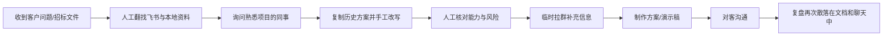
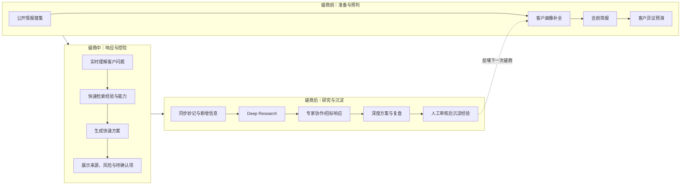
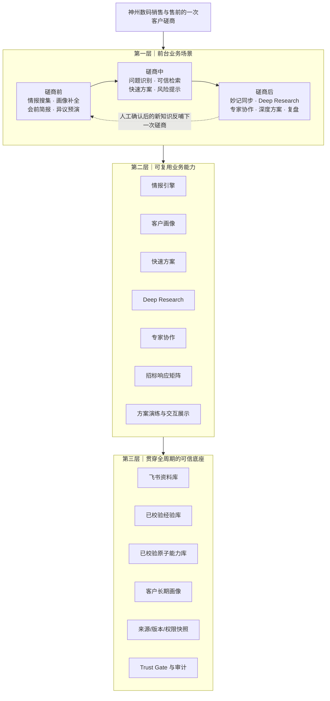
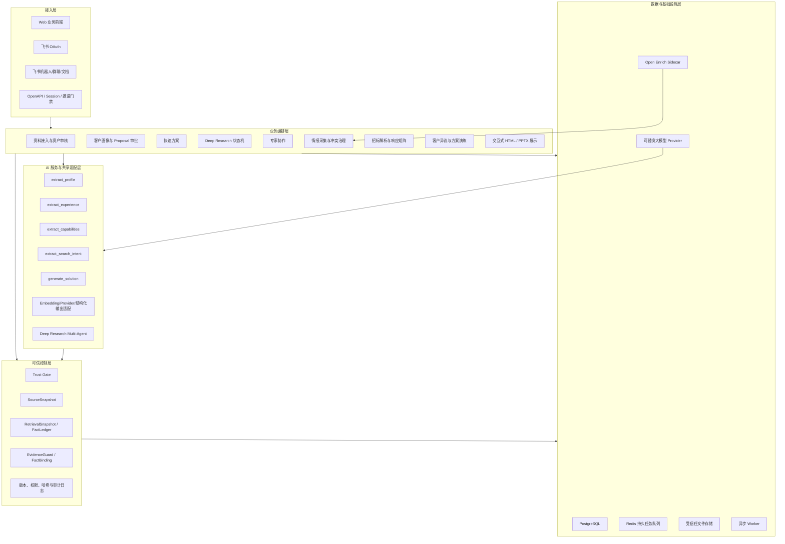
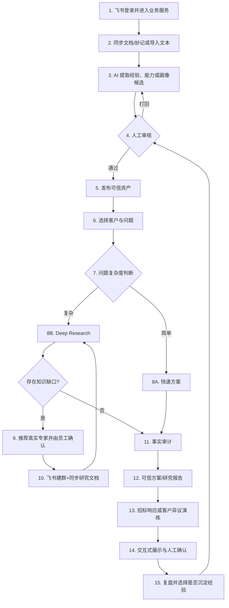
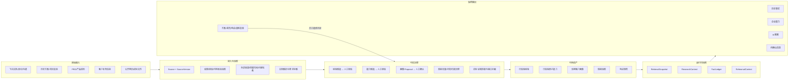

# 淘到宝引擎｜复赛完整参赛方案

> 版本：V2.0 最终方案稿（2026-08-14）
> 提交截止：2026-08-16
> 体验地址：[http://8.218.59.190/](http://8.218.59.190/)
> 提交前仅需补充：正式队名（如与本文不同）、成员个人履历、Demo 视频公开链接、飞书文档公开链接。

---

## 一、参赛方案信息卡

| 项目 | 填写内容 |
|---|---|
| 队名 | 淘到宝引擎团队（如报名系统已有正式队名，请保持与报名信息一致） |
| 命题 | 2026 飞书未来先锋 AI 大赛·神州数码赛题——面向销售与售前的企业经验复用与可信方案生成 |
| 一句话摘要 | 淘到宝引擎把散落在飞书文档、妙记、历史方案、PRD 与客户沟通中的信息，转化为可验证的企业经验和能力，并通过客户画像、可信检索、Deep Research、专家协作、招标响应与方案演练，帮助销售和售前更快、更稳地完成从理解客户到交付方案的全过程。 |
| 成员介绍与分工 | **季添瑞**：产品负责人、整体方案设计、后端集成、测试验收与云端发布；**项嫣然**：AI 可信服务、检索意图与生成链路、可信建议和 AI 专项测试；**王筱涵**：演示稿与交互式 HTML 生成、事实账本、证据守卫、风格解析与展示模块。个人教育/项目经历可在提交前各补充 2—3 句。 |
| 使用的飞书 AI 与平台能力 | 飞书妙记/会议智能纪要、飞书文档、飞书开放平台 OAuth、飞书机器人、群聊与消息能力；以飞书作为企业知识入口、人机协作界面和研究成果承载空间。 |

### 参赛方案核心定位

淘到宝引擎不是一个“接入大模型的聊天框”，而是一套面向销售和售前核心流程的可信业务引擎：

> 把企业资料编译成证据，把客户问题编排成研究，把 AI 输出约束成可审计的方案，再把人的确认重新带回企业知识循环。

它围绕一场真实客户磋商展开，而不是要求销售理解后台模块：

> **磋商前知己知彼，磋商中快速响应，磋商后深度研究；每一次客户交流，最终都沉淀为下一次可复用的组织能力。**

---

## 二、方案成果展示

## 1. 命题场景、问题与痛点

### 1.1 真实业务场景

神州数码销售与售前在一次客户机会中，通常需要同时完成：

1. 理解客户、行业与关键人的真实需求；
2. 找到企业过去做过的相似项目和成功经验；
3. 判断企业当前真正具备、能够交付的产品和服务能力；
4. 拆解招标文件或复杂需求，逐条形成可证明的响应；
5. 对不确定问题找到合适的内部专家，并保留讨论上下文；
6. 生成可用于沟通、汇报和演练的方案成果。

这些工作并不是“缺一份文档”，而是缺少一条能够持续流转、验证和复用的信息链。

### 1.2 当前痛点

| 痛点 | 传统方式 | 业务影响 |
|---|---|---|
| 信息分散 | 飞书文档、妙记、聊天、历史方案和个人电脑各自保存 | 重复搜索，优秀经验依赖个人记忆 |
| 事实与能力混淆 | “以前做过”常被误写成“现在一定能做” | 方案过度承诺，增加交付和合规风险 |
| 客户画像不可复用 | 每次会议、每个方案重新整理客户背景 | 多人协同时上下文丢失，沟通成本高 |
| 招标要求靠人工拆解 | 逐页阅读、复制、整理、查证 | 周期长，容易漏项和答非所问 |
| AI 输出不可验证 | 生成内容没有证据、版本和权限边界 | 内容看似完整，但无法放心对客 |
| 专家协作脱离研究 | 临时拉群后重新解释背景 | 专家时间被消耗，回复难以回流 |
| 方案缺少演练 | 交付前无法系统模拟客户异议 | 销售临场准备不足，方案价值表达不稳定 |

### 1.3 Before：当前人工流程

问题集中在三个断点：**资料找不到、依据说不清、协作回不来**。

### 1.4 After：一场客户磋商的完整生命周期

三段场景使用同一客户画像、同一企业知识底座和同一可信规则：会前信息不会在开会时丢失，磋商中的新信息不会未经确认覆盖长期画像，会后研究也不需要重新解释上下文。

---

## 2. 方案优势与创新点

### 2.1 核心亮点

#### 总亮点：不是功能菜单，而是客户磋商全周期 Copilot

系统以销售行为发生的时间为主线：磋商前完成情报搜集、画像补全、会前简报和异议预演；磋商中通过快速方案即时调用企业经验与能力，同时提示风险和待确认信息；磋商后将妙记、新需求和未决问题送入 Deep Research、专家协作、招标响应与复盘。用户始终围绕“这次客户磋商”工作，而不是在多个孤立 AI 工具之间搬运内容。

#### 亮点一：从“知识问答”升级为“可信证据编译”

系统不是把检索结果直接交给大模型，而是先形成独立检索快照，再将每一条结论绑定到来源、版本、审核版本、权限状态和更新时间。AI 可以提出建议，但最终发布、降级、复核或拦截由后端 Trust Gate 决定。

这使方案具备三种普通问答系统缺少的能力：**可解释、可追溯、可复现**。

#### 亮点二：企业经验与企业能力双轨治理

- **过去的经验库**回答“企业过去真实做过什么”；
- **PRD 原子能力库**回答“企业当前真实能够提供什么”。

两类资产分开提取、分开审核、分开检索，避免用历史案例代替当前交付承诺。来源更新、权限失效或原文删除时，旧资产保留用于追溯，但立即暂停在线召回。

#### 亮点三：四类事实边界，拒绝“有文采的幻觉”

每个输出都区分：

- `historical_fact`：有历史证据的事实；
- `enterprise_capability`：有能力依据的企业能力；
- `ai_inference`：AI 基于证据做出的推断；
- `pending_confirmation`：仍需客户、员工或专家确认的信息。

找不到企业依据时，系统必须明确说明缺口，不能通过语言润色伪装成事实。

#### 亮点四：快慢双通道，不滥用 Multi-Agent

- 高频、轻量问题进入**快速方案**，使用简化检索与生成链路，追求分钟级响应；
- 复杂问题进入 **Deep Research**，由需求分析、经验检索、能力检索、方案编排和事实审计节点协同完成。

Multi-Agent 只用于真正需要分工、冲突处理和长任务恢复的 Deep Research，避免为了“看起来智能”而增加成本和不确定性。

#### 亮点五：专家协作不是外接群聊，而是研究节点

专家群只能从 Deep Research 发起，并复用同一份 `research_task_id`、研究对话、研究文档、客户画像、证据快照、知识缺口和待确认问题。机器人首条消息直接给出研究摘要和文档链接，减少专家重复理解成本。

专家回复先回到原研究任务，且只能作为待确认信息；员工主动选择沉淀并审核后，才可能进入经验库。

#### 亮点六：公开情报与企业证据隔离

公开信息可以补充客户画像、行业变化和招标线索，但不能自动成为企业能力证明。情报通过来源、抓取时间、内容哈希和冲突关系形成快照；进入长期客户画像前必须人工确认。

#### 亮点七：招标响应矩阵把“大文档”变成“可审核任务”

招标文件被拆成逐条要求，每一项对应企业依据、回答草稿、证据状态、风险等级和审核状态。证据不足的要求不会被模型强行补齐，而是进入缺口和确认流程；支持单项审核、批量审核与 CSV 导出。

#### 亮点八：从“生成方案”延伸到“客户异议演练”

系统基于客户画像、公开情报、方案内容和招标响应矩阵模拟客户角色，围绕预算、交付、竞争、合规和能力边界提出异议。演练结束后输出问题记录、回答评价、证据缺口和下一步行动建议，帮助销售提升，而不是替代销售。

#### 亮点九：展示层也受事实约束

演示模块通过 FactLedger、FactBinding 和 EvidenceGuard 约束事实文本、数字、单位、日期及来源。AI 负责规划表达，受控 Renderer 负责确定性渲染，避免“为了好看改了事实”。同时支持交互式 HTML，为评审和客户提供比静态文档更有吸引力的浏览体验。

### 2.2 Before / After

| Before | After |
|---|---|
| 依赖个人记忆找案例 | 经验与能力成为可审核、可检索资产 |
| 历史案例与当前能力混在一起 | 双库隔离，分别给出事实和承诺边界 |
| AI 答案无法核对 | 每轮保存检索快照，结论绑定来源与版本 |
| 找不到依据时仍可能生成 | Trust Gate 降级、复核或拦截 |
| 客户信息散落在多个会话 | 一客一档，新增信息需确认后更新 |
| 专家被临时拉群重新听背景 | 研究上下文、证据和问题随群同步 |
| 招标文件靠人逐页拆解 | 自动形成可审核的响应矩阵 |
| 方案交付前缺少实战准备 | 基于真实上下文模拟客户异议并给出复盘 |

### 2.3 可量化价值目标

以下为试点阶段目标值，最终以真实用户埋点和对照实验验证，不将目标值表述为已实现收益。

| 工作环节 | 传统耗时基线 | 试点目标 | 验证方式 |
|---|---:|---:|---|
| 查找相似经验与能力依据 | 60—120 分钟 | 10—20 分钟 | 同一任务人工组与系统组计时 |
| 首版客户画像整理 | 30—60 分钟 | 5—15 分钟 | 对比字段完整度、确认次数和总耗时 |
| 招标文件首轮拆解 | 2—4 小时 | 15—30 分钟 | 对比要求召回率、漏项率和人工修订量 |
| 首版方案草稿 | 4—8 小时 | 30—60 分钟 | 对比形成可评审草稿的时间 |
| 专家了解研究背景 | 15—30 分钟/人 | 5—10 分钟/人 | 记录建群到首次有效回复时间 |
| 方案交付前异议准备 | 30—60 分钟 | 10—20 分钟 | 演练完成率、关键问题覆盖率和自评变化 |

质量目标：所有正式发布的关键结论要么拥有可用依据，要么明确标记为 AI 推断或待确认；不允许“无依据但写成企业事实”。

---

## 3. 具体方案说明（突出 AI 能力）

### 3.1 场景驱动的产品结构图

这张图刻意把“资料库、经验库、能力库”放在底层：它们是每个场景都能调用的基础设施，而不是要求销售逐个操作的产品终点。

### 3.2 技术架构图

架构原则：

- HTTP 冻结契约与 AI 五方法契约保持稳定；V1.1/V2 使用增量契约；
- Embedding 和模型 Provider 是共享适配能力，不扩展第六个冻结 AIEngine 方法；
- 快速方案保持轻量单链路，Multi-Agent 只进入 Deep Research；
- AI 的 `recommended_action` 仅作为建议，最终动作由后端 Trust Gate 执行；
- 公开情报、内部知识、客户确认和专家回复拥有不同可信等级，不能混用。

### 3.3 端到端业务流程图

### 3.4 可信数据流图

数据流中的关键门禁：

1. 待校验、已打回、来源更新、无权限或已删除资产不能进入在线召回；
2. 客户对话或公开情报只能生成画像 Proposal，不能静默覆盖长期画像；
3. 每次方案运行保存独立快照，后续资产更新不能篡改历史答案；
4. 招标要求没有企业依据时，响应项必须暴露缺口或拒绝承诺；
5. 专家回复和演练建议都不能直接变成已校验经验。

### 3.5 AI 在核心链路中的作用

| 环节 | AI 做什么 | AI 不能做什么 | 控制机制 |
|---|---|---|---|
| 资料沉淀 | 提取画像、经验、原子能力候选 | 自动发布为可信资产 | Schema 校验 + 人工审核 |
| 快速方案 | 提取意图、检索、组织答案 | 使用未审核资产或编造能力 | 双库检索 + RetrievalSnapshot |
| Deep Research | 多节点研究、冲突识别、方案编排 | 绕过事实审计直接交付 | 长任务状态机 + Trust Gate |
| 专家协作 | 总结上下文、生成待确认问题 | 自动邀请未经员工确认的人、自动沉淀回复 | 员工确认 + 同一研究上下文 |
| 公开情报 | 富化、归一化、去重和冲突提示 | 把网页内容当作企业能力证明 | IntelligenceSnapshot + Proposal 审批 |
| 招标响应 | 拆解要求、匹配证据、生成草稿 | 对证据缺口强行承诺 | 响应矩阵 + 缺口拦截 + 版本审核 |
| 方案演练 | 模拟异议、评价回答、给出改进建议 | 评价员工绩效或改写长期画像 | RehearsalContext + 人工复盘 |
| 展示生成 | 规划信息结构与事实绑定建议 | 自由改写数字、事实和来源 | FactLedger + 双重 EvidenceGuard |

### 3.6 飞书深度联动

飞书不是一个“登录入口”，而是方案的数据源、协作空间和成果载体：

- 从飞书文档和妙记接入企业资料；
- 使用飞书 OAuth 继承用户身份；
- Deep Research 出现知识缺口时，员工确认专家与问题；
- 飞书机器人创建协作群并同步同一研究上下文生成的研究文档；
- 专家讨论重新回到原研究任务；
- 研究成果可以继续以飞书文档形式被团队阅读、确认和传播。

已完成真实飞书验证：登录、资料同步、研究文档创建、机器人与发起人建群、中文业务摘要和文档链接发送均已跑通。

### 3.7 当前完成度与工程验证

- V1/V2 核心后端、前端工作台、可信 AI 链路、飞书联动和云端运行环境已合并；
- 最终回归：完整数据库与 Chrome 配置下 `450 passed, 0 skipped`；
- Ruff、Python 编译检查、Alembic 单 Head 与无漂移检查、Node 语法检查通过；
- 冻结 `openapi.yaml` 和 AI 五方法签名未被破坏；
- 生产服务运行于阿里云，数据库和应用健康检查通过；
- 比赛环境以阿里云真实搜索为公开情报主链路；Open Enrich 默认关闭，仅作为可选覆盖率对照 Provider，任何情况下均不使用 Mock 功能伪装公网采集；
- 正式企业场景仍建议补做“真实专家回复 → Deep Research 恢复”的完整业务验收。

---

## 4. 方案价值

### 4.1 对销售和售前

- 减少在多个文档、群聊和历史项目中反复查找资料；
- 快速获得带企业依据、风险和待确认项的方案草稿；
- 面对招标和复杂客户问题时，将大任务拆成可审核的结构化工作项；
- 通过客户异议演练提前暴露表达、证据和承诺问题。

### 4.2 对专家与协作团队

- 专家收到的不是一句“帮忙看看”，而是带背景、证据、缺口和明确问题的研究上下文；
- 专家只处理真正需要人判断的内容，减少重复解释；
- 回复不会被系统擅自包装为企业事实，保护专家和组织的知识边界。

### 4.3 对企业管理与知识资产

- 把一次性的项目材料变成可复用、可审核、可追溯的组织资产；
- 通过来源版本、权限和审核状态控制“哪些知识仍然可用”；
- 将成功经验、能力边界、客户情报和方案反馈形成持续迭代的数据闭环；
- 不依赖某一位员工的个人记忆，降低人员流动带来的知识损失。

### 4.4 可落地性与可推广性

系统采用模块化后端、稳定契约、异步 Worker 和可替换 AI Provider，可从轻量试点逐步扩展：

1. **团队试点**：飞书登录、资料同步、客户画像、快速方案；
2. **部门推广**：Deep Research、专家协作、招标响应；
3. **组织级应用**：公开情报 Provider、企业存储、观测看板、权限审计；
4. **跨行业复制**：替换行业词表、能力模型和审核规范，即可迁移到咨询、制造、软件、金融科技等知识密集型售前场景。

---

## 5. 方案体验入口与 Demo 展示视频

### 5.1 体验入口

- 体验地址：[http://8.218.59.190/](http://8.218.59.190/)
- 登录方式：输入团队提供的限时签名邀请码，再使用飞书 OAuth 登录；
- 推荐浏览器：最新版 Chrome 或 Edge；
- 推荐分辨率：1440 × 900 或以上；
- 打开说明：当前为比赛演示环境，请勿上传真实客户敏感数据；邀请码和测试数据由团队单独提供，不写入公开参赛文档。

### 5.2 3—5 分钟 Demo 脚本

| 时间 | 演示内容 | 评审看到的亮点 |
|---:|---|---|
| 0:00—0:25 | 飞书登录，选择即将磋商的客户 | 从一次真实客户磋商进入系统，而不是从功能菜单开始 |
| 0:25—1:15 | **磋商前**：搜集公开情报、补全画像、生成会前简报 | 系统帮助销售知己知彼，外部情报进入长期画像前必须确认 |
| 1:15—1:55 | **磋商前**：进入客户异议预演并查看建议 | AI 模拟客户而非替代销售，提前暴露证据和表达缺口 |
| 1:55—2:45 | **磋商中**：输入客户现场问题，生成快速方案 | 同一画像和双知识库分钟级响应，明确来源、风险与待确认项 |
| 2:45—3:40 | **磋商后**：同步妙记，将未决问题发起 Deep Research | 会议上下文直接进入长任务，多节点检索、编排和事实审计 |
| 3:40—4:15 | 从知识缺口发起飞书专家协作 | 群聊和研究文档继承同一研究上下文，减少重复解释 |
| 4:15—4:45 | 展示招标响应矩阵或深度方案 | 逐项证据化响应，缺少企业依据就阻断承诺 |
| 4:45—5:00 | 展示复盘沉淀与交互式成果 | 一次磋商最终反哺下一次磋商，形成组织学习闭环 |

Demo 视频公开链接：**[提交前补充飞书妙记、Bilibili 或其他无需登录即可观看的链接]**。

---

## 三、自由展示区

## 1. 团队能力与协作方式

三人采用轻量模块化协作：产品与集成负责人冻结业务边界和契约；AI 负责人围绕可信输出独立开发并维护专项测试；展示负责人围绕事实账本和受控渲染交付成果。各功能通过分支、PRD、增量契约、交接说明和验收报告接力，最终由统一基线完成合并、回归和发布。

团队成员可在此补充个人履历卡片：

| 成员 | 个人简介（提交前补充） | 本项目可验证交付 |
|---|---|---|
| 季添瑞 | [教育/专业/代表项目，2—3 句] | 产品结构、V1/V2 PRD、后端集成、Bug 闭环、阿里云部署与验收 |
| 项嫣然 | [教育/专业/AI 相关经历，2—3 句] | AI 可信服务、SourceSnapshot、recommended_action、AI 专项测试 |
| 王筱涵 | [教育/专业/前端或设计经历，2—3 句] | FactLedger、EvidenceGuard、PPTX 安全解析、HTML/PPTX 展示链路 |

## 2. 工程可信性

本项目将“可信”落到了工程约束，而不仅是展示文案：

- 冻结契约防止多人协作时接口语义漂移；
- 数据库迁移保持单一 Head，并执行 Alembic 无漂移检查；
- 每轮方案保存独立检索快照；
- 推荐动作与最终发布权限分离；
- AI、后端、渲染器和外部 Sidecar 有明确边界；
- 密钥仅通过运行时环境注入，不进入 Git；
- 邀请码采用 HMAC-SHA256 签名、有效期与单次消费账本；
- 外部 Provider 未配置时明确降级，拒绝伪装成真实联网结果。

## 3. 未来迭代规划

| 阶段 | 重点 |
|---|---|
| V2.0（当前） | 资料、画像、快速方案、Deep Research、专家协作、情报与招标、演练与展示形成产品闭环 |
| 试点增强 | 配置真实公开情报 Provider，增加可观测看板、埋点和真实用户效率对照实验 |
| 展示增强 | 扩展交互式 HTML 内容形状、受控图表和授权企业素材；保持事实绑定不被视觉层改写 |
| 企业化 | 对象存储、HTTPS/域名、备份恢复、细粒度权限、审计导出和高可用部署 |

## 4. 参考项目与吸收边界

- AutoRFP：参考招标/RFP 拆解、逐项响应和来源引用思路；
- Solivio：参考草稿—审核—接受状态流、歧义管理和 AI 评测方法；
- Presenton：参考受控展示模板、布局与视觉资产思路。

本项目没有直接照搬上述项目的账户体系或整套技术栈，而是将适合淘到宝可信规则的机制重新实现；涉及开源资产时保留对应许可证和来源审计。

---

## 四、附录

## 1. 幕后故事与花絮

项目最初从“如何让销售更快找到资料”出发，但在真实联调中很快发现：搜索并不是最难的问题，真正困难的是判断一条内容是否仍然有效、能否代表企业能力、能否安全地写进对客方案。

因此团队没有把精力只放在让回答更流畅，而是逐步建立经验与能力双库、来源快照、客户画像确认、Deep Research、专家回流、Trust Gate 和事实账本。真实飞书联调中也暴露过资料同步后页面不刷新、中文历史数据乱码、专家群摘要不够业务化等问题；这些问题被记录在持续维护的 Bug List 中，并通过真实环境回归逐项关闭。

这段过程让我们最终形成一个共同判断：

> 企业 AI 的竞争力，不只来自“生成得多快”，更来自“知道什么可以说、为什么可以说，以及谁为最后一步负责”。

## 2. 验收状态说明

截至 2026-08-14：

- V1 Bug List：5 项代码/体验缺陷均已关闭；
- V2 Bug List：6 项合并与发布缺陷均已关闭；
- 无待定位、修复中或待回归的软件缺陷；
- 可选增强项：Open Enrich 真实公网采集凭据尚未配置，不影响阿里云默认公开情报搜索和 V2 核心验收；
- 外部依赖 2：PptxGenJS 间接依赖的上游安全公告等待无影响版本，当前受限输入边界不暴露相关图片解析入口；
- 正式企业验收建议：补做真实专家回复与 Deep Research 恢复闭环、配置 HTTPS 和真实公开情报 Provider。

## 3. 提交前检查清单

- [ ] 将本文复制到飞书文档并检查 Mermaid 图；若飞书不直接渲染 Mermaid，请导出为 PNG 后插图；
- [ ] 补充正式队名、命题官方名称和三位成员个人履历；
- [ ] 插入 4—6 张真实产品截图或短动图；
- [ ] 上传 3—5 分钟 Demo 视频并补充公开链接；
- [ ] 体验入口使用新的限时邀请码，不在公开文档中长期暴露邀请码；
- [ ] 开启飞书文档“互联网获得链接的任何人可阅读”；
- [ ] 使用无登录浏览器窗口验证文档、视频和体验入口；
- [ ] 在“AI 先锋未来人才大赛—完整参赛方案提交表”中提交最终文档链接。
