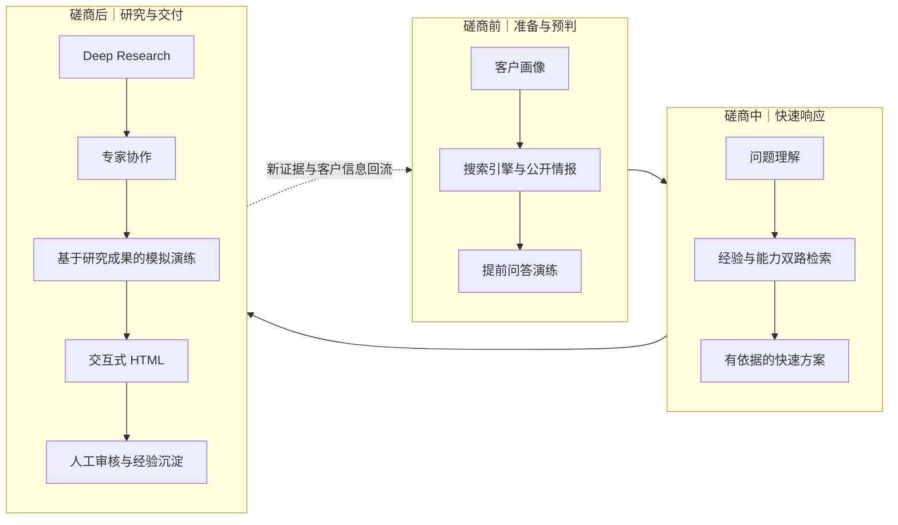
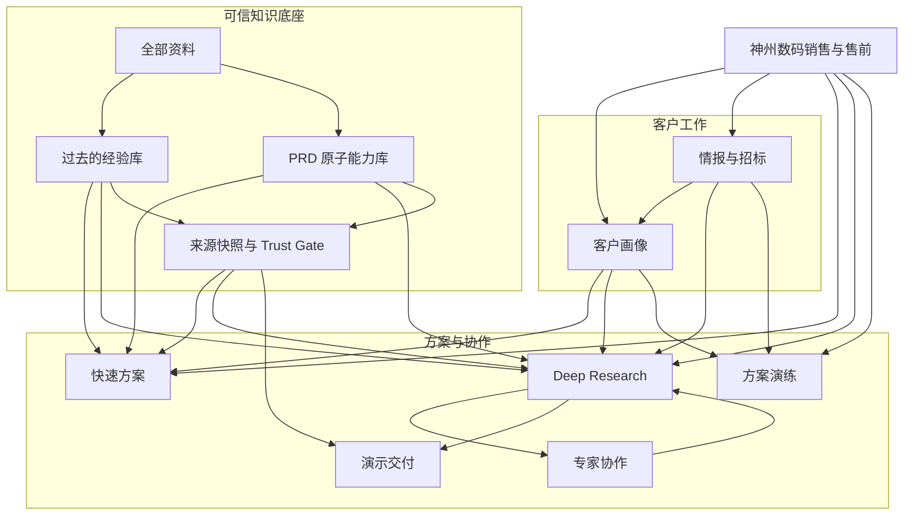
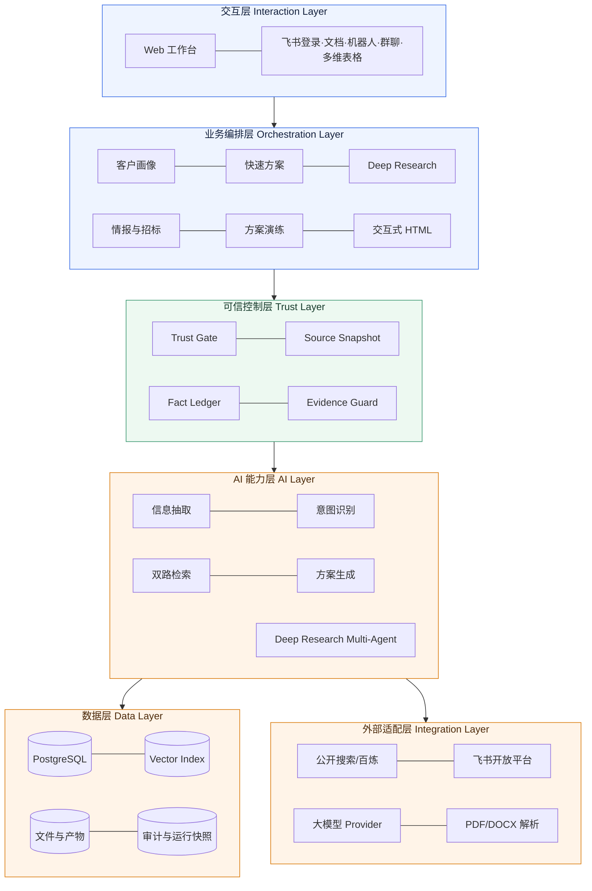
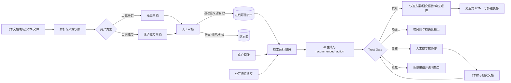
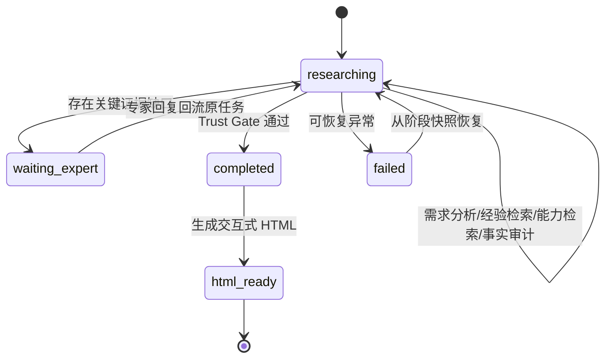
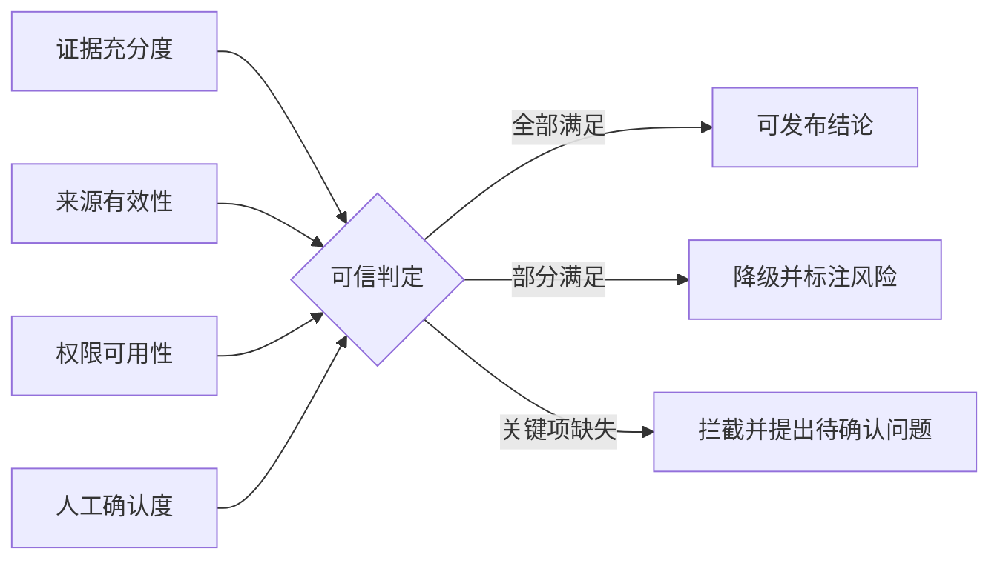

# 淘到宝引擎｜复赛完整参赛方案

> 参赛项目：2026 飞书未来先锋 AI 大赛·神州数码赛题
> 版本：V2.0 Final｜2026-08-16
> 产品体验：[http://8.218.59.190/](http://8.218.59.190/)
> 说明：本文中的汽车制造客户、历史项目与招标材料均为比赛模拟数据；系统能力、接口、数据库、AI 调用、飞书协作和可信门禁均为真实实现。

---

## 一、参赛方案信息卡

| 项目 | 填写内容 |
|---|---|
| 队名 | 淘到宝引擎团队【如报名队名不同，提交前替换】 |
| 命题 | 2026 飞书未来先锋 AI 大赛·神州数码赛题——面向销售与售前的企业经验复用与可信方案生成 |
| 一句话摘要 | 淘到宝引擎把散落在飞书文档、妙记、历史方案、PRD 与客户沟通中的信息沉淀为可验证、可复用的企业经验与能力，贯通磋商前客户画像、情报搜索与提前问答，磋商中快速响应，磋商后深度研究、专家协作、模拟演练与交互式交付。 |
| 季添瑞 | 产品负责人；负责产品规划、总体架构、后端整合、验收与云端部署。【提交前补充个人经历 2—3 句】 |
| 项嫣然 | AI 可信服务；负责检索意图、生成链路、可信建议与 AI 专项测试。【提交前补充个人经历 2—3 句】 |
| 王筱涵 | 演示交付；负责事实账本、证据守卫、交互式 HTML 与展示体验。【提交前补充个人经历 2—3 句】 |
| 使用的飞书能力 | 飞书 OAuth 登录、飞书文档与妙记、机器人、群聊与消息、多维表格；飞书同时承担知识入口、人机协作界面和研究成果载体。 |

### 核心定位

淘到宝引擎不是“接入大模型的聊天框”，而是一套进入销售与售前核心业务链路的可信业务引擎：

> 把企业资料编译成证据，把客户问题编排成研究，把 AI 输出约束为可审计方案，再把人的确认带回组织知识循环。

它围绕一场真实客户磋商展开：

> **磋商前画像与情报辅助知己知彼，磋商中快速方案支持现场响应，磋商后深度研究、专家协作、模拟演练与 HTML 交付形成闭环；每一次客户交流，最终都沉淀为下一次可复用的组织能力。**

---

## 二、方案成果展示

## 1. 场景、问题与痛点

神州数码销售与售前面对客户机会时，往往需要同时完成六件事：理解客户、寻找相似案例、判断可交付能力、拆解复杂需求、协调内部专家、生成可对客成果。真正的问题不是缺少文档，而是缺少一条能持续流转、验证和复用的信息链。

| 业务痛点 | 传统方式 | 直接影响 |
|---|---|---|
| 信息分散 | 文档、妙记、聊天、历史方案和个人电脑分别保存 | 重复搜索，经验依赖个人记忆 |
| 事实与能力混淆 | “过去做过”被误写成“现在一定能做” | 形成过度承诺与交付风险 |
| 客户画像不可复用 | 每次会议、每份方案重新整理背景 | 多人协同上下文丢失 |
| 招标要求依赖人工拆解 | 逐页阅读、复制、查询和回填 | 周期长，容易漏项和答非所问 |
| AI 输出不可验证 | 答案没有证据、版本和权限边界 | 内容看似完整，却不能放心对客 |
| 专家协作脱离研究 | 临时拉群后重新解释背景 | 专家时间被消耗，回答难以回流 |
| 方案缺少演练 | 交付前无法系统模拟客户异议 | 临场准备不足，价值表达不稳定 |

### 1.1 Before：割裂的人工流程

### 1.2 After：以磋商场景组织完整链路

## 2. 方案优势与创新点

### 创新一：从“功能菜单”升级为“客户磋商生命周期副驾驶”

用户不需要理解后台模块，而是按照工作发生的时间顺序使用系统：会前准备、会中响应、会后研究与复盘。客户画像贯穿始终，避免每次从零开始。

### 创新二：经验与能力双轨治理

- 过去的经验库回答“企业过去真实做过什么”。
- PRD 原子能力库回答“企业当前真实能够提供什么”。
- 两类资产分开审核、分开检索，避免把历史案例直接变成当前承诺。
- 原文更新、权限失效或来源删除后，资产立即暂停在线召回，重新审核后才能恢复。

### 创新三：把可信约束写进系统，而不是写进提示词

所有输出都被区分为四种事实类型：

| 类型 | 含义 | 对客边界 |
|---|---|---|
| `historical_fact` | 有来源的历史事实 | 可描述过去做过什么 |
| `enterprise_capability` | 已审核的当前能力 | 可作为能力依据 |
| `ai_inference` | AI 基于证据形成的推断 | 必须明确标注为推断 |
| `pending_confirmation` | 证据不足或存在冲突 | 不得当作结论承诺 |

AI 返回 `recommended_action`，但最终由后端 Trust Gate 决定发布、降级、复核或拦截。找不到企业依据时，系统必须明确拒绝编造。

### 创新四：快速方案与 Deep Research 分级编排

- 快速方案用于现场响应，采用轻量检索与生成，不滥用 Multi-Agent。
- 复杂问题进入 Deep Research，由需求分析、经验检索、能力检索、方案编排和事实审计共同完成。
- 每次运行保留独立证据快照，后续资料变化不能篡改历史答案。

### 创新五：专家不是“通讯录联系人”，而是研究节点

系统只从真实文档作者、历史方案作者、经验贡献者或审核人中推荐专家。员工确认后，飞书机器人创建群聊并同步研究概述、证据缺口和待确认问题；专家回复回到原研究任务，只有经过人工选择与审核后才可能沉淀为经验。

### 创新六：情报、招标、演练形成增长闭环

公开情报引擎补全客户与项目背景，但外部信息不会直接污染内部能力事实；招标引擎把文件拆成逐条响应矩阵；方案演练用客户角色提出异议，让销售在真实沟通前完成压力测试。

### 创新七：事实约束下的交互式 HTML 交付

Deep Research 完成后生成可通过链接打开的交互式 HTML。AI 负责内容规划，事实账本和 EvidenceGuard 负责约束来源、数字和文本，浏览器负责渲染，因此服务器无需承担重型 PPT 渲染压力，评委也能直接体验动态成果。

### Before / After

| Before | After |
|---|---|
| 先找人，再找资料 | 先检索证据，缺口再精准找专家 |
| 历史方案靠复制改写 | 经验与当前能力分轨检索 |
| AI 输出无法解释来源 | 每个结论携带来源、风险和可信边界 |
| 招标文件人工逐项拆解 | 自动形成要求—证据—草稿—审核矩阵 |
| 临时拉群，反复解释背景 | 飞书群自动携带同一研究上下文 |
| 交付后经验再次散落 | 人工审核后回流企业知识库 |
| 静态长文档难以演示 | 交互式 HTML 直接分享和浏览 |

## 3. 具体方案说明

### 3.1 产品结构

### 3.2 论文式分层架构

### 3.3 可信数据流

### 3.4 Deep Research 状态与专家闭环

### 3.5 AI 如何深入业务核心链路

| 环节 | AI 的作用 | 确定性控制 |
|---|---|---|
| 资料入库 | 抽取客户画像、经验、原子能力 | 来源版本、权限和审核状态 |
| 情报引擎 | 搜索、聚合、去重、冲突识别和画像 Proposal | 外部情报与内部证据隔离，人工确认后写画像 |
| 快速方案 | 意图识别、双路检索、依据化生成 | 只召回有效资产；保留运行快照 |
| Deep Research | 多节点协作、证据冲突处理、研究报告 | 长任务状态、失败恢复、事实审计 |
| 专家协作 | 提炼缺口、推荐真实贡献者、生成问题包 | 人工确认后才能建群；回复不自动入经验库 |
| 招标响应 | 文档解析、逐条拆解、草稿生成 | 缺证据不承诺；人工审核独立版本化 |
| 方案演练 | 模拟客户角色、连续追问、生成评估报告 | 演练结论不回写企业事实 |
| 演示交付 | 把研究计划映射为互动页面 | Fact Ledger + EvidenceGuard 双重约束 |

### 3.6 飞书协同不是“贴一个入口”

淘到宝把飞书作为实际业务运行空间：

1. 员工使用飞书 OAuth 登录服务。
2. 飞书文档和妙记进入资料库，保留来源及权限边界。
3. Deep Research 遇到知识缺口后，系统基于作者、贡献者和审核人推荐专家。
4. 员工确认后，机器人建立群聊并发送研究概述、证据缺口和待确认问题。
5. 专家回答回到原研究任务，恢复研究状态。
6. 研究结果生成飞书文档，并可同步关键内容到多维表格，形成结构化协作台账。

### 3.7 当前可演示的真实闭环

以“东岳智行多工厂质量知识闭环”为模拟案例，系统当前已准备以下真实演示资产：

- 完成状态的 Deep Research 任务，包含经验、能力、风险和待确认事项。
- 基于研究任务生成的交互式 HTML，审计和渲染检查通过。
- 真实创建的飞书专家群及研究文档，机器人可发送研究上下文。
- 真实多维表格同步链路，可展示结构化研究记录。
- 完整快速方案，包含历史证据、企业能力、建议、风险、来源和追问。
- 中文 DOCX 招标样例，解析后形成 6 条结构化要求及响应矩阵。

## 4. 方案价值

### 4.1 价值计算逻辑

以下数据为试点目标和可验证口径，不作为未经试点的既成收益：

| 指标 | 传统基线 | 试点目标 | 验证方式 |
|---|---:|---:|---|
| 找到可用历史依据 | 30—60 分钟 | 3—10 分钟 | 系统运行日志与用户计时 |
| 快速方案首稿 | 2—4 小时 | 10—20 分钟 | 创建到首稿完成时间 |
| 招标要求拆解 | 0.5—1.5 人日 | 15—40 分钟 | 上传到响应矩阵生成时间 |
| 专家背景同步 | 15—30 分钟/人 | 2—5 分钟/人 | 群创建到首轮有效回复时间 |
| 方案来源可追溯率 | 依赖人工检查 | 关键结论 100% 标注 | 来源快照与 EvidenceGuard 报告 |
| 无依据承诺暴露率 | 难以量化 | 关键缺口 100% 显式暴露 | Trust Gate 拦截与待确认项 |

以每名销售/售前每周处理 3 次客户机会、每次减少 1.5 小时资料检索与初稿时间估算，单人每月可释放约 18 小时，用于客户沟通、方案深化和内部协同。更重要的收益是降低过度承诺、来源失效和关键条款遗漏造成的业务风险。

### 4.2 对四项评分维度的直接回应

| 评分维度 | 淘到宝引擎的回答 |
|---|---|
| AI 应用创新性 | 可信证据编译、经验/能力双轨、Deep Research 专家节点、招标响应矩阵、事实约束的交互式 HTML |
| 业务价值 | 直接进入销售与售前核心链路，缩短检索、首稿、招标拆解和专家同步时间，同时降低错误承诺风险 |
| AI 应用深度 | AI 参与抽取、检索、研究、冲突处理、招标拆解、演练和展示规划，而非只做摘要或问答 |
| 完整度与落地性 | 已有云端服务、真实数据库、真实飞书联动、人工审核、审计快照、测试基线和可恢复状态机 |

## 5. 体验入口与 Demo 视频

### 5.1 体验入口

- 产品地址：[http://8.218.59.190/](http://8.218.59.190/)
- 飞书多维表格演示：[淘到宝引擎协作台账](https://larkcommunity.feishu.cn/base/RrYQbasB9aVYawsDIoScu1Cinfe)
- Deep Research 研究文档：[东岳智行研究文档](https://feishu.cn/docx/XfzVd4TM4oc3isxuwnrcStSVnFb)
- 邀请码：出于安全考虑不写入公开文档，由参赛团队在体验说明中单独提供。
- 公开参赛方案飞书文档：【提交前补充，并开启“互联网获得链接可阅读”】
- 3—5 分钟 Demo 视频：【提交前补充公开链接】

### 5.2 推荐录制主线

1. **开场 20 秒**：指出企业不缺资料，缺的是“可验证、可流转、可复用”的经验链。
2. **磋商前 60 秒**：依次展示客户画像、搜索引擎和提前问答演练，说明系统如何帮助销售在见客户前完成背景补全与问题预判。
3. **磋商中 40 秒**：输入客户现场问题，展示快速方案中的经验、能力、风险、来源和待确认问题。
4. **磋商后——深度检索 50 秒**：进入 Deep Research，展示阶段进度、证据快照、可信边界和完整研究成果。
5. **磋商后——专家系统 35 秒**：从研究任务发起协作，展示机器人建群、同步研究概述和专家回复回流。
6. **磋商后——模拟演练 35 秒**：基于深度研究成果模拟客户追问，检验方案的完整性、证据覆盖和现场表达。
7. **磋商后——HTML 交付 30 秒**：打开由 Deep Research 生成的交互式 HTML，展示可分享、可浏览的研究成果。
8. **收束 20 秒**：强调每次客户交流都回到组织知识循环，而不是生成后即丢失。

---

## 三、自由展示区

## 1. 我们对企业 AI 的判断：增强人，而不是替代人

企业经验并不只存在于文档中，也存在于销售的客户理解、产品经理的能力判断、研发专家的实施经验和审核人的风险意识里。淘到宝引擎的目标不是“把这些人蒸馏掉”，而是减少他们反复查找、解释和搬运信息的时间，让人的专业判断出现在最需要的位置。

因此，我们为系统划定了三条人机边界：

1. **AI 可以发现知识缺口，但不能虚构缺失答案。**
2. **AI 可以推荐专家，但不能绕过员工确认随意打扰他人。**
3. **AI 可以生成方案草稿，但不能代替人作出能力承诺。**

这让专家协作不再是 AI 失败后的“人工兜底”，而成为可信研究流程中被正式设计的一环。

## 2. 一个可解释的可信公式

我们把方案可信度抽象为一个乘法模型：

> **可信方案 = 证据充分度 × 来源有效性 × 权限可用性 × 人工确认度**

任何一项为零，系统都不能把内容包装成确定结论。与只在 Prompt 中要求“不要幻觉”相比，这套机制可以在数据库、检索快照、状态机和审核记录中被验证。

这套公式对应系统中的来源快照、Fact Ledger、EvidenceGuard 与 Trust Gate，也对应评委可以直接看到的来源、风险、缺口和审核状态。

## 3. 从比赛原型到真实运行：我们已经跨过了什么

本项目并非只完成了静态页面或录屏脚本。当前体验环境使用真实服务、真实数据库和真实飞书开放平台能力运行。

| 可验证成果 | 当前状态 | 评委如何验证 |
|---|---|---|
| 云端产品 | 已部署 | 通过公开体验地址进入系统 |
| 飞书身份 | 已接通 | 使用飞书 OAuth 完成登录 |
| 飞书资料 | 已接通 | 同步飞书文档并保留来源信息 |
| 快速方案 | 已接通 | 输入问题后查看经验、能力、风险和来源 |
| Deep Research | 已接通 | 查看任务阶段、证据快照和研究结果 |
| 专家协作 | 已接通 | 从研究任务发起飞书群并同步问题上下文 |
| 多维表格 | 已接通 | 将结构化战情同步到真实多维表格 |
| 招标响应 | 已接通 | 上传中文 DOCX，生成逐条响应矩阵并审核 |
| 互动交付 | 已接通 | 从 Deep Research 生成并打开交互式 HTML |

其中，汽车制造客户、历史项目和招标材料是为了保护真实企业信息而制作的比赛模拟资料；接口、数据库、AI 调用、搜索、审核、飞书建群和 HTML 生成均不是 Mock。

## 4. 可复现的工程质量

可信不仅是产品概念，也必须成为工程结果：

- HTTP 契约遵循冻结的 `openapi.yaml`，AI 服务五个核心方法签名保持兼容。
- 2026-08-15 发版基线完成 **450 passed、0 skipped**，并通过代码规范、编译、数据库迁移一致性检查。
- 开发阶段只验证相关模块；合并或发版前进行全量回归；云端部署后执行健康检查与关键链路冒烟。
- 每次方案运行保存独立检索快照，资产后续变化不会改写历史答案。
- 所有密钥仅存在服务端安全环境，不进入前端、演示资料或 Git 仓库。

当前版本部署在阿里云 ECS，采用 Docker、PostgreSQL 和同源 Web 前端。交互式 HTML 由用户浏览器渲染，云端主要承担数据、生成、审计与文件服务，在轻量比赛服务器上也能稳定运行。

## 5. 从一次成交到组织记忆的飞轮

传统方案的终点是“交付一个文件”；淘到宝的终点是“让本次工作成为下一次工作的起点”。

这个飞轮带来两种积累：一是客户画像随每次确认不断完善，二是组织经验随每次项目复盘持续增长。系统使用次数越多，个人经验越容易转化为组织能力，但每一次转化仍然保留来源和人工责任边界。

## 6. 推广蓝图

淘到宝的可迁移核心不是某个行业模板，而是“来源快照—人工审核—可信检索—事实门禁—协作回流”的通用方法。因此，它可以从汽车制造模拟场景推广到零售、金融、医疗、政企、能源等需要强证据和多人协作的复杂业务场景。

## 7. 我们主动保留的能力边界

成熟的企业方案不只要说明能做什么，也要明确当前不做什么：

- V2.0 的正式展示产物是交互式 HTML，不把 PPTX 纳入本次验收范围。
- 飞书 Aily 未纳入本版实现，因此不在材料或演示中声称已经接入。
- 专家回复不会自动成为已校验经验，必须由员工选择并经过人工审核。
- 会话中新获得的客户信息不会自动覆盖长期画像，必须重新确认。
- 当来源失效、权限不足或证据冲突时，系统优先降级或拒绝回答，而不是追求表面完整。

---

## 四、附录

## 1. 幕后故事

团队只有一名产品和两名开发，因此我们没有追求“大而全”的炫技架构，而是把协作边界直接写进接口、状态和测试：产品冻结业务契约，AI 服务输出建议，后端 Trust Gate 掌握最终决定，展示层只消费经过事实约束的内容。三个人分别推进后，再通过日期基线和功能分支完成接力合并。

在开发过程中，我们坚持一条底线：**可以模拟资料，但不能模拟功能；能调用就是能，不能调用就明确跳过。** 这条原则最终成为产品可信设计的一部分。

## 2. 参考项目与技术资料

- 飞书开放平台：OAuth、云文档、机器人、群聊、多维表格相关能力。
- OpenAPI Specification：前后端接口契约。
- PostgreSQL / pgvector：结构化数据、审计记录与向量检索。
- AutoRFP：招标/RFP 逐项拆解、检索与来源引用思路参考。
- Solivio：草稿—审核—接受状态流转、人机协作与 AI 评测思路参考。
- Presenton：受控展示布局与视觉表达思路参考；本项目未整套并入其产品或账户体系。

## 3. 提交前检查清单

- [ ] 队名与报名系统一致。
- [ ] 三位成员各补充 2—3 句个人简介。
- [ ] 飞书参赛文档开启“互联网获得链接可阅读”。
- [ ] 补充公开参赛方案文档链接。
- [ ] 补充 3—5 分钟 Demo 视频链接。
- [ ] 在无登录缓存的浏览器中验证体验入口和邀请码。
- [ ] 视频中明确模拟数据边界，不展示 API Key、App Secret、邀请码密钥或服务器登录信息。
- [ ] 在完整参赛方案提交表中提交最终文档链接。
